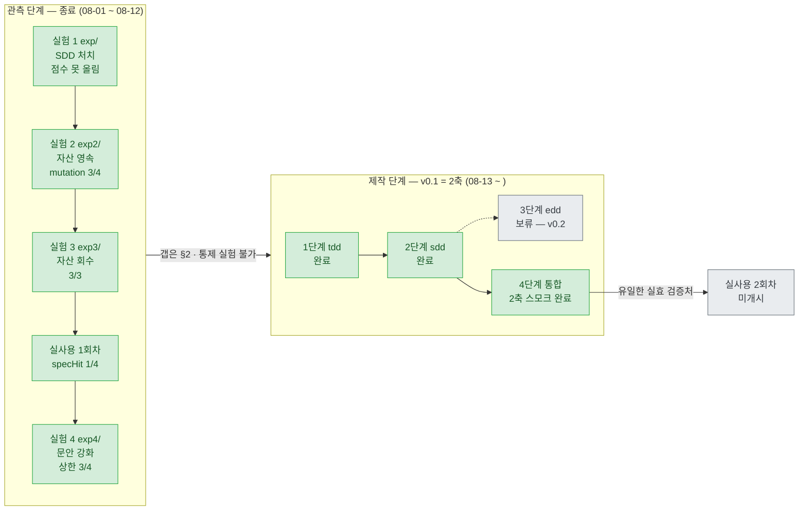
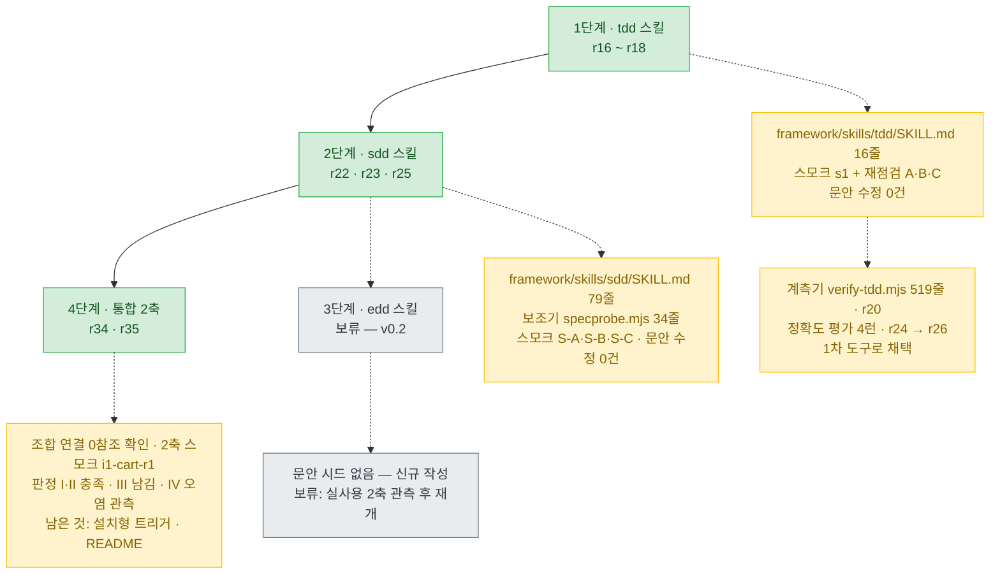
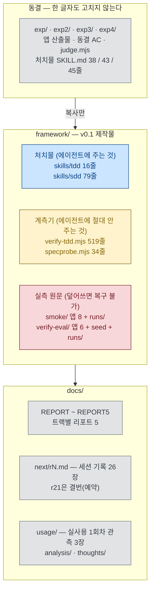
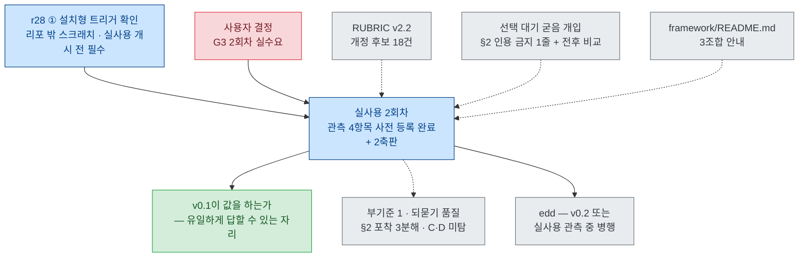

# 현황 — 어디까지 왔고, 무엇이 비었고, 다음은 무엇인가

**기준 시점**: 2026-08-16 · 브랜치 `docs/r34-integration-plan`
**최신 세션 기록**: `docs/next/2026-08-16/r35.md` (r34 지시서 집행 — **v0.1 = 2축 확정** · 4단계 통합 2축 스모크 1런 · 실물 SPEC 재판정 3세션)
**이 문서의 성격**: 현황 요약본이다. 결정은 하지 않는다 — 결정은 `docs/next/rN.md`가, 확정된 실험 설계는
`FROZEN*.md`가 갖는다. **이 문서와 그것들이 어긋나면 그쪽이 이긴다.**

---

## 0. 30초 요약

| | 상태 |
|---|---|
| **관측 단계(실험)** | **5트랙 전부 종료.** 얻은 것: 자산 영속 §4는 값을 한다(mutation 0→3/4, 회수 3/3). 못 얻은 것: SDD가 첫 제출 점수를 올린다는 근거(중앙값 7→6, 비용 4.3×). 결정적 관측: **갭은 §4가 아니라 §2(침묵 포착)에 있다** |
| **제작 단계(v0.1)** | **v0.1 = 2축으로 확정**(r34 §0-1 — edd를 건너뛰는 명시적 계획 변경). tdd(16줄)·sdd(79줄) 스킬 + 계측기 2종 + 판정 루브릭. **4단계(통합)는 조합 연결 확인·2축 스모크 1런까지 완료**, 남은 것은 설치형 트리거 확인·README |
| **지금 막고 있는 것** | edd 결정 2건은 **보류로 내려갔다**(2축 확정의 부수 이득). 남은 게이트는 **G3(실사용 2회차 실수요)** 하나 + 선행 작업 «설치형 트리거 확인»(r28 ①) |
| **가장 큰 공백** | v0.1은 아직 **효과 근거가 0이다.** 스모크는 «문안이 도달했는가»만 재고(n=1, 효과 주장 금지), 실효 검증처인 **실사용 2회차는 미개시** |
| **다음 한 수** | 설치형 트리거 확인(r28 ①) → G3 확정 → 실사용 2회차. 병행 후보: RUBRIC v2.2 · «선택 대기가 tdd로 굳는 경로» 개입 |

---

## 1. 지금까지 한 것

### 1-1. 관측 단계 — 다섯 트랙, 전부 종료

각 트랙은 **결과를 보기 전에 종료 조건과 결론 문장을 박아두고** 실행했다. 승패는 선언하지 않는다(n=3).

| 트랙 | 물음 | 1순위 지표 | 실측 | 사전 등록 결론 |
|---|---|---|---|---|
| `exp/` | 프로세스 강제(SDD 38줄)가 첫 제출 점수를 올리는가 | `firstImplOracle` | (a) 7 vs (b) 6 · 비용 **4.32×** | **올린 것이 관측되지 않았다** |
| `exp2/` | «쓴 테스트를 남겨라»(§4 4줄)가 회귀 자산을 만드는가 | `mutationScore` | (a)(b) 0/4 vs (d) **3/4 ×3** | **만든다.** 대가는 비용 1.16×(b 대비) |
| `exp3/` | 남은 자산이 새 세션에서 회수되는가 | `assetRun` | (b) 0/3 vs (d) **3/3** | **회수된다.** (b)는 같은 돈 쓰고 자산 0 |
| 실사용 1회차 | 요구가 불완전할 때 §2가 침묵을 미리 잡는가 | `specHit` | **1/4** (사건 4건, §2 문장 116개) | **소수 — 어느 침묵이 비싼지 고르지 못한다** |
| `exp4/` | «전부 옮겨라» 2줄이 F-08 갭을 닫는가 | `mutationScore` | 중앙값 **3/4**, F-08 survived 2/3 | **못 닫는다 — 문안 개정의 상한** |

**이 다섯 개가 합쳐서 말하는 것 하나**: 테스트 자산 축(§4)은 만들어지고 회수되는 것까지 확인됐지만, 놓치는
결함(F-08 접근성 이름)은 §4를 아무리 강화해도 안 잡힌다. 이유는 그 문장이 **SPEC에 애초에 없었기** 때문이고,
따라서 갭은 §2(침묵 지점 포착)에 있다(`docs/REPORT5.md` §6).

그리고 §2는 **통제 실험으로 못 잰다** — 채점하려면 계약을 줘야 하고, 계약을 주면 §2가 할 일이 사라진다.
이 «삼각 모순»(r8 §1 · r13 §1)이 «더 이상 실험하지 말고 만들어라»의 근거다.

### 1-2. 제작 단계 — 프레임워크 v0.1

**설계**: 축 3개(sdd · tdd · edd) = 스킬 3개. 모드 설정값을 만들지 않고 **켠 스킬 집합**으로 조합
(2³−1 = 7조합이 공짜). 축끼리 서로 참조하지 않고 **상대 산출물 파일의 존재**로만 연결한다(r16 §1).

**1단계 (tdd) — 종결.** exp2 §4 4줄을 시드로 문안 3건 수정(참조 내부화 / 자기 설명적 파일명 / 환경 의존
단언 금지). 스모크 4런(s1 주입 · s1 대조군 · s2b DOM · s3 회수)에서 판정 기준 전부 충족, **재점검 후 문안
수정 0건**. 대조군이 테스트를 «만들고 지웠다»는 것까지 재현됐다(r18).

**계측 곁가지 — `verify-tdd.mjs` 신설·평가·채택.** tdd 산출물을 사람이 눈으로 세던 절차를 호출 1회로 접었다.
검사 4종, **종료 코드에 판정을 싣지 않는다**(«싣는 순간 그게 게이트다»). 정확도 평가는 2×2 런 + 육안
선판정을 먼저 커밋하는 블라인드 절차로 했고, 결과는 아래.

| 검사 | 무엇을 보는가 | 성격 | 평가 결과 (n=4) |
|---|---|---|---|
| **A** 잔존·실행 | 자체 테스트를 내용 기반 열거 후 임시 config로 실제 실행 | hard 판정 | **일치 4/4** — 실행·집계를 스크립트에 위임 |
| **B** 요구 인용 | **선두 헤더 주석의 존재 여부**(인용의 의미 판정 아님) | flag | **미탐 0** · 오탐 3/4 → 육안 축소 가능 |
| **C** 환경 의존 단언 | 정규식 8종(`Date.now(`·`mtime`·`fetch(` 등) | flag | **미검증**(노출 0) → 육안 전수 유지 |
| **D** 파일명 자기설명 | 일회용 이름 14종 정확 일치 | flag | **미검증**(노출 0) → 육안 전수 유지 |

**2단계 (sdd) — 착수 완료.** exp §1~§3을 시드로 §2를 4건 개정(요청 모호성 방향 / 10범주 점검표 + 접근성 /
질문 승격 K=3 · 기록 무제한 / 확정 3방식 + 6열 표 + 번복 조건). 79줄(발동선 80 이내). 스모크 3런에서
**판정 후 문안 수정 0건**, 대화형 런에서 확정 3방식(선택·위임·직접 정의)이 전부 의도대로 작동했다. 검증 보강 r30/r31: 대조군(문안 없음)에서도 판정 ③ 충족(문안 귀속 약화, n=1 반증 방향) · 블라인드 재판정은 완전 대조 1장에서 재현 · 질문 수는 미재현 → 판정 정의 개정 r32(`framework/rubric-sdd.md` v2.1) → r33 검증: cart 픽스처 6장 × 3세션 전건 재현(문안 수정 0회) → **r35: 실물 SPEC 1장 × 3세션도 전건 재현** — 결론이 «합성 픽스처»에서 «같은 과제 형태의 실물 1장»까지 넓어졌다.

**3단계 (edd) — 보류.** r34 §0-1이 **v0.1을 2축으로 닫기로** 확정했다(사용자가 r27 방향 B 선택). 이유는 효과 근거가 0인 축에 4~6세션을 더 쓰는 대신 3세션 뒤에 실사용 시계를 돌리는 것. 대가는 둘 — **실사용 2회차가 «2축판 관측»으로 소진되고**(3축을 재려면 3회차가 필요), r16 §5-2가 «가치 가설의 핵심»으로 지목한 `sdd+edd`를 못 잰다. 부수 이득으로 사용자 결정 2건(G1·G2)이 보류로 내려갔다.

**4단계 (통합) — 2축판으로 착수·스모크 1런 완료(r35).** ① **조합 연결**: 두 문안의 직접 참조 0건 확인, 2축에서 새로 사는 조건문은 tdd 9~10행(«`SPEC.md`에 그 요구에 해당하는 문장이 있으면 인용해 함께 적는다») 하나 — 문안 수정 0건. ② **스모크 `i1-cart-r1`**(sdd+tdd 동시 주입, 리포 밖 격리, 유효 런 $2.63): 판정 **I 산출물 3종 충족**(SPEC이 첫 Write) · **II 연결 충족**(테스트 4파일 전부가 SPEC 문장을 원문 인용) · **III 수렴 = 남김**(13케이스 잔존·전건 통과 — sdd 단독 `sd1`과 대조군 `sd4`는 둘 다 «만들고 삭제»였다, 단 n=1 대 n=1) · **IV 오염 관측**(§2-2 참조). 남은 것은 설치형 트리거 확인·README.

### 1-3. 리포에 실제로 있는 것

- **처치물과 계측기의 분리가 이 리포의 핵심 규율이다.** 계측기 2종은 헤더 주석에 «에이전트에게 주지
  않는다»가 박혀 있고, 종료 코드에 판정을 싣지 않으며, specprobe는 «육안과 어긋나면 육안이 이긴다»고 적혀 있다.
- 실험 자산은 네 트랙이 **바이트 동일 사본**을 공유한다(`judge.mjs`·`ac/`·`CONTRACT-thin.md` 4곳 전부 동일 해시).

---

## 2. 미비된 점

세 종류로 갈린다 — **막혀 있는 것** / **검증이 안 된 것** / **알고 감수하는 것**. 섞어 읽으면 안 된다.

### 2-1. 막혀 있는 것 (사용자 결정 없이는 못 감)

| # | 항목 | 출처 | 무엇을 정해야 하나 |
|---|---|---|---|
| ~~G1~~ | ~~edd 정의 승인~~ | r16 §7-2 | **보류로 내려감**(r34 §0-1) — 2축 실사용에서 «에이전트가 스스로 검증을 도출하고 사용자가 승인하는» 장면이 실제로 나오는지 보고 나면 더 나은 정보로 답할 수 있다 |
| ~~G2~~ | ~~edd 동결 강도~~ | r16 §7-3 | **보류로 내려감**(같은 이유) |
| **G3** | **실사용 2회차 실수요** | r23 §4-3 · §6-1 | 기본안(멀티 태그·필터형 리소스/북마크 매니저)이 «지금 실제로 만들어 쓸 물건인가» 한 가지 확인. **리포가 대신 답할 수 없는 유일한 입력** |
| **G4** | (조건부) r19·r20·r21 반입 | r23 §6-2 | 기본값은 «비반입 확정». 감사·기록 목적이 생기면 2커밋 프로토콜을 지시 |

**직렬 구조가 끊겼다**(r34 §0-1) — 3단계를 건너뛰어 4단계가 먼저 갔으므로, 지금 실사용 2회차를 막는 것은 **G3 하나 + 선행 작업 «설치형 트리거 확인»(r28 ①)**뿐이다.

### 2-2. 검증이 안 된 것 (관측이 쌓이면 자동 해소)

| 항목 | 지금 상태 | 해소처 |
|---|---|---|
| **v0.1의 효과** | **근거 0.** 스모크는 «문안이 도달했는가»만 잰다(n=1, 효과 주장 금지) | 실사용 2회차 |
| verify-tdd **C·D 미탐** | 표본에 해당 위반이 자연 발생하지 않아 «0건»이 아니라 **«미검증»** — 육안 전수 유지 중 | full 스모크 · 실사용 2회차 |
| **설치형 트리거** | 실험·스모크는 전부 `--append-system-prompt` 주입이었다. **실제 배포 형태(`.claude/skills`)로 발동하는지 한 번도 확인 안 됨** — ① 작업 중간에 발동하는가 ② 과발동이 무해한가 | 4단계, **리포 밖 스크래치에서** |
| **`선택 대기` 행이 tdd로 굳는 경로** | **관측됨(r35 §2-4) — 예비 개입의 발동 조건 충족.** `i1-cart-r1`에서 `선택 대기` 10행 중 **4행**(U1 수량 0의 의미 · U4 빈 상태 · U5 금액 형식 · U6 수량 상한)의 기본값이 테스트 단언으로 굳었고, 에이전트는 테스트 헤더에 «상태 `선택 대기`»라고 **스스로 적으면서도** 고정했다. 개입(§2에 인용 금지 1줄 + 전후 비교)은 문안 개정이므로 별도 라운드 — **사용자 결정 대기** | 개입 라운드 · 실사용 2회차 |
| 부기준 1 (질문 수 감소) | S-A 1 → S-B 1로 해상도 하한에 걸려 **판정 보류** | 실사용 2회차, (질문 수, 유용 비율) 쌍으로 |
| 테스트 3분산 | sdd 단독에서 «삭제 / 남김 / 안 만듦» 세 갈래. **2축 1런에서 «남김»**(r35 판정 III) — 단 n=1 대 n=1이라 «tdd 덕»이라 말하지 않는다 | 실사용 2회차 |
| **sdd·edd 산출물 판정 도구** | verify-tdd의 채택 범위는 «tdd 산출물»뿐. sdd는 specprobe(세기만 함) + **sdd 판정 정의·재판정 루브릭 = `framework/rubric-sdd.md` v2.1**(r33 합성 픽스처 18세션 + **r35 실물 SPEC 3세션** 전건 재현, 육안·인용 필수), edd는 아무것도 없다. v2.2 개정 후보 18건 미처리 | v2.2 라운드 |
| `framework/README.md` | **없다.** 조합 안내(어떤 상황에 어떤 축을 끄는가)가 문서화 안 됨 — 2축 확정으로 3조합이 됐다 | r28 작업 ② |

### 2-3. 알고 감수하는 것 (해소 대상이 아님 — 영구 기록)

- **tdd 단독 효과는 실측된 적이 없다.** «§4만 있고 SDD 없는» 조건은 성립하지 않아(계약에 안 적힌 요구는
  테스트로 못 쓴다) 3/4은 전부 SDD 위에서 잰 값이다(r16 §2).
- **«자산이 사고를 막았다»는 데이터는 여전히 0.** 세 실험이 같은 벽에 부딪혔다 — 이 과제에서는 잡을 회귀가
  안 난다(REPORT3 §3.1). 실사용 1회차의 D(테스트가 사고를 막은 사건)도 0건.
- **verify-tdd 평가는 단일 실험자·비맹검이다.** 선판정 커밋은 순서만 증명하고 미열람은 자기보고다.
  기지값 4앱은 홀드아웃이 아니라 회귀 감시용 — **정확도 근거는 verify-eval 4런뿐이고 n=4**.
- **B 오탐률 3/4 · 실용성 ① 2/4.** 원인은 «선두 헤더»라는 검사 정의와 «파일 안에 적는다»는 문안의 간극.
  콘솔 개선 후보는 있으나 **지금 고치지 않는다**(판정 로직 변경은 새 표본을 요구 → full 스모크에서 일괄 검토).
- **«Contains expansion» 무효 라운드**가 3회 누적(denial 4건). 프롬프트로 막는 건 처치 오염이라 기각했고,
  라운드당 $0.4~0.9의 재실행 비용을 계속 지불하기로 확정.
- **실사용 1회차의 구조적 한계**: 통제군 없음 · n=1 · 관찰자가 곧 사용자 · «§2가 미리 막아서 안 터진 것»과
  공회전이 구분 안 됨.
- 다음 스모크 설계 시 조치할 것 1건: **git 리포 안의 스모크는 `git status`가 이웃 산출물 이름을 노출한다**
  (S-B·S-C에서 각 1회 관측, 판정 영향은 없었음).

---

## 3. 앞으로 할 일

### 순서와 검증

| 순 | 할 일 | → 검증 |
|---|---|---|
| 1 | **r28 작업 ① — 설치형 트리거 확인** (리포 밖 스크래치에 `.claude/skills`로 설치) | ① 작업 중간에 description으로 발동하는가 ② 과발동이 무해한가. **실사용 2회차 개시 전에 반드시** — 배포 형태에서 안 발동하면 2회차가 통째로 헛돈다 |
| 2 | **G3 확정 → 실사용 2회차 개시** (사용자) | 사전 등록 4항목(§2 포착 3분해 / 되묻기 품질 쌍 / 확정 절차 마찰 / 비용 병기)이 실측으로 채워지는가. 되묻기 품질은 RUBRIC v2.1의 A-4 세 값으로 잰다 |
| 3 | (병행 후보) **RUBRIC v2.2** — 개정 후보 18건(r33 §3-3 12 + r35 §3-5 6) | 1순위는 «최종 응답 뒤에 붙은 다른 화자의 줄»을 위한 층(실물에서만 나온 형태) |
| 4 | (병행 후보) **«선택 대기»가 tdd로 굳는 경로 개입** — sdd §2에 인용 금지 1줄 | 사전 등록된 전후 비교. 발동 조건은 r35 §2-4에서 충족됐다 |
| 5 | (병행 후보) **`framework/README.md`** — 3조합(sdd / tdd / sdd+tdd) 안내 | 어떤 상황에 어떤 축을 끄는가가 한 장에 있는가 |
| 6 | **edd** — v0.2 또는 실사용 관측 중 병행 | 이 라운드는 정하지 않았다(r34 §0-1) |
| 7 | **게이트 트랙** (2026-08-16 신규 — 아래 «재개된 것») | 0단계 **완료 — 훅은 막는다.** ① SPEC 골격 `framework/spec-template.md` **완료** · ② 검사기 **A층 완료** — `framework/spec-verify.mjs`(SKILL.md 근거 5종 → exit 0/1/2, r36. 실물 `sd1`에서 육안 3회가 놓친 `선택 대기` 누락 9건 검출). 남은 것: B층(골격 대조) · `verify-tdd.mjs`에 exit code ③ 훅 배선 — matcher에 **`Bash` 포함** ④ 실제 프로젝트 설치(r28 ①과 합류) |

### 하지 않기로 한 것 (범위 밖 — 재개는 별도 결정)

- 페이즈 분할 · 서브에이전트 오케스트레이션 · LLM 채점 eval
- (다) 역할 분리 → v0.2 이월. 재발동 조건 ⓑ(실사용 2회차에서 §2 탐지가 사건 대비 소수)만 아직 열려 있다
- jsx-a11y 등 정적 린터 층 · exp5 설계 · 지표 개편

#### ⟳ 재개된 것 — **훅 기반 강제 · 「게이트」와 결정론 차단** (2026-08-16, 사용자 결정)

뺐던 이유는 *«게이트를 광고하면서 실제로는 fail-open»인 지형에 한 줄 더하는 일이라서*였다.
**그 전제가 실측으로 뒤집혔다** — `acceptEdits`에서 PreToolUse 훅은 **실제로 차단한다**(프로브 2런,
$0.36): 파일 미생성 · `permission_denials`에 기록(계측 가능) · 에이전트가 **2/2로 우회하지 않고
사용자에게 되물었다**(Bash 허용 런에서도 `ls`로 상황만 보고 멈춤). 조사 §207의 미해결 1번
(«훅 하드 게이트를 신뢰할 수 있는가» — *"가장 값싸고 가장 크게 좌우한다"*)이 1년 만에 닫혔다.

**함께 바뀐 전제**: 사용자 목표가 «연구»에서 **«차후 개발 프로젝트에 실제로 투입할 도구»**로
명시 전환됐다(2026-08-16). 따라서 `framework/`에는 실험 엄밀성(사전등록·동결해시·n 통제)을
적용하지 않고 조사 §221대로 «최소 버전 → 써보고 아쉬운 지점부터» 간다. `exp*/`와 이미 끝난
라운드는 그대로 동결·기록으로 남는다. 대화 원문 `docs/thoughts/2026-08-16-md-몇줄이-전부인가.md`.

아직 안 닫힌 것 — **Bash 우회**(matcher가 `Write|Edit`뿐이면 `echo > f.py`는 훅을 발화조차 안 시킨다,
조사 §119. 2런에서 우회가 없었던 건 훅이 막아서가 아니라 **에이전트가 안 한 것**) · bypass 모드
(#20946, 미확인) · Stop 훅 8회 상한 · *"테스트 없이 구현 금지"*는 판단이 필요해 정적 게이트가 안 된다
(조사 §140 — 첫 버전은 경로·리터럴 대조만) · n=2, 「우회 안 함」은 모델 행동이라 버전 의존.

---

## 4. 참고 — 이 리포를 처음 여는 사람이 알아야 할 3가지

1. **`exp*/`의 Todo 앱들은 산출물이 아니라 실험 데이터다.** 고치는 건 거의 항상 오답이고, 네 트랙 전부 동결이다.
   `ac/`는 파일을 *추가*하기만 해도 동결이 깨진다.
2. **하드 제약 3종**(재검토 대상 아님): Smart App Control이 Playwright·oxlint 등 네이티브 바이너리 실행을
   막는다 / jsdom엔 레이아웃 엔진이 없어 CSS 가시성 판정 불가 / 런은 Git Bash + stdin 프롬프트로만
   (PowerShell 5.1은 한글 인자 바이트를 깨뜨린다).
3. **번호 규약**: `rN`은 날짜를 넘겨 이어지고, **r21은 결번(예약)**이다. 리포 밖 세션이 rN을 붙여 생긴 충돌이
   세 번 있었고, 최신 정정(r23 채택 노트)이 이긴다.
