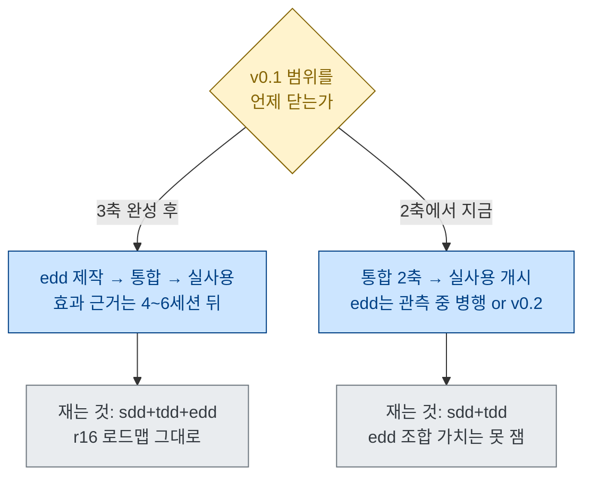
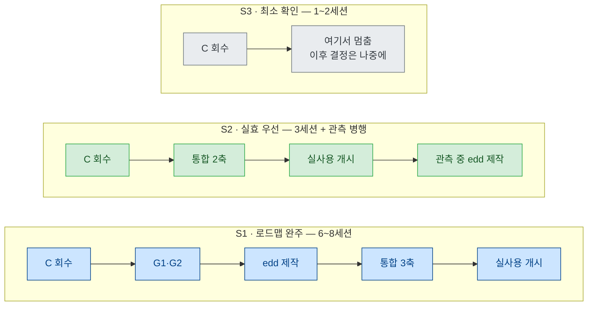

# 다음 일정 — 방향 5개와 조합 시나리오 3개 — r27

**상태**: 결정 대기. **이 문서는 작업 지시서가 아니다** — 무엇을 어떤 순서로 언제 할지만 늘어놓고,
고른 뒤에 그 방향의 지시서를 따로 쓴다(r22·r24가 그 형식이었다).
**이전**: [r26.md](../2026-08-14/r26.md) — verify-tdd 평가 종결. 현황 전체는 `docs/STATUS.md`.
**번호**: 전 브랜치 `docs/next/` 대조 결과 최대 사용 번호 r26, r21은 결번(예약) → r27 채택.

---

## 1. 지금 서 있는 자리

- **관측 5트랙 종료.** 갭은 §4가 아니라 §2에 있고, §2는 통제 실험으로 못 잰다(삼각 모순).
- **v0.1은 4단계 중 2단계까지.** tdd(16줄)·sdd(79줄) + 계측기 2종. edd 미착수, 통합 미착수.
- **효과 근거는 아직 0이다.** 스모크는 «문안이 도달했는가»만 재고 효과 주장을 금지한다(r16 §4).
  실효를 잴 자리는 실사용 2회차 하나뿐인데 아직 안 열렸다.

실측 소요 (일정 어림의 근거로만 쓴다):

| 지난 작업 | 세션 | 비용 |
|---|---|---|
| 1단계 tdd 제작 + 스모크 1런 | 1 | $0.40 |
| tdd 재점검 4런(A·B·C + 무효 1) | 1 | ~$3 |
| verify-tdd 신설 | 1 | 런 없음 |
| verify-tdd 평가 6런 | 1 | $3.66 |
| 2단계 sdd 제작 + 스모크 4런 | 1 | **≈$11.7** (대화형 S-C가 $8.64) |
| 실사용 1회차 | 개시 3 + 관측 | 달력 **10일** |

**교훈 하나**: r16 §4의 «4단계 합쳐 $10 안팎» 어림은 이미 틀렸다 — 2단계 하나가 $11.7이었다.
대화형 런이 들어가는 단계는 $10 단위로 잡는 게 맞다.

---

## 2. 결정해야 할 것

### 2-1. 진짜 분기점은 하나다 — v0.1의 범위를 2축에서 닫는가, 3축까지 가는가

나머지는 전부 여기서 파생된다. 이유는 **실사용 2회차가 처치 고정을 요구**하기 때문이다.
1회차는 43줄 무결성을 종료 시점까지 유지했고 그게 관측의 전제였다(REPORT4 머리말). 즉 —

> **실사용 2회차를 여는 순간 v0.1의 범위가 확정된다.**

그래서 «edd를 먼저 만들까»는 사실 «실효 검증을 얼마나 뒤로 미룰까»와 같은 질문이다.

### 2-2. 방향 5개

| # | 방향 | 순서 | 어림 | 사용자 결정 선행 |
|---|---|---|---|---|
| **A** | **로드맵 직진** | edd 제작 → 4단계 통합 → 실사용 개시 | 4~6세션 · $25~40 | G1·G2 |
| **B** | **2축으로 닫고 실효 먼저** | 4단계(2축) → 실사용 개시 → edd는 v0.2 | 2~3세션 · $10~20 | G3 |
| **C** | **회수 라운드** | 설치형 트리거 · README · 스모크 인프라 · 콘솔 개선 | 1~2세션 · $1~5 | 없음 |
| **D** | **병행** | 실사용 2회차(대상 리포)를 열어두고 proj3에서 edd 제작 | 병렬 | G3 (+ 나중에 G1·G2) |
| **E** | **동결·문서화** | 지금까지를 v0.1로 닫고 더 안 만든다 | 1세션 | 없음 |

**A — 로드맵 직진.** r16 §2가 정한 순서(tdd → sdd → edd → 통합) 그대로다. 얻는 것은
«sdd+edd가 가치 가설의 핵심 조합»(r16 §5-2)이라는 설계 전제를 실사용에서 실제로 재는 것.
잃는 것은 시간 — 효과 근거 0인 상태가 4~6세션 더 간다. 그리고 edd는 **문안 시드가 없는 유일한 축**이라
가장 무거운데, 정작 «edd가 tdd를 흡수한다»(exp/FROZEN.md §8)는 관측 때문에 조합 가치가 확실하지 않다.

**B — 2축으로 닫고 실효 먼저.** 효과 근거를 가장 빨리 얻는다. 부수 이득이 하나 더 있다 —
**G1·G2(edd 정의·동결 강도)를 더 나은 정보로 결정하게 된다.** 2축 실사용에서 «에이전트가 스스로
검증을 도출하고 사용자가 승인하는» 장면이 실제로 나오는지 보고 나면 [가정]을 확인하기 쉬워진다.
잃는 것은 두 가지: r16 순서 이탈(계획 변경이라 승인 사항)과, 4단계 «full 스모크: 산출물 4종이 순서대로
나오는가»가 3축 전제라 2축용으로 재정의해야 한다는 것.

**C — 회수 라운드.** 축을 늘리지 않고 미뤄둔 것만 소진한다. 핵심은 **설치형 트리거 확인**이다 —
실험·스모크는 전부 `--append-system-prompt` 주입이었고, **실제 배포 형태(`.claude/skills` 설치)에서
description으로 발동하는지 한 번도 확인한 적이 없다.** 실패하면 배포 형태 전체가 흔들리는데, 확인은
싸고(리포 밖 스크래치 1런) **2축만으로도 된다**. 다른 세 항목(README · 스모크를 git 밖에 두기 ·
verify-tdd 콘솔 개선)도 어느 방향을 고르든 버려지지 않는다.

**D — 병행.** 실사용 2회차는 **별도 리포에서 돌아간다**(1회차도 `ai-prompt-vault` 세션과 proj3 세션이
분리돼 있었다). 그래서 2회차를 열어둔 채 proj3에서 edd를 만드는 것은 **물리적으로 가능하다** — 2회차에
주입한 문안만 안 건드리면 처치 고정은 지켜진다. 달력 시간을 벌 수 있다는 게 이 방향의 전부다.
대신 정직하게 적어야 할 비용: **2회차가 «2축판 관측»으로 소진된다.** 3축을 재려면 3회차가 필요한데,
실사용은 대상 프로젝트 하나와 달력 10일을 먹는다.

**E — 동결·문서화.** 더 안 만들고 지금까지를 쓸 수 있는 형태로 닫는다. 실제로 굴러가는 물건이 손에
남는다는 게 유일하고 진짜인 이득이다. 다만 **효과 근거 0인 채로 닫는 것**이라, 이 리포가 다섯 트랙
내내 지켜온 «근거 없이 주장하지 않는다» 규율에 비추면 «완성»이 아니라 «중단»으로 기록해야 한다.

### 2-3. 조합 시나리오 3개

| | S1 로드맵 완주 | S2 실효 우선 | S3 최소 확인 |
|---|---|---|---|
| 세션 | 6~8 | 3 + 관측 | 1~2 |
| 비용 어림 | $30~45 | $12~22 | $1~5 |
| 효과 근거가 나오는 시점 | 6~8세션 뒤 + 달력 10일 | 3세션 뒤 + 달력 10일 | 안 나옴 |
| v0.1이 재는 것 | 3축 | 2축 | — |
| 되돌리기 | 어렵다(2회차 소진) | 어렵다(2회차 소진) | 쉽다 |

### 2-4. 어느 방향을 골라도 버려지지 않는 것 (= 먼저 해도 손해가 없다)

1. **설치형 트리거 확인** — 리포 밖 스크래치. 확인 항목 2개: ① 테스트를 만든 **직후**(작업 중간)에
   발동하는가(완료 시점에야 발동하면 중간 삭제를 못 막는다) ② «TDD로 해줘» 류의 과발동이 무해한가.
2. **`framework/README.md`** — 조합 안내(어떤 상황에 어떤 축을 끄는가). 근거는 r16 §5에 이미 있다.
3. **다음 스모크는 앱을 git 밖에 두기** — `git status`가 이웃 산출물 이름을 노출하는 문제(r25 §4-3).
4. **verify-tdd 콘솔 개선 검토** — 실용성 ① 2/4의 미달분. 단 판정 로직을 건드리면 새 표본이 필요하다.

---

## 3. 권장과, 사용자가 답할 것

**권장: C를 먼저 1세션, 그다음 S2.** 근거 셋 —

1. **설치형 트리거는 «실패하면 아픈데 확인은 싼» 유일한 항목이다.** edd를 만든 다음에 «설치하면 발동을
   안 한다»를 알게 되면 손실이 크고, 지금 확인하는 데는 2축이면 충분하다.
2. **실사용은 달력을 먹는다.** 시계를 먼저 돌려놓고 그동안 edd를 만드는 편이 총 소요가 짧다(방향 D).
3. **G1·G2는 지금보다 그때 더 잘 답할 수 있다.** edd 정의의 [가정]은 2축 실사용에서 간접 관측된다.

**권장에 대한 반론도 같이 둔다**(이게 S2의 진짜 비용이다): 2회차가 2축판 관측으로 소진되면 3축을
재려면 3회차가 필요하고, 실사용은 대상 프로젝트 하나와 달력 10일을 요구한다. **«실효를 빨리 보는 것»과
«완성판을 재는 것» 중 하나만 고를 수 있다** — 실사용 자원이 그만큼 비싸다. r16 로드맵을 지키는 쪽을
택한다면 A(=S1)가 틀린 선택이 아니다.

**답이 필요한 것 3개**:

| | 질문 | 기본값(답 없으면 이렇게 간다) |
|---|---|---|
| Q1 | **v0.1을 2축에서 닫는가, 3축까지 가는가** | 3축 (r16 로드맵 유지) |
| Q2 | **실사용 2회차를 지금 여는가** — 기본안은 멀티 태그·필터형 리소스/북마크 매니저다. 물을 것은 하나: «지금 실제로 만들어 쓸 물건인가»(G3) | 열지 않음 |
| Q3 | **회수 라운드(C)를 먼저 할 것인가** | 한다 (무의존이고 쌈) |

Q1이 «3축»이면 G1·G2(edd 정의 승인 · 동결 강도)를 그다음에 물어야 한다 — 그 둘은 edd 지시서를 쓰기
전에 필요하다.

---

## 4. 열어둔 리스크

1. **이 문서는 일정만 정한다.** 고른 방향의 실행 설계(스모크 과제·판정 기준·사전 등록 지표)는 별도
   지시서가 필요하고, 그 문서 없이 착수하면 r22·r24가 세운 규율(«결과를 보기 전에 박는다»)이 깨진다.
2. **어느 시나리오든 v0.1의 효과는 실사용 2회차 이전에는 알 수 없다.** 스모크를 몇 번 더 돌려도
   n=1 신호일 뿐이고, 이 리포는 그것으로 효과를 주장하지 않기로 이미 정해뒀다.
3. **비용 어림의 신뢰도는 낮다.** 근거는 지난 5세션의 실지출뿐이고, 대화형 런이 몇 턴으로 끝나는지가
   비용을 지배한다(S-C 2차는 64턴 $5.57). ±50%로 읽는 게 맞다.
4. **실사용 2회차의 원리적 한계는 1회차와 같다** — 통제군 없음 · n=1 · 관찰자가 곧 사용자 ·
   작성자가 택소노미를 아는 오염은 제거 불가(r23 §4-4). 2회차를 연다고 이게 나아지지 않는다.
