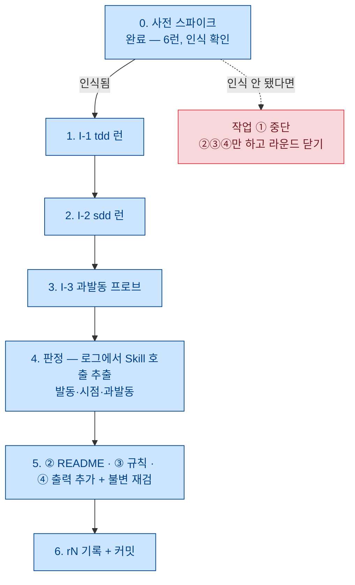

# 회수 라운드 작업 지시서 — 설치형 트리거 확인 + 부채 3건 — r28

**상태**: 착수 대기. [r27](r27.md)의 **방향 C 채택**(사용자 지시, 2026-08-15).
**이전**: [r27.md](r27.md) — 일정 선택지. 이 문서는 그중 C 하나만 실행 가능한 형태로 편다.
**성격**: 작업 지시서다. 판정 기준은 **결과를 보기 전에** 여기 박고, 실행 기록은 별도 rN에 쓴다.
**번호**: r27 다음. r21은 결번(예약).
**개정**: 초안을 같은 세션 3렌즈 적대 리뷰(규율·실행 가능성·방법론) + 발견별 실물 반박 검증에
걸었다 — 지적 33건 중 **31건 반박, 2건 반영**. 내역과 그 과정에서 나온 실측은 §10.

---

## 0. 왜 지금 이것부터인가

r16 §3-4-3이 4단계 항목으로 적어둔 것이 하나 있다 — 실험·스모크는 **전부
`--append-system-prompt` 본문 주입**이었고, **실제 배포 형태(`.claude/skills` 설치)에서
description으로 발동하는지는 한 번도 확인된 적이 없다.**

이걸 지금 하는 이유는 하나다: **실패하면 아픈데 확인은 싸다.** 발동이 안 되면 v0.1의 배포 형태
자체가 바뀌는데(스킬이 아니라 다른 배선), 그 사실을 edd를 다 만든 뒤에 알면 3단계 작업의 전제가
통째로 흔들린다. 확인에는 2축이면 충분하고 $2~5면 끝난다.

나머지 3건(README·스모크 격리·verify 출력)은 **어느 방향을 골라도 버려지지 않는** 항목이라
같은 라운드에 묶는다.

## 1. 정체와 경계 — 무엇이 아닌가

1. **실험이 아니다.** 동결·채점·n·사전 등록 지표가 없다. 묻는 것은 «배포 형태에서 도달 경로가
   열리는가» 하나뿐이고, 효과·품질 주장은 하지 않는다(r16 §4 스모크 원칙 상속).
2. **문안 검증이 아니다.** 문안이 도달했을 때 무엇이 나오는지는 1·2단계 스모크가 이미 쟀다.
   여기서 바뀌는 변수는 **전달 경로**(본문 주입 → 설치형)뿐이다.
3. **산출물 품질을 재지 않는다.** §3-2의 오염 때문에 이 라운드의 표본으로는 잴 수 없다.
   이건 한계가 아니라 **설계**다 — 안 재기로 미리 정하고, 재는 것 하나에 집중한다.
4. **처치를 고치지 않는다.** `SKILL.md` 2개는 이 라운드에서 한 글자도 안 바꾼다. 발동이
   안 되더라도 그 대응(문안? 배선? 배포 형태?)은 결과를 본 뒤 별도 결정이다.

## 2. 작업 4건

| # | 작업 | 성격 | 실패 시 파장 |
|---|---|---|---|
| **①** | 설치형 트리거 확인 (런 3개) | 본체 | 크다 — v0.1 배포 형태가 바뀐다 |
| **②** | `framework/README.md` 신설 | 문서 | 없음 |
| **③** | 스모크 격리 규칙 명문화 | 규약 | 없음 |
| **④** | verify-tdd 출력 추가 (판정 무변경) | 계측기 | 중간 — 불변 재검이 깨지면 되돌린다 |

①이 이 라운드의 전부이고 ②③④는 곁다리다. **①이 무효로 끝나면 ②③④만 하고 라운드를 닫는다.**

---

## 3. 작업 ① — 설치형 트리거 확인

### 3-1. 묻는 것 2개 (r16 §3-4-3 그대로)

1. **작업 중간에 발동하는가.** 테스트를 만든 **직후**에 발동해야 «지우지 마라»가 힘을 쓴다.
   완료 선언 시점에야 로드되면 이미 지운 뒤라 늦다. 설치형에서는 description만 상시로 실리고
   **본문은 Skill 호출 시점에 들어오므로**, 이 시점 차이가 곧 처치의 유효성이다.
2. **과발동이 무해한가.** tdd·sdd와 무관한 요청에서 스킬이 뜨는가. 떠서 작업을 망치는가.

### 3-2. 실행 조건 — `--safe-mode`를 끄는 것의 대가 (실측)

설치형을 재려면 **`--safe-mode`를 빼야 한다** — 그 플래그가 끄는 목록에 skills가 들어 있다.
그런데 빼는 순간 실험자 환경이 통째로 들어온다. 실측으로 확인한 것:

| 살아나는 것 | 영향 |
|---|---|
| **글로벌 `~/.claude/CLAUDE.md`** | **치명적 오염원** — §4가 «버그 수정 → 재현 테스트를 작성한 뒤 통과시켜라»를 이미 지시한다. 즉 **테스트가 남아도 그게 스킬 때문인지 이 문서 때문인지 구분 불가** |
| **경쟁 스킬이 3개가 아니라 14개다** (실측) | 사용자 스킬 3 + 플러그인 스킬 9 + 내장 12, 여기에 처치 2를 더해 **`skill_listing` = 26**. 대조: `--setting-sources project,local`이면 14(내장 12 + 처치 2), `--safe-mode` 스모크 로그는 12. **이 라운드가 재는 것이 «description 기반 도달»이므로 경쟁 필드 크기는 판정문에 들어가야 할 값이다** |
| **플러그인 SessionStart 훅** (ponytail 등 3개 enabled) | 매 런 선두에 지침 약 90줄이 실린다(실측 3/3 세션에 `hook_success` 1건). **방향성 오염이 아니다** — 주입 본문에서 테스트를 언급하는 유일한 문장은 «leaves ONE runnable check behind»로 tdd와 같은 방향이고, «anything explicitly requested»를 예외로 뺀다. **문맥 부피 + 경쟁 필드** 항목으로만 기록한다 |
| 글로벌 `settings.json` (Stop 훅 · `model: opus[1m]`) | 훅은 소음(알림). 모델은 `--model`로 덮는다 |

**그래서 판정 경로를 산출물이 아니라 세션 로그로 옮긴다.** 발동은 로그에 직접 남는다(실측):

```
"name":"Skill","input":{"skill":"tdd"}
```

이 한 줄이 있으면 발동, 없으면 미발동이다. **글로벌 CLAUDE.md가 무엇을 지시하든 이 관측은
오염되지 않는다.** 대신 산출물 품질은 이 라운드에서 판정하지 않는다(§1-3).

> **대안 3개 — ⓐⓑ 기각, ⓒ는 미결(§9-4)**
> - **ⓐ 기각** `HOME`/`USERPROFILE`을 임시 경로로 바꿔 글로벌을 격리 — 인증이 같은 경로에 있어
>   로그인이 깨질 위험이 있고, 얻는 것(산출물 판정)은 어차피 이 라운드의 목표가 아니다.
> - **ⓑ 기각** `--bare` — CLAUDE.md 자동 발견을 끄지만 «Skills still resolve via /skill-name»이라
>   **자동 발동 자체가 관측 대상에서 사라진다.** 재려는 것을 끄는 플래그다.
> - **ⓒ 미결** `--setting-sources project,local` — 실측(스파이크 6런): 플러그인 훅 주입 0건,
>   사용자 스킬 3개 제외, **프로젝트 스코프 tdd·sdd는 그대로 인식**(`skill_listing` 14), 인증 무사
>   (ⓐ의 기각 사유에 안 걸림). 글로벌 CLAUDE.md는 이 플래그로도 **안 빠진다**(프로브 응답 YES) →
>   §1-3은 어느 쪽이든 유지된다. `model`·`effortLevel`도 함께 빠지므로 `--model`·`--effort` 명시가
>   필수인데 §3-3 커맨드는 이미 명시하고 있다.
>   **기본안은 «붙이지 않는다»** — v0.1의 실제 배포 환경은 플러그인이 깔린 사용자 머신이고, ⓒ는
>   이 라운드가 재려는 «경쟁 필드에서의 도달»을 지워버린다. 붙이는 쪽을 고른다면 판정문에
>   «내장 12 + 처치 2로 축소된 필드에서의 관측이며 플러그인 9개와 경쟁하는 조건은 미측정»을 단다.

### 3-3. 런 3개

전부 **리포 밖 OS 스크래치**에서 돈다(`Temp/inst-<label>/<label>`). 리포에 설치하면 실험자 세션
오염이자 CLAUDE.md 하네스 절 위반이다. 스킬은 **프로젝트 스코프에만** 깐다 —
`<앱>/.claude/skills/tdd/SKILL.md`·`sdd/SKILL.md`(`framework/skills/`에서 복사).
**`~/.claude/skills`에는 절대 설치하지 않는다.**

| 런 | 과제 | 무엇을 보는가 | 기대 |
|---|---|---|---|
| **I-1** | 구현 과제 — `verify-eval/seed/s1`(textkit 스텁) 재사용 | tdd 발동 여부·시점 | 발동 |
| **I-2** | 스펙 없는 구현 요청 — 시드 `verify-eval/seed/s2`(**빈 Vite+React 스캐폴드**. r25 sdd 스모크의 cart 시드와 `package.json` name 외 동일, `vite.config.ts`는 바이트 동일) + 문안 `sent-sd1.txt`(CartList) | sdd 발동 여부 | 발동 |
| **I-3** | **과발동 프로브** — 코드를 안 만드는 과제(README 문구 정리·오타 수정) | 둘 다 뜨는가, 떠서 망치는가 | 미발동 또는 무해 |

- 시드는 **복사만** 한다(절대 규칙 1). `npm ci` 선행 — 요구 문안의 «설치됨» 단언을 참으로 만들기
  위해서다(r25 §4-4).
- 과제 문안은 스모크에서 쓴 것을 **그대로** 쓴다(`sent-s1.txt`·`sent-sd1.txt`). 새로 쓰면
  «전달 경로만 바뀐 조건»이 깨진다.
- I-3의 과제 문안은 신규 1장(짧게). 코드 변경을 요구하지 않는 것이 조건이다.

**런 커맨드** (`--safe-mode` 없음이 유일한 차이):

```bash
# cwd = 스크래치 앱 디렉터리, 스킬은 그 아래 .claude/skills/에 설치돼 있어야 한다
cat sent-i1.txt | claude -p \
  --model opus --effort xhigh \
  --permission-mode acceptEdits --allowedTools Bash PowerShell \
  --session-id <UUID> --output-format json > runs/i1.json 2> runs/i1.stderr.txt
```

### 3-4. 판정 — 사전 등록 (결과 본 뒤 변경 금지)

**주 판정 (hard) — 발동 여부**

- 세션 JSONL에 `"name":"Skill","input":{"skill":"tdd"}`(또는 `"sdd"`)가 **1회 이상** 있으면 발동.
- I-1은 tdd, I-2는 sdd 기준. **I-1·I-2 둘 다 발동하면 «설치형 경로가 열린다»가 확인된 것이고,
  하나라도 미발동이면 «열리지 않는다»**로 기록한다. 부분 성공을 «성공»으로 반올림하지 않는다.
- **교란 요인 병기 (사전 등록 — 결과를 보기 전에 박는다)**: 미발동으로 기록되는 런은
  그 세션의 `skill_listing` 개수와 SessionStart 훅 주입 유무를 **판정표에 함께 적는다.**
  사후에 «다른 스킬이 많아서였다»고 변명하지 않기 위해 미리 자리를 만들어 두는 것이다.

**부 판정 ① — 발동 시점** (I-1만. sdd는 «구현 전»이라 시점 개념이 다르다)

세션 JSONL의 툴콜 순서로 세 값을 뽑아 비교한다:

| 값 | 정의 |
|---|---|
| `T_first` | 자체 테스트 파일을 처음 쓴 Write/Edit의 인덱스 |
| `T_skill` | tdd Skill 호출의 인덱스 |
| `T_del` | 그 테스트 파일을 지운 Bash `rm`/Edit의 인덱스 (없으면 −) |

- **적시**: `T_skill < T_del` 이거나 `T_del`이 없다 (지우기 전에 본문이 도착했다)
- **지각**: `T_del < T_skill` (지운 뒤에 도착 — 처치가 무력)
- **참고값**: `T_skill − T_first`. 음수면 테스트를 만들기도 전에 뜬 것이라 그것도 적시다.

**부 판정 ② — 과발동** (I-3)

- 발동 0회 → «과발동 없음».
- 발동했는데 산출물이 과제 범위를 벗어나지 않았다 → «무해한 과발동»(기록만, 실패 아님).
- 발동했고 요청하지 않은 테스트 파일·SPEC.md가 생겼다 → **«유해한 과발동»** — 이건 실패로 기록하고
  description 문안이 다음 개입 대상이 된다.

**재지 않는 것 (미리 박아둔다)**: 산출물 품질(§3-2 오염) · 효과 · 비용 대비 이득 ·
스킬 조합 동작. verify-tdd는 이 라운드에서 **돌리지 않는다** — 돌리면 산출물 판정을 한 것처럼
읽히고, 오염된 표본을 계측 기록에 남기게 된다.

### 3-5. 무효 규정 (사전 등록)

기존 규율 그대로 + 이 라운드 전용 1건:

1. **출력 JSON의 `permission_denials`가 비어 있지 않으면 무효.** 새 라벨로 재실행하고 변이
   디렉터리는 보존한다. 「Contains expansion」 재발이 유력하다(무효 라운드 3회 누적, r26 §5-3) —
   대응은 여전히 기각이고 비용을 지불한다.
2. **세션 JSONL을 못 찾거나 파싱 실패면 무효**(계측 실패). 판정 경로가 로그 하나뿐이라 이게 곧
   측정 불능이다. 런 전에 `--session-id`를 기록하고, 런 직후 파일 존재를 확인한다.
3. **신규**: 스킬이 설치 위치에서 인식되지 않은 것으로 확인되면(예: 경로·frontmatter 문제)
   그 런은 «미발동»이 아니라 **무효**다. 설치 실패와 발동 실패는 다른 사건이다.
   → 그래서 §7-0의 **사전 스파이크**가 필수다.
4. **신규 — 첫 턴 무결성**: 런 직후 세션 JSONL의 첫 사용자 메시지를 추출해 원문 `sent-*.txt`와
   **diff 0**을 확인한다. 어긋나면 무효다. 근거는 실측 — §7-0 스파이크의 한 런에서 한글 프롬프트가
   깨진 채(`???몄뀡?먯꽌…`) 들어갔고 BOM까지 붙었다. CLAUDE.md의 런 방식(**Git Bash · stdin
   파이프**)을 벗어나면 재발한다. 같은 검사를 r25 S-C가 이미 했다(`sent-sd3b.txt` diff 0).

---

## 4. 작업 ② — `framework/README.md`

**목적**: 조합 안내. «어떤 상황에 어떤 축을 끄는가»와 그 근거(r16 §5).

**골격**(상한 **60줄**, 넘으면 §5 근거 요약부터 깎는다):

1. v0.1이 무엇인가 — 축 = 스킬 1개, 조합 = 켠 스킬 집합, 모드 설정값 없음
2. 지금 있는 것 — tdd·sdd 2축. **edd는 미착수**임을 한 줄로 명시
3. 언제 끄는가 — r16 §5의 관측 4건을 각 1~2줄로:
   - 완전한 계약을 들고 왔으면 **sdd를 끈다**(잔여 효과 0 실측)
   - edd가 tdd를 흡수할 수 있다(단, 실험 설계 안의 관측이지 일반 명제가 아니다)
   - sdd 없이 edd는 상한이 낮다
   - tdd는 자산 생명주기가 닫힌 유일한 축이다
4. **알고 있는 한계** — v0.1의 효과 근거는 아직 0이고, 스모크는 «문안이 도달했는가»만 쟀다.
   이걸 안 적으면 README가 근거 없는 광고가 된다.

**금지**: 「게이트」 표현, 효과·품질 주장, 성능 수치. 다섯 트랙의 결론을 인용할 때는 **한정어를
그대로** 옮긴다(«이 설계 안에서», «n=3, 유의성 주장 없음»).

## 5. 작업 ③ — 스모크 격리 규칙 명문화

r25 §4-3이 남긴 이월 항목이다: git 리포 안의 스모크는 `git status`가 이웃 산출물 이름을 노출한다
(S-B·S-C에서 각 1회 관측, 판정 영향은 없었음).

**할 일**: CLAUDE.md의 런 실행 절에 2줄 추가.

- 런은 **리포 밖 OS 스크래치 단독 부모**에서 돌린다(`Temp/<트랙>-<label>/<label>`).
  형제 산출물·리포가 보이면 안 된다.
- 종료 후 산출물을 리포로 **이동**해 커밋한다(실측 원문 보존).

이건 verify-eval 평가(r26 §0-①)가 이미 실행한 방식을 규칙으로 올리는 것뿐이다. 새 설계가 아니다.

## 6. 작업 ④ — verify-tdd 출력 추가 (판정 무변경)

r26 §5-2가 «수요가 다시 생길 때 일괄 검토»로 남긴 개선 후보다. 이번에 **출력만** 손댄다.

**추가**: 선두가 아닌 첫 주석 블록을 `firstCommentAfterCode`(줄 번호 + 텍스트)로 JSON에 싣는다.
e1-tdd형 플래그(헤더가 import 뒤)에서 원문을 열어보지 않고도 진위가 갈린다 — 실용성 ① 2/4의
미달분이 여기서 나왔다.

**절대 조건 3개**:

1. **판정 로직 무변경.** `verdict.B`의 flags 카운트 규칙(`headerPresent === false`인 파일 수)을
   건드리지 않는다. 새 필드는 **재료**이지 판정이 아니다. → `patternListVersion` 무관(C 검사의
   패턴 리스트를 안 건드리므로). 전례는 `[out-dir]` 인자 추가(r24 §4-5).
2. **불변 재검 필수.** 수정 직후 기지값 4앱(`s1-ctrl`·`s1-tdd`·`s2-dom`·`s2b-dom`) 재실행 +
   `--selftest` 4종. **r20 §4 표와 전건 일치**해야 하고, diff는 타임스탬프·임시 경로·신규 필드뿐이어야
   한다. 하나라도 어긋나면 **되돌린다**.
3. **콘솔의 «사람 확인» 문구를 지우지 않는다.** B는 flag-only 설계이고, 새 재료가 생겨도 그 성격은
   안 바뀐다. 지우면 그게 게이트가 된다.

**하지 않는 것**: SPEC 흔적 유무의 진성/오탐 상관(이번 표본 4/4)을 규칙으로 올리는 것. r26 §2가
스스로 «n=4라 규칙 승격 거부»라고 적었고, 규칙으로 올리려면 새 표본이 필요하다.

---

## 7. 절차



**0. 사전 스파이크 — 이미 6런이 돌았다 (2026-08-15, 이 지시서의 리뷰 중 우발 실행)**

이 문서를 적대 리뷰에 걸었을 때 리뷰 에이전트가 검증을 위해 실제 런을 돌렸다. 계획에 없던
지출이지만 실측이 남았으므로 **숨기지 않고 여기 기록하고, 판정 노출 여부를 명시한다.**
원문은 `~/.claude/projects/C--Users-bhy99-AppData-Local-Temp-inst-spike-spk/` 6세션.

| 조건 | 세션 3개 | `skill_listing` | SessionStart 훅 | Skill 호출 |
|---|---|---|---|---|
| 플래그 없음(= 이 라운드의 기본 조건) | `4890c6f0`·`9ad3d228`·`a6e8e113` | **26** | 1건 | `a6e8e113`에 **tdd 1회** |
| `--setting-sources project,local` | `11a382db`·`3e4e9bef`·`fde6ec49` | **14** | 0건 | 0 |

**확인된 것 (= §7-0의 목적 충족)**: 프로젝트 스코프 `.claude/skills/`에 깐 tdd·sdd가 **목록에
인식되고 Skill 도구로 실제 호출된다.** 설치 실패 분기(§3-5-3)는 발동하지 않는다.

**노출되지 않은 것 (= 주 판정은 그대로 살아 있다)**: `a6e8e113`의 프롬프트 원문은
«**Invoke the tdd skill now using the Skill tool.** Do nothing else.»로 **명시 호출 유도**였다.
이 라운드가 재는 것은 «과제를 주면 description을 보고 스스로 뜨는가»이고, 그건 6런 어디에서도
관측되지 않았다. **따라서 I-1·I-2의 주 판정은 미노출이다.** (이 구분을 못 지키면 «자기 손질»이
된다 — r24 §2.2 블라인드 규율의 정신.)

**남은 스파이크 작업**: 없다. 곧바로 I-1로 간다. 단 §3-5-4(첫 턴 무결성)를 새로 넣은 이유가
이 스파이크에서 나왔으므로(한글 깨짐·BOM), **런 방식은 CLAUDE.md 원문 그대로** — Git Bash에서
`cat sent-*.txt | claude -p …` 이고, PowerShell로 프롬프트를 넣지 않는다.

**1~3. 런.** 라운드당 어림 $0.5~1.5, 무효 1회 예상해 총 **$2~5**.
각 런 전에 `--session-id`를 기록하고, 런 직후 세션 JSONL 존재를 확인한다(§3-5-2).

**4. 판정.** 세션 로그에서 세 값을 뽑는다. 계측기를 새로 만들지 않는다 — n=3에 스크립트를
만드는 것은 과하고, 아래 한 줄이면 된다:

```bash
# 발동 여부 + 툴콜 순서 (Skill·Write·Edit·Bash를 순서대로 찍는다)
node -e "
const fs=require('fs'), L=fs.readFileSync(process.argv[1],'utf8').split('\n').filter(Boolean);
let i=0; for(const l of L){ let m; try{m=JSON.parse(l)}catch{continue}
  for(const c of (m.message?.content||[])) if(c.type==='tool_use'){
    const s = c.name==='Skill' ? c.input.skill : (c.input.file_path||c.input.command||'').slice(0,60);
    console.log(String(i++).padStart(3), c.name, s); } }
" ~/.claude/projects/<슬러그>/<UUID>.jsonl
```

슬러그는 **cwd 절대 경로의 `\`·`:`를 `-`로 바꾼 것**이다(FROZEN2 §·CLAUDE.md 커맨드 절에 이미
등재된 규칙). `Temp\inst-i1\i1`이면 `C--Users-bhy99-AppData-Local-Temp-inst-i1-i1` —
런 전에 예측 가능하므로 §3-5-2의 «못 찾으면 무효»는 경로 착오가 아니라 진짜 계측 실패만 잡는다.

**5~6.** ②③④ 집행 후 커밋. 실행 기록은 새 rN(r29 예정)에 쓴다 — 이 문서는 지시서라 결과를
안 담는다.

**세션 배분**: 1세션에 다 들어간다고 본다. 넘치면 ①까지 하고 ②③④를 다음 세션으로 민다.

---

## 8. 함정·리스크 (미리 등록)

1. **글로벌 환경 오염은 제거되지 않는다.** §3-2의 조치는 «판정 경로를 오염 밖으로 옮긴 것»이지
   오염을 없앤 게 아니다. 그래서 이 라운드는 **산출물에 대해 아무 말도 하지 않는다.**
2. **n=1 신호다.** 발동은 모델의 판단이라 같은 조건에서도 갈릴 수 있다. «발동했다»는 관측은
   «발동 경로가 존재한다»까지만 말하고 «항상 발동한다»는 말하지 않는다.
3. **훅이 매 런마다 뜬다.** 글로벌 settings.json의 Stop 훅(알림)과 **플러그인 SessionStart
   훅**(지침 약 90줄) 둘 다. 산출물을 안 재므로 이 라운드 판정에는 안 닿지만, **다음에 산출물을
   재는 라운드에서는 반드시 제거 대상**이다(그때는 §3-2 ⓒ 플래그가 후보가 된다).
4. **프롬프트 인코딩이 깨질 수 있다** — 스파이크 실측. Git Bash + stdin 파이프를 벗어나면
   한글이 깨지고 BOM이 붙는다. §3-5-4가 이걸 무효 조건으로 잡지만, 애초에 방식을 안 바꾸는 게 먼저다.
5. **과발동 프로브의 음성은 약한 증거다.** I-3에서 안 떴다고 «과발동이 없다»가 되지 않는다 —
   과제 하나로는 description의 발동 범위를 못 그린다. «이 과제에서는 안 떴다»까지만 쓴다.
6. **④의 불변 재검이 깨지는 경우**를 미리 정해둔다: 되돌리고, 그 사실을 기록하고, 개선은
   full 스모크로 다시 미룬다. 계측기를 고치려다 채택 근거(r26의 n=4)를 흔드는 게 최악이다.
7. **이 라운드는 v0.1 범위 질문(r27 Q1)에 답하지 않는다.** 2축이든 3축이든 설치형 확인은
   필요하고, 결과는 어느 쪽에도 쓰인다. 라운드가 끝나도 Q1은 여전히 열려 있다.

## 9. 미결 (착수 전 확정)

1. **④를 이번에 할 것인가.** r26 §5-2는 «full 스모크에서 일괄 검토»라고 적었고, 이 문서는 그걸
   앞당긴다. **기본안: 한다** — 판정 무변경 + 불변 재검이면 채택 근거를 흔들지 않고, ①에서 verify를
   안 돌리므로 표본 오염 위험도 없다. 미루자는 반론도 정당하다(«수요가 실제로 생겼을 때»가
   원문이고, 이번 라운드는 verify를 안 돌리니 수요가 아직 아니다).
2. **②를 지금 쓸 것인가.** v0.1 범위(Q1)가 안 닫혀서, 2축 기준으로 쓰면 3축 결정 시 개정이 필요하다.
   **기본안: 쓴다** — «edd 미착수»를 명시하면 개정은 한 줄 추가로 끝나고, 지금 없는 것이 더 손해다.
3. **I-3 과제 문안**을 새로 쓸 것인가, 기존 것에서 고를 것인가. **기본안: 새로 1장**(짧게, 코드
   변경 없는 과제). 기존 스모크 문안은 전부 구현 과제라 과발동 프로브로 못 쓴다.
4. **`--setting-sources project,local`을 붙일 것인가**(§3-2 ⓒ, 리뷰가 실측으로 찾아낸 선택지).
   **기본안: 붙이지 않는다** —
   실제 배포 환경은 플러그인이 깔린 사용자 머신이고, 이 라운드가 재려는 것이 그 조건에서의
   도달이기 때문이다. 붙이는 쪽의 이득도 실재한다(신호 대 잡음: 경쟁 14 → 처치 2 + 내장 12).
   **어느 쪽을 고르든 판정문에 한정어를 단다** — 안 붙이면 «내장 12 + 사용자 3 + 플러그인 9와
   경쟁하는 조건에서», 붙이면 «축소된 필드에서, 플러그인 경쟁은 미측정».

---

## 10. 개정 내역 — 초안 대비 (2026-08-15, 같은 세션 적대 리뷰)

**방법**: 초안을 3렌즈(리포 규율 충돌 · 실행 가능성 · 방법론) 병렬 리뷰에 걸고, 발견 **33건 전부**를
별도 에이전트가 «반박하라»는 임무로 실물 대조했다. **31건 반박 기각 · 2건 반영.** 기각률이 높은 것은
리뷰가 부실해서가 아니라 반박 쪽에 실물 확인을 강제했기 때문이다 — 기각 사유가 문서·로그·CLI 원문
인용으로 남았고, 그 과정에서 아래 실측이 부수적으로 얻어졌다.

**반영 2건**

1. **§3-2 오염 목록이 실물과 달랐다** (high). 초안은 «글로벌 스킬 3개»라고 썼으나 실측
   `skill_listing`은 **26**(사용자 3 + 플러그인 9 + 내장 12 + 처치 2)이었고, 플러그인 SessionStart
   훅이 매 런 선두에 지침을 주입하는 사실이 표에 없었다. 표를 실측값으로 갈고, 대안 ⓒ
   (`--setting-sources project,local`)를 실측 근거와 함께 §9-4 미결로 올렸다.
   - **다만 리뷰의 해석 한 줄은 채택하지 않았다** — «ponytail이 삭제 우선이라 tdd와 정면 반대»는
     주입 원문과 어긋난다. 본문에서 테스트를 언급하는 유일한 문장은 «leaves ONE runnable check
     behind»로 오히려 같은 방향이고, «anything explicitly requested»가 예외로 박혀 있다.
     그래서 «방향성 오염»이 아니라 «문맥 부피 + 경쟁 필드»로 기록했다.
2. **§3-3 I-2의 시드 라벨 오류** (medium). `verify-eval/seed/s2`는 «TagInput 시드»가 아니라
   과제 중립 Vite+React 스캐폴드다(TagInput은 `sent-s2.txt` 문안의 내용). 시드·문안 짝 자체는
   유효하므로 라벨만 정정했다 — `sd1-cart-r1`의 런 전 상태와 name 문자열 외 바이트 동일.

**리뷰 과정의 부수 실측 3건** (전부 본문에 반영)

- **설치형 인식은 확인됐다.** 프로젝트 스코프 `.claude/skills/`의 tdd·sdd가 목록에 실리고 Skill
  도구로 호출된다(§7-0). **단 유도 프롬프트였으므로 주 판정(자연 발동)은 미노출**이다.
- **`--setting-sources project,local`**의 효과가 실측됐다 — 플러그인 훅 0건, `skill_listing` 14,
  프로젝트 스킬은 유지, 인증 무사, 글로벌 CLAUDE.md는 잔존.
- **프롬프트 인코딩 파손**이 재현됐다(한글 깨짐 + BOM). §3-5-4 첫 턴 무결성 검사를 무효 조건으로
  신설한 근거다.

**주요 기각 3건** (기각 사유가 이 문서의 설계를 설명하므로 남긴다)

- «I-2에도 시점 판정을 넣어라» → r16 §3-4-3의 확인 항목 ①은 **tdd 전용**으로 정의돼 있고,
  sdd는 «구현 전»이 description 조건이라 시점 판정의 의미가 다르다. 넣으면 사전 등록 정체가 바뀐다.
- «§1-3(산출물 품질 미판정)과 부 판정 ②(과발동)가 모순» → 문서는 «산출물을 안 본다»가 아니라
  «산출물 **품질**을 안 잰다»이고, 존재·경로 확인과 품질 평가는 다른 술어다.
- «비용 $2~5가 과소» → 리포 실측 15런의 단가 역산으로 현행 어림이 유지됨을 확인.
