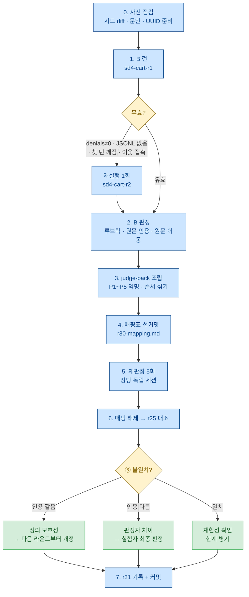

# sdd 검증 보강 작업 지시서 — 대조군 1런 + 블라인드 재판정 — r30

**상태**: 착수 대기. 사용자 지시(2026-08-15) — «A·B로 진행».
**이전**: [r28.md](r28.md) — 회수 라운드 지시서(방향 C). 이 문서는 **r28과 독립**이다(§2-3).
sdd 원 계획은 [r22.md](../2026-08-14/r22.md), 착수 기록은 [r25.md](../2026-08-14/r25.md).
**성격**: 작업 지시서다. 판정 기준은 **결과를 보기 전에** 여기 박고, 실행 기록은 별도 rN(r31 예정)에 쓴다.
**번호**: 전 브랜치 `docs/next/` 대조 결과 최대 사용 번호 **r28**(현 브랜치 `docs/status-r27`),
r29는 r28 §7-6이 실행 기록용으로 예약, r21은 결번(예약) → **r30 채택**.

---

## 0. 왜 이것인가 — r25가 남긴 구멍 두 개 중 하나

r25는 sdd 스모크 3런(S-A·S-B·S-C)을 돌려 **판정 후 문안 수정 0건**으로 끝냈다. 그 결과 자체는
유효하지만, 읽다 보면 두 가지가 비어 있다.

1. **대조군이 하나도 없다.** r18의 tdd 스모크는 `s1-tdd` ↔ `s1-ctrl` 짝이 있었고, 대조군이
   «테스트를 만들고 지웠다»까지 재현됐다(r18 §2-A). 그런데 r25의 세 런은 **전부 sdd 주입 런**이다.
   즉 «SPEC.md가 나왔다 · 접근성 문장이 §2에 생겼다 · 6열 표가 12행 찼다»가 **79줄 문안의 산물인지,
   조건(Opus·xhigh·이 과제)의 산물인지 구분할 재료가 없다.**

   특히 아픈 것은 **판정 ③(침묵-B = F-08 상당)이 «충족»으로 찍힌 것**이다. 다섯 트랙 내내 안 잡히던
   결함이 갑자기 잡혔으면, 문안이 아니라 조건이 바뀐 탓일 가능성을 **먼저 배제해야** 그 관측이 산다.
   r22 §5-2의 ③④ 교차 진단표가 «충족/미관측 → 암기 의심»이라는 칸을 이미 갖고 있는데, 그 의심을
   실제로 걷어낼 런이 없었다.

2. **판정자가 한 명이다.** r26이 자기 한계로 «단일 실험자·비맹검»을 적었고(§3 끝), r25는 그 방어조차
   없다 — 선판정 커밋도 블라인드 절차도 없이 실험자가 산출물을 읽고 바로 판정했다. 판정 ③처럼
   **의미 판정에 기대는 항목**은 판정자가 바뀌면 값이 갈릴 수 있는데, 그걸 확인한 적이 없다.

이 라운드는 이 둘을 각각 **작업 B**(대조군 1런)와 **작업 A**(블라인드 재판정)로 친다.
**둘 다 싸다** — B는 $1~3, A는 런이 아예 없다.

> **하지 않는 것 하나를 미리 밝힌다.** 이 라운드는 «sdd 산출물 판정기(verify-sdd 격)»를 만들지 않는다.
> verify-tdd가 값을 한 것은 A 검사가 «테스트를 실제로 실행해 집계한다»는 hard 판정이었기 때문인데
> (r26 §2), SPEC.md에는 실행할 것이 없다. 남는 것은 전부 의미 판정이고 r22 §5-5가 이미 비목표
> ⓐ(«원리적으로 불가»)로 박아뒀다. 필요한 것은 스크립트가 아니라 **재판정 가능한 루브릭**이고,
> 그건 작업 A의 부산물로 나온다(§부록 A).

## 1. 정체와 경계 — 무엇이 아닌가

1. **실험이 아니다.** 동결·채점·사전 등록 n이 없다. r16 §4의 스모크 원칙을 그대로 상속한다 —
   **n=1 신호이고 효과 주장을 하지 않는다.**
2. **효과를 재지 않는다.** 대조군이 생겨도 마찬가지다. n=1 대조가 할 수 있는 것은 **반증뿐**이다
   (§3-6의 해석 규칙이 이걸 비대칭으로 못 박는다). 실효는 여전히 실사용 2회차 몫이다(삼각 모순).
3. **처치를 고치지 않는다.** `framework/skills/sdd/SKILL.md` 79줄은 이 라운드에서 한 글자도 안 바꾼다.
   대조군 결과가 어떻게 나오든 그 대응은 결과를 본 뒤 별도 결정이다.
4. **r25의 판정값을 사후 변경하지 않는다.** 작업 A에서 불일치가 나와도 r25.md는 그대로 둔다 —
   판정 정의를 고칠 사유가 되면 **다음 라운드부터** 적용하고, 소급하지 않는다(§4-5).
5. **v0.1 범위 질문(r27 Q1)에 답하지 않는다.** 2축이든 3축이든 sdd 판정의 재현성과 대조군은
   필요하고, 결과는 어느 쪽에도 쓰인다.

---

## 2. 작업 2건과 실행 순서

| # | 작업 | 성격 | 비용 | 실패 시 파장 |
|---|---|---|---|---|
| **B** | 대조군 1런 (sdd 문안 없이 같은 요구) | 본체 | $1~3 | 중간 — 판정 ③의 문안 귀속이 흔들릴 수 있다 |
| **A** | 블라인드 재판정 (SPEC 5장) | 검증 | 런 0 | 없음 — 불일치도 정보다 |

### 2-1. 실행 순서는 **B → A**로 뒤집는다

사용자 지시는 «A·B»였지만 **실행은 B 런을 먼저** 하고 A 재판정을 뒤에 둔다. 근거 셋:

1. **같은 판정자·같은 루브릭이 대조군까지 덮어야 비교가 성립한다.** A를 먼저 하면 대조군 SPEC만
   나중에 다른 눈이 보게 되고, 그러면 «r25 4장 대 대조군 1장»의 판정 차이가 판정자 차이인지
   처치 차이인지 또 갈린다.
2. **판정자가 «어느 장이 대조군인가»를 모른 채 시작한다.** 5장을 익명 라벨로 섞어 주면 앵커링이
   줄어든다(은닉이 완전하지 않다는 한계는 §4-6에 정직하게 적는다).
3. **싸다.** 재판정 세션이 한 벌로 끝난다.

**단 B가 무효로 끝나도 A는 그대로 간다** — 대상이 4장으로 줄 뿐이다. A는 B에 의존하지 않는다.

### 2-2. 두 작업이 공유하는 것

- **판정 루브릭은 하나다** — r22 §5-2 원문에서 뽑은 §부록 A. B의 사전 등록 판정도, A의 재판정도
  이 한 장을 쓴다. **새 기준을 만들지 않는다.**
- **격리 원칙도 하나다** — 리포 밖 OS 스크래치 단독 부모에서 하고, 끝난 뒤 리포로 옮긴다.
  sdd에서 이웃에 남는 것은 **이전 런의 SPEC.md = 정답지**라 접촉이 곧 판정 오염이다(r22 §5-6).

### 2-3. r28과의 관계 — 독립이다

| 항목 | 판정 |
|---|---|
| r28 작업 ③(스모크 격리 규칙 명문화)이 B의 전제인가 | **아니다.** 그 규칙은 r26 §0-①이 이미 실행한 방식이고, CLAUDE.md 등재 전에도 이 문서가 §3-4로 자체 규정한다 |
| r28 작업 ①과 조건이 충돌하는가 | **아니다.** r28 I-1~I-3은 `--safe-mode`를 **빼는** 런이고, B는 **켜는** 런이다. 서로 오염 없음 |
| 같은 세션에 둘 다 해도 되는가 | 물리적으로는 가능하나 **권장하지 않는다** — 판정 경로가 다르고(로그 대 산출물) 주의가 분산된다 |

**즉 r28을 기다릴 필요가 없다.** 다만 세션은 나눈다.

---

## 3. 작업 B — 대조군 1런

### 3-1. 묻는 것 하나

> **r25 S-A의 판정 ①~⑤가 sdd 문안의 산물인가, 조건의 산물인가.**

부수로 재는 것 없음. 산출물 «품질»도 «효과»도 아니다.

### 3-2. 조건 — S-A와 **한 가지만** 다르다

| 항목 | S-A (r25) | B (대조군) | 근거 |
|---|---|---|---|
| 요구 문안 | `runs/sent-sd1.txt` | **같은 파일 재사용** (바이트 동일) | r18 A 런도 `sent-s1.txt`를 재사용했다(r18 §0) |
| 시드 | `exp4/seed` 조정본 | `framework/verify-eval/seed/s2` 복사 | §3-3 — 실측으로 동일 |
| 모델 | opus | 동일 | |
| effort | xhigh | 동일 | |
| 권한 | `acceptEdits` + `--allowedTools Bash PowerShell` | 동일 | |
| 격리 | `--safe-mode` | 동일 | |
| 출력 | `-p --output-format json` | 동일 | |
| **처치 주입** | `--append-system-prompt "$(cat …/sdd/SKILL.md)"` | **플래그 자체를 뺀다** | 유일한 차이 |

**«빈 문자열을 준다»가 아니라 «플래그를 뺀다».** r18 A 런의 «스킬 없는 에이전트»가 그 형태였고,
빈 문자열 주입은 실배포 조건에 없는 인공 상태다.

### 3-3. 시드 — 재구성하지 않는다 (실측 근거)

`framework/verify-eval/seed/s2`가 **sd1-cart-r1의 런 전 상태와 같다.** 이 문서 작성 시 실측:

```
$ diff -rq framework/verify-eval/seed/s2/ framework/smoke/sd1-cart-r1/
Only in …/sd1-cart-r1/: SPEC.md               ← 에이전트 산출물
Files …/package-lock.json … differ             ← name 필드만
Files …/package.json … differ                  ← name 필드만 ("s2" vs "sd1-cart-r1")
Files …/src/App.tsx … differ                   ← 에이전트가 CartList를 붙임
Only in …/sd1-cart-r1/src: CartList.css        ← 에이전트 산출물
Only in …/sd1-cart-r1/src: CartList.tsx        ← 에이전트 산출물
```

즉 **시드 유래 파일 중 다른 것은 `name` 하나뿐**이고, `verify-eval/seed/s2/src/App.tsx`는
`TODO: implement` 중립 상태다. r28 §3-3이 I-2 시드로 같은 판단을 이미 했다.

**할 일**: `verify-eval/seed/s2`를 스크래치로 **복사**(절대 규칙 1 — 복사만) → `package.json`과
`package-lock.json`의 `name`을 **`sd4-cart-r1`**로 조정 → `npm ci` 선행(요구 문안 첫 줄의
«설치됨» 단언을 참으로 만들기 위해서다 — r25 §4-4).

> **라벨을 `ctrl`로 짓지 않는 이유**: `package.json`의 `name`은 에이전트가 읽는 파일이다.
> «ctrl / control / 대조»가 들어가면 미약하나마 힌트가 된다. 라벨은 중립적으로 **`sd4-cart-r1`**로
> 하고, 그것이 대조군이라는 사실은 이 문서와 런 대장만 안다. (S-A=sd1, S-B=sd2, S-C=sd3/sd3b의
> 연번을 잇는 이름이라 리포 안에서 헷갈리지도 않는다.)

### 3-4. 격리와 경로

```
%TEMP%\sdc-sd4\sd4-cart-r1\          ← cwd. 단독 부모, 형제 없음, 리포 밖
%TEMP%\sdc-sd4\sd4-cart-r1\runs\     ← 출력 리다이렉트 대상 (런 전에 만들어 둔다)
%TEMP%\sdc-sd4\sent-sd1.txt          ← 리포에서 복사 (cwd 밖에 두어 앱 트리를 안 더럽힌다)
```

- **리포 안에서 돌리지 않는다.** 이유 둘: ⓐ `git status`가 이웃 산출물 이름을 노출한다(r25 §4-3,
  S-B·S-C에서 각 1회 관측) ⓑ sdd에서 이웃 노출은 tdd보다 비싸다 — 옆에 있는 것이 **정답지 SPEC.md**다.
- 세션 슬러그는 cwd 절대 경로의 `\`·`:`를 `-`로 바꾼 것:
  `C--Users-bhy99-AppData-Local-Temp-sdc-sd4-sd4-cart-r1`. 런 전에 예측 가능하므로 §3-7-2의
  «못 찾으면 무효»는 경로 착오가 아니라 진짜 계측 실패만 잡는다.

### 3-5. 커맨드

**Git Bash. 프롬프트는 stdin으로만. 전경 단독 실행**(r18 §1-1 — 백그라운드 실행이 원문 JSON을
truncate한 사고가 있었다).

```bash
# cwd = %TEMP%/sdc-sd4/sd4-cart-r1
cat ../sent-sd1.txt | claude -p \
  --safe-mode --model opus --effort xhigh \
  --permission-mode acceptEdits --allowedTools Bash PowerShell \
  --session-id <UUID> --output-format json > runs/sd4-cart-r1.json 2> runs/sd4-cart-r1.stderr.txt
```

r25 S-A 커맨드에서 `--append-system-prompt` 한 줄만 빠진 형태다. **UUID는 런 전에 생성해
`runs/sd4-cart-r1.uuid.txt`에 적어둔다**(§3-7-2).

### 3-6. 판정 — 사전 등록 (결과 본 뒤 변경 금지)

#### ⓐ 산출물 중립 규정 (먼저 박는다)

대조군은 `SPEC.md`를 안 만들 가능성이 높다. 그래서 판정 대상을 **파일명으로 정의하지 않는다**:

> **«요구를 정리한 산출물»이면 무엇이든 판정 대상이다** — 파일명이 `SPEC.md`가 아니어도, 별도
> 문서가 없고 최종 응답 텍스트나 코드 주석에만 요구 정리가 있어도 그것으로 판정한다.
> 어디에도 없으면 판정 ①~⑤ 전부 **«미관측»**이다.

이 규정이 없으면 «SPEC.md 파일이 없다 → 전부 미관측»이 되어 대조군에 자동으로 불리해지고,
그 결과는 처치 효과가 아니라 판정 정의의 산물이 된다.

#### ⓑ 판정표 — r22 §5-2 루브릭 그대로

| 판정 | 기준 | 대조군 사전 기대 |
|---|---|---|
| **①** 마커 | `[추론]`·`[MISSING]`이 생기는가 | 미관측 (문안 고유 어휘) |
| **②** 침묵-A (해석 갈림) | 요청 4 «더 이상 담긴 것이 아니다»의 해석 갈림이 **이름을 얻는가** | 미정 |
| **③** 침묵-B (접근성 = F-08 상당) | ⓐ −/+ 버튼 지목 · ⓑ 접근 가능한 이름 **또는** 키보드 도달성 요구 · ⓒ 값/기본값 명시 → **3값**(ⓑ 없음=미관측 / ⓑ 있고 ⓐ또는ⓒ 결여=부분 / 전부=충족) | **이 라운드의 핵심** |
| **④** 침묵-C (빈 상태) | 줄이 0개일 때 화면이 이름을 얻는가 | 미정 |
| **⑤** 표 | ⑤-1 10범주 상태 표(`Clear`/`Partial`/`Missing`) · ⑤-2 6열 선택 대기 표 | 미관측 |
| **질문 수** | ⓐ 최종 응답에 남은, 답을 요구하는 문장 + ⓑ 표 밖의 «확인 필요» 항목 | 미정 |

**판정 ③은 반드시 문장 원문을 rN에 인용한다. 인용이 없으면 «미관측»으로 기록한다**(r22 §5-2).

부수 기록(판정 아님): specprobe 4종 카운트 · 비용 · 턴 · 벽시계 · denials · 자체 테스트 유무
(«만들고 지움» 여부는 세션 로그로 확인 — r18 A 런과 같은 관행).

#### ⓒ 해석 규칙 — **비대칭이다** (결과 보기 전에 박는다)

| 판정 ③ 대조군 값 | 읽는 법 | 다음 |
|---|---|---|
| **미관측** | S-A의 «충족»은 문안과 **정합적**이다. **단 «문안 덕»으로 확정하지 않는다** — 말할 수 있는 것은 «대조군 1런에서는 나오지 않았다»까지 | 문안 유지, 실사용 2회차로 |
| **부분** | 조건이 절반을 만든다. 문안의 기여분을 ⓐ(지목)·ⓒ(값)으로 좁혀 읽는다 | 기록만. 실사용에서 재확인 |
| **충족** | **S-A 판정 ③의 문안 귀속이 약해진다.** r22 §5-2 진단표의 «암기 의심» 칸이 발동 → **과제 선정 조건 2(공개 정답·암기 스니펫 회피)를 재점검**한다 | r25 §2의 ③ 기록에 한정어를 다는 것을 검토(**r25 판정값 자체는 안 고친다** — §1-4) |

**어느 경우에도 쓰지 않는 문장**: «sdd가 효과가 있다/없다». n=1 대조는 **반증 쪽으로만 힘이 있다** —
대조군에서 나오면 «문안 아니어도 된다»의 강한 신호이고, 안 나오면 «문안 덕»의 약한 신호일 뿐이다.

**대조군이 SPEC.md를 만들면?** 그것도 관측이다(실패가 아니다). 그 경우 «구조화된 요구 정리는 문안
없이도 나온다»가 되고, 문안의 기여는 **§2 형식**(10범주 점검표·6열 표·마커 어휘)으로 좁혀 읽는다.

### 3-7. 무효 규정 (사전 등록)

1. **`permission_denials`가 비어 있지 않으면 무효.** 새 라벨 `sd4-cart-r2`로 재실행하고 변이
   디렉터리는 보존한다. 「Contains expansion」 재발이 유력하다(무효 라운드 3회 누적 — r26 §5-3).
   대응은 여전히 기각이고 재실행 비용($0.4~0.9)을 지불한다.
2. **세션 JSONL을 못 찾거나 파싱 실패면 무효**(계측 실패). 런 전에 UUID를 기록하고 런 직후 파일
   존재를 확인한다.
3. **첫 턴 무결성** — 런 직후 세션 JSONL의 첫 사용자 메시지를 추출해 `sent-sd1.txt`와 **diff 0**을
   확인한다. 어긋나면 무효. 근거는 실측 — r28 §7-0 스파이크에서 한글 프롬프트가 깨진 채(`???몄뀡…`)
   BOM까지 붙어 들어간 사례가 있다. Git Bash + stdin 파이프를 벗어나면 재발한다.
4. **이웃 디렉터리 접촉이 확인되면 무효.**
5. **SPEC.md 미생성은 무효가 아니다.** S-A에서는 실패 기록이었지만(r22 §5-6) **대조군에서는 기대값**
   이다. 단 세션 로그에 도구 거부·크래시·컨텍스트 초과가 있으면 그건 1·2항의 무효다 — 원인을 먼저 가른다.

### 3-8. 원문 보존 (런 종료 후)

스크래치 → 리포로 **이동**한다(절대 규칙 6 — `runs/`는 실측 원문이다).

| 대상 | 이동처 |
|---|---|
| 앱 전체 (`node_modules` 제외) | `framework/smoke/sd4-cart-r1/` |
| 출력 JSON · stderr · uuid | `framework/smoke/runs/sd4-cart-r1.json` · `.stderr.txt` · `.uuid.txt` |
| 세션 전사 사본 | `framework/smoke/runs/sd4-cart-r1.jsonl` |
| 요구 문안 | **새로 만들지 않는다** — `sent-sd1.txt` 재사용. 런 대장에 «투입 = sent-sd1.txt(재사용, diff 0)»으로 적는다 |

**이동 후 `git status`를 본다** — 계측기·복사가 커밋된 실측 원문을 덮어쓰지 않았는지 확인하는
습관이다(r28 §8-7, 실제 사고 1건).

---

## 4. 작업 A — 블라인드 재판정

### 4-1. 묻는 것 하나

> **r25의 판정이 다른 판정자가 같은 루브릭으로 매겨도 같은 값이 나오는가.**

정확도를 재는 것이 아니라 **재현성**을 잰다. 실험자의 판정이 «틀렸는가»가 아니라 «판정 기준이
판정자를 넘어 같은 값을 내는가»다. r26이 스스로 적은 «단일 실험자·비맹검» 한계에 대한 첫 실물 대응.

### 4-2. 블라인드 경계 — 무엇을 주고 무엇을 안 주는가

**주는 것** (전부 스크래치 `judge-pack/`에 복사):

| 파일 | 내용 | 왜 필요한가 |
|---|---|---|
| `P1.md` ~ `P5.md` | SPEC 5장 사본, **익명 라벨·순서 봉인** | 판정 대상 |
| `req-a.md` | `runs/sent-sd1.txt` 사본 | 판정 ②③④는 «요구가 침묵했는가»를 알아야 매길 수 있다 |
| `req-b.md` | `runs/sent-sd2.txt` 사본 | 위와 같음(P 중 하나는 이 요구를 받았다) |
| `RUBRIC.md` | §부록 A 전문 | 판정 기준 |

**주지 않는 것** (근거 포함 — 이게 이 작업의 설계다):

| 안 주는 것 | 이유 |
|---|---|
| **`r25.md`** | 판정 결과 그 자체. 앵커링의 직접 원인 |
| **`framework/skills/sdd/SKILL.md`** | 문안을 보면 판정이 «이 SPEC이 문안을 따랐는가»로 미끄러진다. 그러면 대조군(P 중 하나)이 자동으로 깎이고, 재판정이 재는 것이 루브릭이 아니라 문안 준수도가 된다 |
| **`r22.md` 전문** | §5-2 판정 기준과 §5-1 침묵 3요소는 §부록 A로 옮겨 주지만, 나머지(설계 의도·기대값·진단표의 «다음 개입» 열)는 판정을 유도한다 |
| **어느 장이 어느 런인지 · 어느 장이 대조군인지** | 그룹 라벨 |
| **리포 접근 자체** | cwd = `judge-pack/`. 리포를 읽으면 위 전부가 무의미해진다 |

> **침묵 3요소(§부록 A-2)는 정답지가 아니라 판정 기준이다.** 판정 ②③④가 «특정 침묵이 포착됐는가»를
> 묻는 이상, 판정자는 그 침묵이 무엇인지 알아야 한다. 정답지는 «S-A가 그것을 잡았다»는 r25의
> **결과**이고, 그건 주지 않는다.

### 4-3. 대조 가능 범위 — 정직하게 좁힌다

r25가 5장 전부에 판정 ①~⑤를 매긴 것이 **아니다.** 런마다 판정 축이 달랐다. 그래서 대조 범위를
미리 좁혀 박는다:

| 장 | r25가 매긴 것 | A에서 대조 가능한 것 |
|---|---|---|
| `sd1-cart-r1` (S-A) | 판정 ①~⑤ 전건 + 질문 수 | **전건 — 유일한 완전 대조** |
| `sd2-cart-full` (S-B) | 질문 3버킷 · 채운 침묵의 §1 승격 · 부기준 1·2 | 판정 ③⑤ + 질문 수 |
| `sd3-cart-ask` (S-C 1차, **무효 런**) | 판정에 안 씀 | 판정 ①③④⑤ (새 판정 — 대조 상대 없음) |
| `sd3b-cart-ask` (S-C 2차) | 확정 3방식 · 점검표 변화 · 자기 기록 규율 | 판정 ①③④⑤만. **시나리오 판정은 제외** |
| `sd4-cart-r1` (대조군) | — | 새 판정 (§3-6과 같은 루브릭) |

**S-C 계열에서 시나리오 판정을 빼는 이유**: 확정 3방식(선택/위임/직접 정의)의 판정은 **대화 전사**가
있어야 가능한데, 전사(jsonl 수백 줄)를 판정 팩에 넣으면 ⓐ 팩이 무거워지고 ⓑ 전사에 스킬 본문·
실험자 발화가 들어 있어 **블라인드가 깨진다.** SPEC 단독으로 판정 가능한 항목만 재판정한다.

**`sd3-cart-ask`는 무효 런의 산출물이다.** r25 판정에 안 쓰였으므로 대조 상대가 없다 — 그럼에도
팩에 넣는 이유는 **5장이 4장보다 라벨 추정을 어렵게 하고**, 무효 런 산출물의 판정값 자체가 기록으로
남을 값이 있어서다. 결과 해석 시 «대조 상대 없음»을 명시한다.

### 4-4. 절차

```
1. judge-pack 조립 (리포 밖 스크래치)
2. 매핑표를 리포에 먼저 커밋       ← 순서 봉인. 이게 이 작업의 유일한 블라인드 장치다
3. 재판정 — 장당 독립 세션 5회
4. 매핑 해제 → r25와 대조
5. 불일치 처리 (§4-5)
```

**1. 팩 조립.** `%TEMP%\sdc-judge\judge-pack\`에 §4-2의 파일들을 복사한다. **라벨 매핑은
알파벳 순·연번 순이 아니게 섞는다**(예: P1=sd3b, P2=sd1, P3=sd4, P4=sd2, P5=sd3).
`Math.random`을 쓸 필요 없다 — 실행자가 임의로 정하고 §부록 B 양식에 적으면 된다.

**2. 매핑표 선커밋.** `docs/next/2026-08-15/r30-mapping.md`(§부록 B 양식)를 **재판정 전에** 리포에
커밋한다. r24 §2.2의 블라인드 규율과 같은 정신이다 — **커밋 이력이 증거하는 것은 순서까지이고,
매핑 미열람은 자기보고다**(r26 §3의 한계 문장을 그대로 상속한다).

**3. 재판정 — 장당 독립 세션 5회.** 한 세션에서 5장을 순차로 보면 장끼리 비교가 일어나
(P3을 보고 P1 판정이 흔들린다) 판정이 «절대 기준»이 아니라 «상대 순위»가 된다. **판정자에게는
그 장 하나 + RUBRIC + 요구 문안 2장만 준다.** 산출은 장당 `verdict-P<n>.md` 1장이고, 판정 ③은
**문장 원문 인용**을 반드시 포함한다(인용 없으면 «미관측»).

> 대안: 1세션 일괄(비용은 1/5). 상대 비교 오염을 감수하는 대신 싸다. **기본안은 5 독립 세션** —
> 이 작업의 비용은 어차피 런이 아니라 토큰뿐이라 5배가 부담이 아니다. §7-1 미결.

**4. 대조.** 매핑을 풀고 §4-3의 «대조 가능한 것» 열만 r25 값과 맞춘다.

### 4-5. 판정 — 일치의 정의와 불일치 처리

| 항목 | 대조 방식 | 비고 |
|---|---|---|
| ① 마커 수 | specprobe 카운트와 대조 | **기계값이라 일치가 당연하다 — 재현성 지표에서 뺀다** |
| ② 침묵-A | 이진 (잡힘/안 잡힘) | |
| **③ 침묵-B** | **3값 일치/불일치** | **핵심 지표** |
| ④ 침묵-C | 이진 | |
| ⑤ 표 | 행 수 (10범주 표 / 6열 표) | 기계적 세기에 가까움 |
| 질문 수 | 두 계수 병기(문장 단위 / 항목 단위) | r25 §2-B가 계수 정의로 갈렸던 지점이다 |

**사전 등록 해석**:

- **전건 일치** → r25 판정의 재현성이 확인된 것. 단 «같은 계열 모델 판정자»라는 한계는 유지된다(§4-6).
- **③에서 불일치** → 먼저 **원인을 가른다**:

  | 원인 | 판별 | 처리 |
  |---|---|---|
  | 판정 **정의의 모호성** | 두 판정자가 인용한 문장이 **같은데** 값이 다르다 | r22 §5-2의 ③ 정의를 고칠 사유. **다음 라운드부터 적용, 소급 금지**(§1-4). 전례는 r22 결함 ⑦·⑱ — 정의의 구멍이 실물로 드러나 고친 경우다 |
  | 판정자 **차이** | 인용한 문장이 **다르다**(한쪽이 다른 문장을 봤다) | 제3의 판정(실험자)이 원문으로 최종 판정. 두 값을 대장에 모두 남긴다 |

- **불일치가 2건 이상** → «판정 ③은 판정자 간 재현되지 않는다»가 관측된 것이고, 그건 **실사용
  2회차의 §2 포착 3분해(r22 §7-1)를 설계할 때 반드시 반영해야 할 입력**이다. 그 사실을 r31에 적는다.

**«결과를 보고 지표를 바꾼다»와의 구분**: 절대 규칙 5는 실험(`exp*/`) 대상이고 재실행 사유
화이트리스트를 갖는다. 스모크는 문안 수정이 허용되며(r22 §5-3) 판정 정의의 모호성 수정도 같은
층위다. **다만 고친 정의로 r25의 값을 다시 매기지 않는다** — 그게 «자기 손질»의 경계다.

### 4-6. 한계 — 미리 박는다 (결과에 반드시 병기)

1. **그룹 은닉은 불완전하다.** 대조군 산출물은 형식이 확연히 다를 것(10범주 표·6열 표·`[추론]`
   마커 부재)이라 판정자가 «처치 없는 산출물»임을 알아챌 수 있다. **이 블라인드가 막는 것은
   r25 판정값에 대한 앵커링이지 그룹 인지가 아니다.**
2. **판정자는 사람이 아니라 같은 계열 모델이다.** 실험자와 독립적인 제3자 판정이 아니고, 같은
   훈련 분포에서 오는 공통 편향은 이 절차로 안 걷힌다.
3. **매핑 미열람은 자기보고다**(r26 §3 상속). 커밋 순서는 순서만 증명한다.
4. **n=5, 그중 완전 대조는 1장이다**(§4-3). 일치율을 «n/5»로 쓰지 않는다.

---

## 5. 절차와 예산



**0. 사전 점검** (런 전, $0):

- `diff -rq framework/verify-eval/seed/s2/ framework/smoke/sd1-cart-r1/` 재실행 — §3-3의 실측이
  여전히 참인지 확인(시드가 그새 바뀌었으면 이 지시서의 전제가 깨진다).
- 스크래치에 시드 복사 → `name` 조정 → `npm ci` → `npm run build` 통과 확인.
- UUID 생성 후 `runs/sd4-cart-r1.uuid.txt`에 기록.

**예산**:

| 항목 | 어림 |
|---|---|
| B 런 1회 | $0.5~1.5 (S-A가 $1.39. 대조군은 SPEC 작성이 없을 공산이 커서 하한 쪽) |
| B 무효 재실행 1회 | +$0.5~1.5 |
| A 재판정 5세션 | 런 아님 — 토큰 비용만 |
| **합계** | **$1~3** |

**체크포인트**: $4를 넘기면 **턴 경계에서** 멈추고 남은 절차를 rN에 적은 뒤 사용자 판단을 받는다
(r22 §5-6의 «비용 때문에 절차를 조용히 줄이지 않는다» 상속).

**세션 배분**: 1세션에 다 들어간다고 본다. 넘치면 B까지 하고 A를 다음 세션으로 민다 —
A는 런이 없어서 언제 해도 조건이 안 변한다.

---

## 6. 함정·리스크 (미리 등록)

1. **대조군이 «충족»을 내면 그게 이 라운드의 최대 수확이자 최대 손실이다.** r25 §2의 가장 강한
   관측이 약해지는데, **그것을 확인하려고 도는 런이므로 결과를 뒤집어 읽지 않는다.** §3-6ⓒ의
   해석표를 결과 전에 박아두는 이유가 이것이다.
2. **n=1의 방향 비대칭을 잊기 쉽다.** «대조군에서 안 나왔다»는 약한 증거다. 문장을 쓸 때
   «문안 덕이다»로 미끄러지지 않도록 §3-6ⓒ의 어법을 그대로 쓴다.
3. **재판정자가 리포를 읽으면 작업 A가 통째로 무의미해진다.** cwd를 스크래치로 고정한다.
   팩 오염 점검은 **이 문서 작성 시 기존 4장에 대해 이미 실행했고 0건**이다:

   ```bash
   grep -inE "proj3|framework/|r25|SKILL|sdd|스킬|10범주|sd1-|sd2-|sd3" <SPEC>
   # → 4장 모두 "### 2-2. 점검표" 류 섹션 제목만 걸린다(SPEC 자신의 목차 = 판정 ⑤-1의 대상, 오염 아님)
   ```

   **남은 점검 대상은 `sd4-cart-r1`(대조군) 1장뿐**이다 — 팩에 넣기 전에 같은 grep을 돌린다.
   SPEC 본문에 허용되는 경로는 `src/CartList.tsx:59` 같은 **앱 내부 경로**뿐이다.
4. **「Contains expansion」 재발**이 유력하다(무효 4회째가 될 수 있다). 대응은 기각이고 비용을 낸다 —
   프롬프트로 막는 것은 처치 오염이다(r26 §5-3).
5. **스크래치 정리 시점.** 판정이 끝나기 전에 스크래치를 지우면 재확인 경로가 사라진다.
   **r31 커밋 후에 지운다.**
6. **`sd3-cart-ask`는 무효 런 산출물이다.** 판정값이 나와도 «대조 상대 없음 · 무효 런»을 병기하지
   않으면 나중에 유효 판정처럼 읽힌다.
7. **이 라운드는 실사용 2회차를 대신하지 않는다.** 대조군이 생겨도 효과 근거는 여전히 0이다
   (STATUS §2-2의 «v0.1의 효과 — 근거 0»은 이 라운드 뒤에도 그대로다).

## 7. 미결 (착수 전 확정)

1. **재판정을 5 독립 세션으로 할 것인가, 1세션 일괄인가.** **기본안: 5 독립** — 상대 비교 오염을
   막는다. 비용이 토큰뿐이라 5배가 부담이 아니다. 반론도 정당하다(일괄이면 판정 기준의 일관성이
   높아진다 — 같은 판정자가 같은 호흡으로 매기므로).
2. **B가 무효로 끝나면 몇 번까지 재실행하는가.** **기본안: 1회** — 2회 연속 무효면 런을 접고
   A만 하고 라운드를 닫는다(무효 원인이 조건에 있다는 뜻이므로 별도 진단이 필요하다).
3. **`sd3-cart-ask`(무효 런)를 팩에 넣을 것인가.** **기본안: 넣는다**(§4-3 근거). 빼면 4장이 되고
   라벨 추정이 쉬워진다.
4. **대조군 결과를 r25.md에 반영할 것인가.** **기본안: 반영하지 않는다** — r25는 그 세션의 기록이고,
   대조군 관측은 r31이 갖는다. 단 §3-6ⓒ가 «충족» 분기로 가면 **CLAUDE.md·STATUS.md의 sdd 서술에
   한정어를 다는 것**은 별도로 검토한다(문서 갱신이지 판정값 변경이 아니다).

---

## 부록 A — 재판정 루브릭 (`RUBRIC.md`로 그대로 복사해 쓴다)

> 아래는 판정자에게 주는 전문이다. **이 문서의 다른 절은 주지 않는다.**

---

### A-0. 당신이 하는 일

주어진 문서 1장을 읽고 **판정 ①~⑤와 질문 수**를 매긴다. 문서를 평가하거나 개선하지 않는다.
**각 판정에는 근거가 된 문장 원문을 인용한다. 인용할 문장이 없으면 그 판정은 «미관측»이다.**

함께 주어진 요구 문안 2장(`req-a.md`·`req-b.md`) 중 **어느 것이 이 문서의 입력이었는지는 문서
내용으로 판단한다**(어느 쪽도 아닐 수 있다).

### A-1. 배경 — 이 문서들이 무엇인가

React 컴포넌트 구현 요청을 받은 에이전트가, 구현 전에 요구를 정리한 작업 문서다. 요구 문안은
일부러 **세 지점에서 침묵**하도록 쓰였고, 판정은 «그 침묵이 문서에서 이름을 얻었는가»를 본다.

### A-2. 심어둔 침묵 3요소

| 라벨 | 침묵의 내용 |
|---|---|
| **침묵-A (해석 갈림)** | 요구 4번 «수량이 0이 되면 그 줄은 더 이상 담긴 것이 아니다» — 줄을 **제거**하는가, 줄은 **남기고** «담기지 않음»으로 표시하는가, 0에 도달을 **막는가**. 요구 문장 하나로 해석이 갈린다 |
| **침묵-B (접근성)** | −/+ 아이콘 버튼의 **접근 가능한 이름**과 **키보드 도달성**. 요구는 «아이콘만 있는 작은 버튼»이라고만 적고 이름·키보드에 침묵한다 |
| **침묵-C (빈 상태)** | 줄이 하나도 없을 때 화면이 무엇을 보여주는가. 요구는 전면 침묵한다 |

`req-b.md`를 입력으로 받은 문서라면 이 셋 중 일부가 **요구에 이미 적혀 있다** — 그 경우 «침묵이
아니었다»가 정상이고, 판정은 «그것이 근거 있는 문장으로 문서에 반영됐는가»로 읽는다.

### A-3. 판정 ①~⑤

| 판정 | 무엇을 보는가 | 값 |
|---|---|---|
| **①** 마커 | `[추론]` 또는 `[MISSING` 표기가 문서에 있는가 | 있음(각각 개수) / 없음 |
| **②** 침묵-A | 해석이 갈린다는 사실 자체가 **항목으로 잡혔는가**(갈리는 해석들이 나열됐는가) | 잡힘 / 안 잡힘 |
| **③** 침묵-B | 아래 3요건 → 3값 | 미관측 / 부분 / 충족 |
| **④** 침묵-C | 빈 상태가 **이름을 얻었는가**(문장으로든 표의 한 행으로든) | 잡힘 / 안 잡힘 |
| **⑤** 표 | ⑤-1 범주별 상태 표가 있고 `Clear`/`Partial`/`Missing` 리터럴을 쓰는가(행 수) · ⑤-2 미확정 항목 표가 6열(`# / 침묵 지점 / 적용한 기본값 / 대안 / 상태 / 번복 조건`)이고 `선택 대기` 리터럴을 쓰는가(행 수) | 각각 있음(행 수) / 없음 |

**판정 ③의 3요건**:

- **ⓐ 지목** — 그 조작 요소를 지목한다(«− / + 버튼», «수량 스테퍼의 두 버튼» 등). 일반론이 아니라
  이 화면의 그 요소를 가리켜야 한다.
- **ⓑ 요구** — 접근 가능한 이름 **또는** 키보드 도달성이 필요하다고 적는다.
- **ⓒ 값** — 그 값이나 기본값을 명시한다(`aria-label="수량 늘리기"`, `<button>`이라 Tab 도달 등).
  추론·기본값 표기여도 된다.

**3값 매핑** (ⓑ가 1차 분기다):

| 조건 | 값 |
|---|---|
| ⓑ 없음 | **미관측** |
| ⓑ 있음 · ⓐ 또는 ⓒ 중 하나라도 결여 | **부분** |
| ⓐⓑⓒ 전부 | **충족** |

즉 «접근성 이름이 필요하다»는 일반론만 적고 −/+ 버튼을 지목하지 않았으면 **부분**이다.

### A-4. 질문 수

**두 가지 계수를 모두 적는다** — 어느 쪽이 옳은지 판단하지 말고 둘 다 센다.

- **문장 단위**: 사용자의 답을 요구하는 문장이 몇 개인가.
- **항목 단위**: 답을 기다리는 항목이 몇 개인가(한 문장에 세 항목이 묶여 있으면 3).

**표의 행은 질문이 아니라 기록이다.** «선택 대기» 상태로 표에만 있는 항목은 질문으로 세지 않는다.
표 **밖**에서 «사용자 확인이 필요하다»고 적힌 항목은 질문으로 센다.

### A-5. 산출 형식

```markdown
# 재판정 — P<n>

**입력 요구 추정**: req-a / req-b / 판단 불가 — 근거 한 줄

| 판정 | 값 | 근거 인용 |
|---|---|---|
| ① 마커 | | `[추론]` n개 · `[MISSING` n개 |
| ② 침묵-A | | «…원문…» |
| ③ 침묵-B | | ⓐ «…» / ⓑ «…» / ⓒ «…» — 없는 요건은 «없음»으로 적는다 |
| ④ 침묵-C | | «…원문…» |
| ⑤-1 범주 표 | | 행 수 · 쓰인 리터럴 |
| ⑤-2 미확정 표 | | 행 수 · 열 수 · `선택 대기` 사용 여부 |
| 질문 수 | 문장 n / 항목 n | «…원문…» |

**판정이 애매했던 지점** (있으면): 무엇이 왜 갈렸는지 한 문단.
```

마지막 항목을 반드시 채운다 — **판정 기준의 구멍은 여기서만 드러난다.**

---

## 부록 B — 매핑표 양식 (`r30-mapping.md`, 재판정 **전에** 커밋)

```markdown
# r30 작업 A — 라벨 매핑 (재판정 전 선커밋)

**커밋 시각**: <ISO>
**용도**: 순서 봉인. 이 파일은 재판정이 끝날 때까지 열지 않는다(미열람은 자기보고 — r26 §3).

| 라벨 | 실제 출처 | r25 판정 축 |
|---|---|---|
| P1 | framework/smoke/____/SPEC.md | |
| P2 | | |
| P3 | | |
| P4 | | |
| P5 | | |

**대조군**: P_ (= sd4-cart-r1)
**무효 런 산출물**: P_ (= sd3-cart-ask)
```
