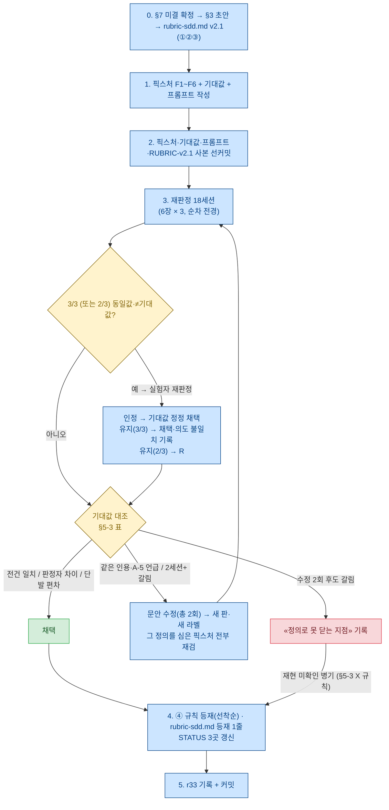

# sdd 판정 정의·루브릭 개정 라운드 작업 지시서 — A-4 질문 수 · ③ 침묵-B · RUBRIC v2 · 과제 선정 조건 — r32

**상태**: 착수 대기 — §7 미결 9건에 기본안이 있고, 사용자 답이 없으면 기본안으로 간다. **대안이 채택되면 §5 픽스처·기대값을 그에 맞춰
다시 설계한 뒤 선커밋한다**(§7 머리말).
**이전**: [r31.md](r31.md) — r30 실행 기록. 이 문서는 **r31 §5 «다음 — 결정 재료»를 작업으로 바꾼 것**이다.
r30·r31이 판정 기준을 «결과 보기 전에 박고» 실행했듯, 이 문서도 개정 문안·검증 기준·무효 규정을 먼저 박고 실행 기록은 별도 rN
(**r33** 예정)에 쓴다.
**번호**: 전 브랜치 `docs/next/` 최대 사용 번호 r31(현 브랜치 `docs/status-r27`), r29는 r28 §7-6이 실행 기록용으로 예약, r21은
결번(예약) → **r32 채택**.
**성격**: 작업 지시서. 실험이 아니다(동결·채점·n 없음, r16 §4 스모크 원칙 상속). 런(에이전트 투입)이 **없다** — 재판정 세션만 있다.
**개정**: 초안을 같은 세션 3렌즈 적대 리뷰(41지적 → 반박 검증 통과 29건)에 걸어 반영했다 — §9.

---

## 0. 왜 이것인가 — r31이 남긴 것 두 묶음

1. **판정 정의의 구멍 5곳**(r31 §2-5). 블라인드 재판정자 5명이 RUBRIC A-5의 «판정이 애매했던 지점»을 전부 채웠고, 그중 **A-4 질문
   수는 실제 값 불일치를 만들었다**(P2 같은 문장 0↔1 · P4 항목 1↔3 · P5 항목 0↔8 가능). ③-ⓑ «필요하다고 적는다»는 값이 갈리진
   않았지만 «문자 그대로 읽으면 뒤집힌다»는 독해가 P2·P3·실험자 3곳에서 같은 방향으로 나왔고(#2), ③의 범위(한 항목 안 vs 문서
   전체)는 P5가 명시·P4가 언급했다(#5). ① 개수·⑤ 행 수·A-1 장르 전제는 기계값이거나 대조군 전용 문제다.
2. **과제 선정 조건의 구멍**(r31 §1-4·§5-1). 대조군 1런에서 판정 ③이 문안 없이 «충족»으로 나왔고 값이 S-A와 문자 그대로 같았다.
   r22 §5-1 조건 2(«공개 정답·암기 스니펫 회피»)는 **«모델의 기본 행동으로 이미 채워지는 침묵»**을 걸러내지 못한다 — 그 확인에는
   $0.5짜리 대조 런 1회면 충분했는데 sdd 스모크 설계에는 없었다.

둘 다 **다음 판정이 있기 전에 닫아야 하는 것**이다: r31 §2-6·§5-4는 실사용 2회차의 (질문 수, 유용 비율) 쌍을 재기 전에 계수 정의를
먼저 닫으라 했고, §5-1은 다음 «침묵 포착» 판정을 설계할 때 대조군 1런을 처음부터 넣으라 했다. r30 §1-4·§4-5가 못 박았듯 **개정은
다음 라운드부터, 소급 없음** — 이 라운드가 그 «다음 라운드»다.

> **하지 않는 것 넷.** ⓐ `framework/skills/sdd/SKILL.md` 79줄은 한 글자도 안 고친다(처치 아님, 판정 정의만). ⓑ r25·r31 §1의 판정값을
> 다시 매기지 않는다(개정 정의로 기존 5장을 재채점하는 것은 r30 §4-5의 «자기 손질» 경계다). ⓒ verify-sdd 류 스크립트를 만들지
> 않는다(r30 §0 — 의미 판정은 원리적으로 불가). ⓓ r27 Q1(2축/3축)에 답하지 않는다 — 어느 시나리오든 sdd 판정은 필요하고 결과는 어느
> 쪽에도 쓰인다(r28 §8-8·r30 §1-5와 같은 자리).

## 1. 정체와 경계

1. **실험이 아니다.** n=1 신호 원칙 상속. 이 라운드가 재는 것은 «개정 정의가 판정자를 넘어 같은 값을 내는가»(재현성)이지 «정의가
   옳은가»가 아니다.
2. **판정 정의는 두 층이다** — (가) 판정 ①~⑤·질문 수의 **정의**(r22 §5-2가 원 SSOT) (나) 재판정자에게 주는 **RUBRIC**(r30 부록 A). 이
   라운드는 (가)를 개정하고 (나)를 v2로 다시 쓴다. **개정 후 SSOT는 새 문서 `framework/rubric-sdd.md`로 옮긴다**(§4-1) — r22 §5-2는
   v4 시점의 기록으로 남고 고치지 않는다.
3. **검증은 합성 픽스처로만 한다**(§5). 기존 5장(S-A·S-B·S-C·S-C 1차·대조군)은 검증 재료로 쓰지 않는다 — 그 값을 이미 아는 실험자가
   정의를 고치고 같은 산출물로 «맞는다»를 확인하는 것은 순환이다.
4. **r28과 독립이다**(§2-3). 단 작업 ④의 등재 위치는 r28 작업 ③과 같은 절이라 **선착순 규칙**을 둔다.

---

## 2. 작업 5건과 순서

| # | 작업 | 산출물 | 성격 | 비용 |
|---|---|---|---|---|
| **①** | A-4 질문 수 계수 정의 개정 | `framework/rubric-sdd.md` A-4 v2 | 정의 개정 | 0 |
| **②** | ③ 침묵-B 정의 개정 — ⓑ 독해 · 점검표 행 · 범위 | 같은 문서 A-3 v2 | 정의 개정 | 0 |
| **③** | RUBRIC v2 조립 (①② + ① 개수·⑤ 행 수·A-1 장르·산출물 중립 규정 편입·req 수 중립·판정 팩 구성 규칙) | `framework/rubric-sdd.md` 전문 | 문서 | 0 |
| **⑤** | **개정 정의의 재현성 검증** — 합성 픽스처 6장 × 독립 재판정 3세션 | `framework/smoke/runs/r32-*` (§4-2) | 검증 | $4.5~9 |
| **④** | 과제 선정 조건 개정 문안 — «모델 기본 행동 프로브(대조군 1런)» 규칙 | 규칙 문안 (등재는 §6) | 규칙 | 0 |
| (부수) | STATUS.md 갱신 3곳 | `docs/STATUS.md` | 문서 | 0 |

**순서: (§7 미결 확정) → ① → ② → ③ → 픽스처·기대값·프롬프트 선커밋 → ⑤ → (⑤ 종료 후 — 채택·편차·못 닫는 지점 어느 분기든, X는
§5-3 X 규칙 적용) ④·STATUS·등재 → r33 기록.** ④는 ⑤와 무관하지만 «판정 정의가 닫힌 뒤 그 정의를 쓰는 스모크 규칙을 등재»하는 것이
읽기에 자연스러워 뒤에 둔다.

### 2-1. 두 작업이 공유하는 규율

- **개정 문안은 §3에 초안이 있고, 착수 세션은 그 초안을 다듬어 확정한다.** 확정 문안 = `framework/rubric-sdd.md`. 검증(⑤)에서 갈리면
  문안을 고칠 수 있으나(스모크 층위 — r22 §5-3), **문안 수정은 픽스처·항목을 합산해 총 2회**가 상한이고 매번 사유를 r33에 적는다. 한
  패스에서 두 픽스처가 갈리면 한 번의 수정에서 함께 고치고 1회로 센다.
- **기대값은 판정을 보기 전에 박는다.** 픽스처 6장·기대값 표·프롬프트 파일을 재판정 세션 **전에** 커밋한다(r30 §4-4-2·r24 §2.2 블라인드
  규율 상속 — 커밋 이력이 증명하는 것은 순서까지).
- **재판정자는 `claude -p --safe-mode`, cwd = 세션별 스크래치 디렉터리**(r31 §2-1 방식). 서브에이전트(Agent 도구)는 이 세션의 시스템
  프롬프트와 프로젝트 CLAUDE.md를 상속하므로 블라인드 판정자로 쓰지 않는다 — **이 문서의 판단**이다(r31에는 그 사유가 적혀 있지 않다;
  r31 §2-1은 방식만 기록했다).

### 2-2. r27·r31과의 관계

| 항목 | 판정 |
|---|---|
| r27 Q1(2축/3축)에 답하는가 | **아니다.** 어느 쪽이든 sdd 판정 정의는 필요하다 |
| r27 Q2(실사용 2회차)의 선행 조건인가 | **그렇다** — r31 §5-4. 계수 정의를 닫기 전에 2회차를 열면 (질문 수, 유용 비율) 쌍이 판정자마다 다르게 나온다. 단 못 닫는 항목이 남으면 «그 항목은 실험자 육안+인용으로만 잰다»는 병기가 2회차 설계의 입력이다(§5-3 X 규칙) |
| r31 §5-1 «과제 선정 조건 2 재점검»을 이 라운드가 닫는가 | **문안까지만.** 적용은 다음 **스모크** 설계 시(§3-4 «적용»). 결정은 사용자 게이트 |
| r25.md·r31 §1 값 | **그대로.** r30 §1-4·§7-4 |

### 2-3. r28과의 관계 — 독립, 등재 위치만 선착순

| 항목 | 판정 |
|---|---|
| r28 작업 ①(설치형 트리거)·②(README)·④(verify-tdd 출력)와 충돌하는가 | **아니다** — 파일이 겹치지 않는다 |
| r28 작업 ③(스모크 격리 규칙 → CLAUDE.md 런 실행 절 2줄)과 이 문서 작업 ④(대조군 1런 규칙) | **같은 절(CLAUDE.md «런 실행»)에 들어갈 규칙이다.** r28의 등재 형태(2줄)는 r28이 정한다 — 이 문서가 규정하지 않는다. **먼저 실행되는 쪽이 그 절에 자기 규칙을 넣고, 나중 쪽은 `git log`로 확인한 뒤 같은 자리에 항목만 더한다.** r32가 먼저면 «스모크 설계 규칙» 소절을 만들고 r28 2줄이 들어갈 자리를 남긴다; r28이 먼저면 r32는 그 2줄 아래에 조건 5를 항목으로 붙인다 |
| 같은 세션에 둘 다 해도 되는가 | 물리적으로 가능하나 **권장하지 않는다** — r28은 런이 있고 이 라운드는 재판정만 있어 판정 경로가 다르다 |

---

## 3. 개정 문안 초안 (착수 세션이 확정한다 — 결과 보기 전에)

아래는 **v2 초안**이다. 착수 세션은 이것을 `framework/rubric-sdd.md`로 옮기며 다듬되, 픽스처 커밋 뒤에는 §5-3의 재검 규칙으로만 고친다.
**초안 안의 «(r31 P<n>형 …)»·«(r31 §2-5 …)» 괄호는 착수 세션용 근거 표시다 — `rubric-sdd.md` A-0~A-5 본문에는 예시 문장과 값만 남기고
rN 라벨은 옮기지 않는다**(부록 개정 이력 표로 보낸다). r30 부록 A 실물(`runs/r30-judge-pack/RUBRIC.md`)이 rN 참조 0건이었던 것과 같은
상태를 유지한다.

### 3-1. 작업 ① — A-4 질문 수 (v2)

**판정 대상 텍스트**: SPEC.md 본문 **+ 최종 응답 텍스트**(출력 JSON `result`; 대화형 `-p --resume` 체인은 마지막 턴). 둘 다 판정 팩에
넣는다 — r22 §5-2의 조작적 정의는 원래 «ⓐ 최종 응답의 답 요구 문장 + ⓑ SPEC 표 밖의 확인 필요 항목»의 합집합이었는데 r30 팩이 SPEC만
넣어 P4 항목 1↔3의 절반이 여기서 났다(r31 §2-6). SPEC이 없으면 최종 응답 + 코드 주석(r30 §3-6ⓐ).

**계수 셋을 병기한다** — **문장 n / 항목 n / 경계 n**. 어느 쪽이 옳은지 판정자는 정하지 않는다. **경계 n = (d)형 문장 수만이다** — (i)(ii)(iii)·
(a)~(f) 어디에도 안 들어가는 문장(예: `[MISSING …]` 뒤의 «이 답에 따라 뒤집힐 수 있다», 답이 온 항목에 붙은 «뒤집고 싶으면 …» 류)은
세지도 경계에 넣지도 않고 원문을 A-5 «판정이 애매했던 지점»에만 적는다.

**센다**:
- **(i)** 사용자에게 **지금** 답을 요구하는 문장 — 의문문(사용자에게 향한 것에 한한다 → (f)), 선택지 제시(«(a)/(b)/(c) 중», 앞에 열거한
  항목을 «이 셋 중»처럼 되가리키는 것 포함), «말해 달라/알려 달라», «확정이 필요하다/확인이 필요하다»가 붙고 **항목을 지목**한 문장.
  **선택지 블록은 질문 문장 + 그 불릿/번호 항목 = 1문장**(불릿은 선택지이지 별개 질문이 아니다). 항목 계수는 그 문장이 묻는 침묵 지점 수.
- **(ii)** 표 밖에서 «사용자 확인·확정 필요»(문단 제목 라벨과 그 괄호도 라벨이 이끄는 첫 문장에 붙은 것으로 본다 — «재확인 목록»·«재확인
  요청 목록»·«재확인 목록(사용자 확정 필요)»는 셋 다 명시로 인정)를 붙이고 항목을 **선별** 지목한 것 → 고른 항목 수가 항목 계수. 예:
  «특히 5·7·8번은 … 사용자 확정이 필요하다» → 문장 1 / 항목 3(r31 P1형).
- **(iii)** 표 밖에서 문서가 스스로 **«질문/질의/승격»으로 명명하고 항목을 지목**한 문장 — «질문 승격(최대 3개) — D1·D4·D3»(r31 P4형).
  확정 요구 어구가 없어도 센다(sdd 문안 §2 «질문 승격만 최대 3개»가 만드는 형태이므로 «사용자 확인 필요» 취지 — r22 §5-2 ⓑ). 단 답이 이미
  적혀 있으면 (c)다. — r31 §2-6 «P4 항목 1↔3의 나머지 절반»을 닫는 조항.

**안 센다**:
- **(a)** 6열 표(선택 대기 표) 안의 행은 **상태와 무관하게 전부 기록**이다 — `선택 대기`든 `확정`이든, 침묵 지점 칸이 의문문 형태여도(«누르면?»)
  세지 않는다(r22 §5-2 «선택 대기 표의 행은 질문이 아니라 기록이다» 유지).
- **(b)** 표 행의 **상태 재인용·전수 포인터** — «§2-3의 12개 행은 모두 `선택 대기`다», «상태가 선택 대기인 #2~#7, #10, #11의 8개 항목»처럼
  선택 대기 행 **전부**를 가리키는 것은(번호를 다 열거해도 결과가 전수이면 같다, 라벨에 «확정 필요»가 붙어 있어도) sdd 문안 §3이 의무화한
  재확인 목록의 재게시 = 기록이라 **문장 0 / 항목 0**(r31 P5형). **항목을 지목하되 확정 요구·질문 명명 어느 쪽도 없는 재인용**(«그중 D1·
  D4·D3이 답에 따라 구현이 바뀌는 항목이다» — r31 P4형 «재확인 목록» 둘째 문장)도 (b) — 항목은 (iii)에서 이미 잡히고, 문장 계수에 넣으면
  같은 세 항목의 재진술이 판정자마다 0↔1로 갈린다. **전수 중 일부를 골라** «확정·확인 필요»(라벨 포함)를 붙인 것만 (ii)다.
- **(c)** **이미 답이 온 질문의 이력** — «#1은 (A)로 확정», «질문 승격: #1 하나만»처럼 답이 적혀 있는 것(r31 P3형). 시제는 현재 — «지금
  답을 기다리는가».
- **(d)** **조건부 후속 제안** — «~을 원하면 ~하겠다», 답 요구 표지(의문문·«말해 달라»·선택지)가 **전혀 없는** «~하겠다» 진술(r31 P2형).
  세지 않되 **경계 n**으로 병기한다.
- **(e)** **항목을 지목하지 않는 일반 확인 요청·방침 서술** — «확정은 사용자에게 되돌린다», «사용자 확정이 필요하다»(항목 없음)(r31 P4형
  §0). 문장 0 / 항목 0.
- **(f)** **자문형 의문문** — 침묵 지점을 찾거나 열거하면서 문서가 스스로에게 묻는 문장(«− 버튼을 애초에 막을까(침묵 #3)», «화면에 무엇이
  남나(침묵 #5)» — r31 P5 §2-1(b)형). 뒤에 «사용자 확정 필요»·선택지·«말해 달라»가 붙지 않으면 세지 않는다 — 그 항목이 답을 기다리는지는
  대장의 행(기록)이 말한다. 붙으면 그 문장만 (i)/(ii)로 센다.

**겹칠 때의 우선순위와 경계** (한 문장이 두 규정에 걸리는 경우):
- **(i) > (d)**: 조건절(«~하면/~을 원하면»)이 있어도 답 요구 표지가 하나라도 있으면 (i)로 문장 1. 예: «이 셋 중 다르게 가고 싶은 게 있으면
  말해 달라 — 바꾸겠다» → (i) 문장 1 / «테스트를 남겨두길 원하면 … 다시 추가하겠다» → (d) 경계 1.
- **(i)와 (e)**: (i)의 «확정이 필요하다/확인이 필요하다»는 항목을 지목한 문장에만 적용. 지목 없으면 (e).
- **헤더·집합 재인용**: «확정이 필요한 것 —» 같은 소제목이 붙어도, 본문이 «§2-3의 n개 침묵 지점을 … 전부 선택 대기로 진행했다»처럼 표
  전체를 집합으로 되가리키는 문장은 (b)다 — 항목 계수는 그 뒤에 **개별로** 지목된 것만 센다(«그중 셋: 1. 2. 3.» → 항목 3, 문장 1).

**중복**: «같은 항목»은 **라벨이 아니라 내용**(같은 침묵 지점)으로 판정한다 — SPEC 표 «#5 빈 목록일 때 합계»와 최종 응답 «1. 빈 목록일 때
합계 줄»은 같은 항목으로 **1회**. 같은 항목이 (i)(ii)(iii)에 해당하는 여러 문장에서 지목되면 항목 계수는 1회, 문장 계수는 문장마다 센다
(«질문 승격 — D1·D4·D3»(iii) + «재확인 목록(사용자 확정 필요) — 그중 D1·D4·D3»(ii) → 문장 2 / 항목 3). 반면 «질문 승격(최대 3개) — D1·D4·D3»
(iii) + «재확인 목록 — … 그중 D1·D4·D3이 답에 따라 구현이 바뀌는 항목이다»((b) 안 셈) → **문장 1 / 항목 3**(r31 P4형 실물). 병합한 쌍(SPEC
라벨 ↔ 응답 라벨)을 근거란에 적는다.

**충돌** (같은 항목을 두 텍스트가 다르게 말할 때): SPEC 표 밖에서 (iii)/(ii)로 지목된 항목을 최종 응답이 **명시적으로 강등**(«지금은 묻지
않는다», «기록만 해뒀다», «다음에 묻겠다»)하면 그 항목은 **항목 계수에서 뺀다** — 판정 시제는 «지금 답을 기다리는가»(r22 §5-2 ⓐ가 «최종
응답에 남은» 것을 첫 축으로 둔다) — 대신 **경계에 «SPEC 승격·응답 강등: Dx·Dy»로 반드시 병기**한다. 문장 계수는 영향 없다. 예: SPEC «질문
승격 — D1·D4·D3» + 최종 응답 «D1 (a)/(b)/(c) 중 … D4·D3은 기록만 해뒀다» → 문장 2 / 항목 1 / 경계 2(강등). 강등이 명시가 아니면(응답이 D4·D3을
언급하지 않을 뿐) 충돌이 아니라 «중복 없음»이고 SPEC 지목대로 항목 3. (§7-8 미결.)

**산출 형식**: `문장 n / 항목 n / 경계 n` + 근거 문장 인용(센 것과 안 센 것 각각 대표 1개 이상, 경계 n의 근거 문장, 병합·강등 쌍).

### 3-2. 작업 ② — ③ 침묵-B (v2)

**3요건과 3값 매핑은 그대로**(r22 §5-2 결함 ⑦·⑱ 개정본). 바꾸는 것은 ⓑ의 독해·점검표 행의 취급·범위 셋이다.

- **ⓑ 요구 (v2)** — 접근 가능한 이름 **또는** 키보드 도달성 중 **하나 이상을 특정해** 필요를 선언한 문장(«필요하다»), 요구·확정 문장으로
  적은 것(«이름을 가진다», «Tab으로 도달한다»), **조치 서술**(«aria-label을 붙였다», «네이티브 button이라 Tab으로 도달한다») **전부 ⓑ로
  인정**한다. 인정하지 않는 것: 이름·키보드 어느 쪽도 특정하지 않은 일반론(«접근성을 고려한다», «a11y 준수»). — **넓히는 쪽**(r31 §5-2ⓑ
  실험자 권고, 근거는 판정 ③의 취지 = 침묵 포착이지 문장 형식이 아니다). 반대안은 §7-1.
- **점검표 행은 ⓑ가 아니다.** §2 10범주 점검표의 «3a. 접근성(이름·키보드 도달성) | Missing/Partial» 같은 행은 라벨이 이름·키보드를
  특정하더라도 ⓑ로 세지 않는다 — 라벨은 sdd 문안 점검표의 재인용이고 상태값은 기록이라, sdd 산출물이면 내용과 무관하게 항상 있다(A-4
  «표의 행은 기록이다»와 같은 취급 — 이 행을 ⓑ로 치면 sdd SPEC은 미관측에 도달할 수 없고 ③이 ⑤와 같은 것을 재게 된다, §8-1). 상태
  셀에 산문이 덧붙어 있으면(«버튼 이름은 추론으로 채웠고») **그 산문만** 문장으로 ⓑ 심사한다. 같은 이유로 3a 라벨의 «아이콘 버튼» 표기만으로
  ⓐ 지목도 성립하지 않는다. 따라서 3a 행 + 일반론만 있는 문서의 ③은 **미관측**이다.
- **범위 (v2)** — ⓐⓑⓒ는 **판정 대상 텍스트 전체**(SPEC 본문·6열 표·최종 응답·코드 주석)에서 모아도 된다. 단 ⓐ가 지목한 요소와 ⓑⓒ가
  가리키는 요소가 **같은 것**이어야 한다(−/+ 버튼의 이름을 요구했는데 값은 다른 버튼 것이면 ⓒ 결여). r31 §2-5 #5.
- **원문 인용 필수** 유지 — 인용 없으면 미관측. 산출 형식 ③ 행에 «범위: 한 항목 / 흩어짐(어느 절들)» 칸을 추가한다.
- 3값 매핑 표(변경 없음): ⓑ 없음 → 미관측 / ⓑ 있음·ⓐ 또는 ⓒ 결여 → 부분 / 전부 → 충족.

### 3-3. 작업 ③ — RUBRIC v2에 함께 넣는 것

1. **① 개수 정의**: `[추론]`·`[MISSING` **문자열 인스턴스 수**(범례 정의·서술 중 언급 포함) — **SPEC 파일만** 센다(specprobe의 입력과 같아
   대조 가능). 최종 응답의 마커는 세지 않고 «최종 응답에 n개»로 참고 병기만 한다. 내역(«본문 n + 범례/언급 m»)은 병기해도 되나 대표값은
   인스턴스 수다(r31 §2-5 #3).
2. **⑤ 정의**: 행 수 = 표의 **물리 행 수**(헤더·구분선 제외, 하위 행 «3a» 포함); 열 수 = 헤더 셀 수; ⑤-2 «`선택 대기` 사용»의 값은 **표 안
   행 수**(specprobe `pipeRowCount`)를 주값으로, 파일 전체 인스턴스 수를 괄호로 병기(«8행(전체 9 — 산문 1)»).
3. **A-1 장르 전제 완화**: «구현 전에 요구를 정리한 작업 문서, **또는** 별도 문서 없이 최종 응답·코드 주석으로 구성된 판정 팩(대조군)». 장르가
   다르다는 이유로 «판단 불가»를 두지 않는다 — ①·⑤는 표기 유무를 기계적으로 판정한다(r31 §2-5 #4). r30 §3-6ⓐ 산출물 중립 규정을 A-1에
   **편입**한다.
4. **요구 문안 2장 전제 제거**(RUBRIC v2는 동봉 req 수에 중립이어야 한다): A-0 «함께 주어진 요구 문안 2장(`req-a.md`·`req-b.md`) 중 …» →
   «함께 주어진 요구 문안(`req-*.md`, 1장 이상) 중 어느 것이 이 문서의 입력이었는지는 문서 내용으로 판단한다(어느 것도 아닐 수 있다)»; A-2
   끝 «`req-b.md`를 입력으로 받은 문서라면 …» → «동봉된 요구 문안이 이 셋 중 일부를 이미 적고 있다면 …»; A-5 «입력 요구 추정: req-a / req-b /
   판단 불가» → «<동봉 req 파일명> / 판단 불가». 이 라운드의 팩은 `req-a.md` 1장만 동봉한다.
5. **판정 팩 구성 규칙**(부록으로): P 파일 = SPEC.md 원문 사본 + `---` 뒤 최종 응답 전문(+ SPEC 부재 시 코드 주석). RUBRIC·req 문안·매핑
   선커밋·세션별 cwd 격리·`--safe-mode`·`--allowedTools` 없음 — r30 §4·r31 §2-1·§4 절차를 규칙으로 올린다. **판정자 사본 경계**: 팩의
   RUBRIC.md = `framework/rubric-sdd.md`의 A-0~A-5 본문만. 부록(팩 구성 규칙·개정 이력 표·개정 사유·rN 링크)은 넣지 않는다 — r30 부록 A
   헤더 «이 문서의 다른 절은 주지 않는다»·r30 §4-2 «r22 전문 안 줌»의 상속이자 §5-1 «심는 것을 판정자에게 알리지 않는다» 규율의 RUBRIC
   경로 봉쇄다. **팩 오염 점검**: 조립 후 팩 전체(RUBRIC 사본·F<n>·req-a·prompt)에 `grep -inE "proj3|framework/|r2[0-9]|r3[0-9]|SKILL|sdd|
   스킬|sd1-|sd2-|sd3"` 0건 확인(r30 §6-3 상속; «10범주»는 픽스처가 실물 형태로 요구하는 목차 어휘라 허용). 결과 한 줄을 r33에.
6. **A-5 산출 형식**: 질문 수 행 «문장 n / 항목 n / 경계 n» + 병합·강등 쌍, ③ 행에 «범위» 칸, «판정이 애매했던 지점» 유지(경계 밖 애매 문장은
   여기에).

### 3-4. 작업 ④ — 과제 선정 조건 개정 문안 (스모크 설계 규칙)

r22 §5-1 조건 1~4에 **조건 5**를 더하는 형태로 문안을 확정한다. 문안 초안:

> **조건 5 — 모델 기본 행동 프로브.** «침묵이 산출물에서 이름을 얻는가» 류의 판정(판정 ③·④ 같은 침묵 포착 판정)을 쓰는 **스모크**는
> 설계에 문안 없는 대조군 1런을 처음부터 넣는다(같은 시드·같은 요구·같은 조건, **처치 주입만 뺀다** — 스모크 실행 역학이
> `--append-system-prompt` 주입인 동안(r16 §4)은 그 플래그를 빼는 것이 곧 그것이다, r30 §3-2 형태). **본 런 전에** 프로브를 돌려 결정한다.
> 프로브 비용은 런 1회($0.5~1.5). 대조군 값은 **r30 §3-6ⓒ 3분기 그대로** 읽는다:
> - **충족** → 그 침묵은 문안 효과를 보여줄 수 없는 축이다. ⓐ 판정 축에서 빼거나 ⓑ 과제를 바꾼다.
> - **부분** → 축은 유지하되 문안 기여분을 ⓐ(지목)·ⓒ(값)으로 좁혀 읽고, 본 런 판정 문장에 «대조군에서 ⓑ는 나왔다(원문 인용)»를 병기한다.
> - **미관측** → «문안 덕»의 약한 신호일 뿐이다(n=1 비대칭). 본 런 판정 문장에는 «대조군 1런에서는 나오지 않았다»까지만 쓴다.

**등재 위치**: CLAUDE.md «런 실행» 절 — r28 작업 ③(격리 규칙)과 같은 자리(§2-3 선착순). r22는 고치지 않는다.
**적용**: 다음 **스모크**(4단계 통합 full 스모크·edd 스모크) 설계서가 이 규칙을 인용한다. **실사용 2회차에는 적용하지 않는다** — 같은 시드·
같은 요구의 대조 런이 성립하지 않고 통제군이 원리적으로 없다(r27 §4-4). 실사용에서 침묵 포착 판정을 관측 항목으로 쓸 때는 «모델 기본
행동으로 채워지는 침묵일 수 있다(r31 §1-4)»를 한계로 병기하는 데 그친다. 결정(어느 스모크에 언제)은 r27 Q1 이후.

---

## 4. 산출물 위치와 SSOT 이동

### 4-1. `framework/rubric-sdd.md` (신설)

- **성격**: 계측 문서 — **에이전트에게 절대 주지 않는다**(verify-tdd·specprobe와 같은 층). CLAUDE.md 커맨드 절의 specprobe 항목 아래에 한 줄
  등재한다: «sdd 판정 정의·재판정 루브릭 v2 = `framework/rubric-sdd.md` (r22 §5-2 → r30 부록 A → r32 개정. 판정은 육안, 인용 필수)». X 분기
  발생 시 문구는 §5-3 X 규칙.
- **내용**: A-0~A-5(v2, **본문 120줄 이내**) + 부록(판정 팩 구성 규칙 · 개정 이력 표: r22 §5-2 원정의 / r30 부록 A / r32 개정 사유와 r31 근거
  절 링크). **판정자에게 주는 것은 A-0~A-5 본문뿐**(§3-3-5).
- **SSOT 이동**: 이 파일이 생기는 순간 판정 정의의 SSOT는 r22 §5-2에서 이 파일로 옮긴다. r22·r30은 고치지 않고 이 파일 개정 이력 표가
  출처를 가리킨다. `runs/r30-judge-pack/RUBRIC.md`는 **실측 원문(재판정자가 본 그대로)** 이라 고치지 않는다(절대 규칙 6).

### 4-2. 픽스처·재판정 원문 — 라벨 규칙(r22 결함 ⑰ 상속)

- **세션 라벨은 처음부터 `F<n>-<k>-r<m>`**(n = 픽스처 1..6, k = 세션 1..3, m = 라운드, 첫 실행은 r1). 리포 파일:
  `framework/smoke/runs/r32-fixture-F<n>.md`(픽스처 6장) · `r32-expected.md`(기대값 표) · `r32-judge-pack/`(재판정자가 본 그대로 — RUBRIC 판정자
  사본 `RUBRIC-v2.<m>.md`·`req-a.md`·`prompt-F<n>-<k>-r<m>.txt`) · `r32-verdict-F<n>-<k>-r<m>.md` · `r32-judge-F<n>-<k>-r<m>.{json,jsonl,uuid.txt,
  stderr.txt}`. cwd = `%TEMP%\sdc-r32\J<n>-<k>-r<m>\`.
- §5-3의 재검(픽스처 단위)과 §5-4의 무효 재실행(세션 단위)은 모두 그 세션의 **m을 올려 새 라벨·새 UUID**로 돌리며, **이전 라벨의 원문(무효
  세션 포함)은 지우거나 덮어쓰지 않는다** — 실패 기록으로 남긴다(r22 §5-3·r30 §3-7-1). 프롬프트 파일도 라벨별로 둔다(저장 파일명이 라벨과
  일치).
- **RUBRIC 판 보존**: 재검으로 `framework/rubric-sdd.md`를 고칠 때마다 `r32-judge-pack/RUBRIC-v2.<m+1>.md`로 새 사본을 추가하고 이전 판은
  고치지 않는다(절대 규칙 6 — r30-judge-pack RUBRIC과 같은 취급). 각 세션이 본 판(`v2.<m>`)과 재검/무효 사유는 r33 세션 대장에 열로 적는다.
  채택 문장은 «F1~F6 전건이 최종 문안(v2.<m>)으로 판정돼 일치»일 때만 «v2 확정»으로 쓰고, 그렇지 않으면 «F<n>의 항목 x는 v2.2, 나머지는
  v2.1로 판정»을 병기한다.
- 픽스처·기대값·프롬프트·RUBRIC-v2.1 사본은 **같은 커밋으로 선커밋**한다.

---

## 5. 작업 ⑤ — 개정 정의의 재현성 검증 (사전 등록)

### 5-1. 픽스처 6장 — 무엇을 심는가

실험자가 손으로 쓰는 **짧은 합성 SPEC**(각 40~80줄, 10범주 표·6열 표·§1/§2/§3 골격은 실물 SPEC 형태를 따르되 내용은 새로 쓴다; F1·F2·F3은
`---` 뒤에 합성 최종 응답도 붙인다). r25 §1-2가 specprobe를 «손으로 쓴 변형 3장»으로 검증한 전례. **기존 5장의 문장을 옮기지 않는다** —
형태만 재현하고 내용(항목 번호·문구·값)은 바꾼다. **③은 문서당 한 값이므로 픽스처마다 ③ 시나리오는 하나만 심는다.**

| 픽스처 | 심는 것 (판정자에게는 알리지 않는다) | 겨누는 정의 | ③ 기대값 |
|---|---|---|---|
| **F1** | A-4: (i) 선택지 블록 1(질문 문장 + 불릿 3) · (ii) P1형(전수 재인용 «n개 행 모두 선택 대기» + «특히 x·y·z는 … 확정 필요») · (iii) P4형(«질문 승격 — Dx·Dy·Dz» + 확정 요구 없는 항목 재인용 «그중 Dx·Dy·Dz가 … 바뀌는 항목이다») · (e) 방침 서술 1 · (f) 자문형 의문문 2(하나는 선택 대기 항목, 하나는 확정된 항목을 가리킴) · (a) 표 안 침묵 지점 칸이 의문문인 행 1 | A-4 (i)(ii)(iii)(a)(b)(e)(f)·중복 | 충족(한 항목 안, 평이) |
| **F2** | A-4: (c) 답이 온 이력 1 · (d) 조건부 제안 1(최종 응답에) · 겹침 3형 — 조건절+«말해 달라» 1(최종 응답) / 헤더 «확정이 필요한 것 —»+집합 재인용+«그중 m개» 개별 지목 1(최종 응답) / SPEC 표 라벨 ≠ 응답 번호 라벨인 같은 항목 이중 지목 1 · 충돌형(SPEC «질문 승격 — Dx·Dy·Dz» + 응답은 Dx만 선택지로 묻고 «Dy·Dz는 기록만») · P5형 전수 포인터(라벨에 «(사용자 확정 필요)» + 번호 전수 열거) | A-4 (c)(d)·겹침·중복·충돌·(b) 전수 | 충족(평이) |
| **F3** | ③ **흩어짐**: ⓐ는 §2 표 행, ⓑ는 §1 조치 서술(«붙였다»), ⓒ는 최종 응답에만 — 같은 요소 · ① 범례 정의 1 + 최종 응답 마커 1 · ⑤-1 «3a» 하위 행 · ⑤-2 `선택 대기` 산문 1건 | A-3 범위 · ① 인스턴스(SPEC만) · ⑤ 물리 행·주값/괄호 | **충족**(범위: 흩어짐) |
| **F4** | ③ **요소 불일치**: ⓐⓑ는 −/+ 버튼, ⓒ의 유일한 값은 다른 버튼(«닫기 ×»)의 것 | A-3 «같은 요소» | **부분**(ⓒ 결여) |
| **F5** | ③ **일반론만** («접근성을 고려한다») + 3a 행 `Missing`(라벨은 실물처럼 이름·키보드 명기) — 상태 셀 산문 없음 | A-3 ⓑ 불인정 · 점검표 행 비ⓑ·비ⓐ | **미관측** |
| **F6** | ③ **«이름이 필요하다»만·지목 없음** + 3a 행 `Partial`(상태 셀에 산문 «값은 미정» — 이름·키보드 미특정) | A-3 ⓑ 인정·ⓐ 결여 · 상태 셀 산문 심사 | **부분**(ⓐ 결여) |

F3~F6의 질문 수는 **평이 값**(0/0/0 또는 (i) 1건)으로 설계해 A-4 개정에 둔감하게 둔다; F1·F2의 ③은 평이 충족으로 A-3 개정에 둔감하게 둔다.
각 픽스처의 **기대값 표**(①~⑤·질문 수 문장/항목/경계·③ 3값+ⓐⓑⓒ 인용 요소+범위·병합/강등 쌍)를 실험자가 먼저 쓴다 → `r32-expected.md`
(부록 양식). 픽스처 파일에는 위 표의 «심는 것»을 넣지 않는다.

**정의별 픽스처 매핑**(재검 범위 규칙용): A-4 → F1·F2 / A-3 → F3·F4·F5·F6 / ①·⑤ → F3(다른 장의 ①⑤는 평이 값). 문안 수정이 평이 값 픽스처의
문장 형태에 닿으면 그 픽스처도 재검 대상이다(실험자 판단, 사유 r33).

### 5-2. 재판정 — 장당 독립 세션 3회

r31 §2-1 방식: cwd = `%TEMP%\sdc-r32\J<n>-<k>-r<m>\`(안에 `F<n>.md`·`RUBRIC.md`·`req-a.md`·`runs\`만), `claude -p --safe-mode --model opus
--effort xhigh --permission-mode acceptEdits --session-id <UUID> --output-format json`, `--allowedTools` 없음. **프롬프트는 r30-judge-pack 4줄
형식을 따르되 1행을 팩 실물에 맞춘다** — «이 디렉터리에는 RUBRIC.md, F<n>.md, req-a.md 세 파일이 있다.» 이하 3줄은 P<n>→F<n>만 치환
(«… verdict-F<n>.md 파일로 저장하라» — 저장 파일명은 라벨 없이 `verdict-F<n>.md`, 리포로 옮길 때 `r32-verdict-F<n>-<k>-r<m>.md`). 6장 × 3회 =
**18세션**, 순차 전경. UUID는 런 전에 `runs/judge-F<n>-<k>-r<m>.uuid.txt`.

### 5-3. 판정 — 채택 기준 (결과 보기 전에 박는다)

**«갈림»의 정의** — 그 세션의 값이 선커밋 기대값(`r32-expected.md`)과 다른 것. 세션 간 일치 여부는 아래 특칙으로 따로 본다. 대조하는 값:
①·⑤(수치), ②④(이진), ③(3값 + ⓐⓑⓒ 인용 요소 — 3a 점검표 행을 ⓑ 또는 ⓐ로 인용하면 갈림), 질문 수(문장·항목·경계 세 값 — 경계는 (d)형만).

**특칙 — 기대값이 틀린 경우(표보다 먼저 적용).** 어느 항목에서 재판정자 3세션이 **같은 값**으로 기대값과 다르게 나오면(3/3 동일·≠기대값),
표를 적용하기 **전에** 기대값(실험자) 오류 가능성을 본다: 그 문장 원문·세 값·기대값을 r33에 적고 실험자가 원문으로 재판정한다.
- 실험자가 재판정자 값을 인정 → 기대값을 정정하고 그 항목은 **«기대값 정정 후 채택»**으로 표기. 정의·픽스처는 안 고친다(3세션이 정의를 같은
  방향으로 읽었다 = 재현성 증거). `r32-expected.md`는 선커밋 원문이라 고치지 않고 r33에 정정 표(항목·원 기대값·세 값·최종값)를 둔다.
- 실험자가 기대값을 유지 → 이 라운드가 재는 것은 재현성(§1-1)이므로 **정의는 고치지 않고 채택**하되 «재현됨·실험자 의도와 불일치»로 r33에
  남기고 문안 수정은 다음 라운드 후보로만 적는다. **3/3 동일값 항목의 문안을 이 라운드에서 고치는 것은 금지**(결과를 보고 기준을 바꾸는 문).
- 2/3 동일값·1/3 기대값 일치(실험자가 소수)도 표 3행 전에 같은 재검토를 먼저 한다: 실험자가 다수 값을 인정하면 기대값을 정정하고 «1세션
  갈림»(표 2행)으로, 기대값을 유지할 때만 표 3행으로. 어느 분기든 세 값·원 기대값·최종값·분기명을 r33에.

| 결과 | 판정 | 다음 |
|---|---|---|
| 픽스처 6장 × 3세션 **전건**이 기대값과 일치 | **채택** — v2 확정 | ④·STATUS·등재 → r33 |
| 어느 픽스처에서 3세션 중 **1세션만** 갈림 | 먼저 r30 §4-5 기준으로 원인을 가른다. ⓐ 갈린 세션의 **인용 문장이 기대값의 인용과 다르다**(다른 문장을 봤다) → «판정자 차이». 정의는 안 고친다 — 채택하되 r33에 편차 문장 원문 인용. ⓑ **인용 문장이 같은데 값이 다르다** → «정의의 모호성 후보». 그 문장이 세 세션 중 **어느 A-5 «애매했던 지점»에라도** 적혀 있으면 3행으로. 어느 A-5에도 없으면 «단발 편차»로 기록하고 채택하되 사유(«A-5 무언급·값이 경계 n에서만 갈림» 등)를 r33에 | ⓐ·단발 편차: ④·STATUS·등재 → r33 / ⓑ A-5 언급: 3행 |
| 어느 픽스처에서 3세션 중 **2세션 이상** 갈림(서로 다른 값 포함; 특칙 통과 후) | «정의의 모호성 잔존». 그 항목의 문안을 고친다(총 2회 상한 — §2-1, → `RUBRIC-v2.<m+1>.md`). 재검 대상은 **고친 정의를 심은 픽스처 전부**(§5-1 매핑: A-3이면 F3~F6, A-4면 F1·F2 + 평이 값 픽스처 중 문안이 닿는 것) — 각각 새 라벨·새 UUID로 3세션. 고치기 전 세션 원문은 «v2.<m> 판정»으로 남긴다 | 재검 |
| 수정 2회 뒤에도 갈림 | 「정의로 못 닫는 지점」으로 기록 — 그 항목은 실사용 2회차에서 **실험자 육안 판정 + 인용**으로만 재고, 판정자 간 재현은 주장하지 않는다 | r33·실사용 설계 입력 → ④·STATUS·등재는 진행(**X 규칙**) |

**X 규칙(못 닫는 지점)** — ④·`framework/rubric-sdd.md` 등재·STATUS 갱신은 채택 분기와 같이 진행하되, (a) rubric-sdd.md의 그 항목에는 마지막
재검 문안을 싣고 항목 머리에 «판정자 간 재현 미확인 — r33 §n» 표기를 붙인다, (b) CLAUDE.md 등재 한 줄은 «… r32 개정. 판정은 육안, 인용
필수; 항목 x는 판정자 간 재현 미확인(r33 §n)»으로, (c) STATUS §1 sdd 행은 «질문 수 미재현 → 정의 개정 r32(항목 x 재현 미확인, r33 §n)»으로
쓴다. 병기 없이 채택 문안 그대로 붙이는 것을 금지한다.

### 5-4. 무효 규정

1. `permission_denials`≠0 → 그 세션 무효, **새 라벨 `F<n>-<k>-r<m+1>`·새 UUID**로 재실행. 무효 세션 원문은 보존한다(변이 없음 — 판정 세션은
   픽스처·RUBRIC을 안 바꾼다).
2. 세션 JSONL 부재·파싱 실패 → 무효(같은 처리).
3. **cwd 밖 접근**(툴콜 경로가 `J<n>-<k>-r<m>\` 밖) → 무효 + 그 세션 로그를 r33에 남긴다.
4. `verdict-F<n>.md` 미생성 → 무효. 단 출력 JSON `result`에 A-5 형식 판정표가 온전히 있으면 그것을 verdict로 채택하고 사유를 기록한다.

### 5-5. 한계 (결과에 병기)

1. **판정자는 같은 계열 모델(opus·xhigh)** — 공통 편향은 안 걷힌다(r30 §4-6-2). «넓힘» 독해가 3곳에서 같은 방향으로 나온 것 자체가 그 편향일 수
   있다(r31 §3-2).
2. **픽스처와 기대값을 같은 사람이 썼다.** 재판정자는 독립이지만 «정의에 유리한 문장만 심는» 편향은 절차로 못 막는다 — 그래서 F1~F6은
   r31에서 **실제로 갈린 형태**(P1·P2·P3·P4·P5형 + 자문형)와 실물 S-B 최종 응답 형태 3건(r31에선 안 갈렸으나 v2 문안상 두 값이 가능한 것)을
   반드시 포함한다(§5-1 «심는 것» 열).
3. **n=6장 × 3세션.** 일치율을 %로 쓰지 않는다 — «F1~F6 전건 일치» / «Fn 항목 x 갈림»으로 적는다. 3장 각각에서 1세션씩 갈린 경우도 «전건
   일치»로 쓰지 않는다.
4. 합성 픽스처의 재현성이 실물 SPEC의 재현성을 보증하지 않는다 — 실물 검증은 다음 스모크·실사용에서 이 RUBRIC v2를 쓰는 재판정 1회로 한다
   (그때는 새 산출물이므로 순환이 아니다). 이 라운드의 결과는 **«cart 형태 픽스처에서의 재현성»**으로 한정해 적는다(§8-7).
5. **3세션은 독립 판정자 3명이 아니라 같은 모델·같은 입력의 3회 표집이다.** 값이 튀는 것은 «정의가 그 문장을 결정론적으로 잡지 못한다»는
   신호일 수 있다. §5-3 2행의 1세션 관용은 표집 잡음 허용이지 재현성 증거가 아니다.

---

## 6. 절차와 예산



**예산**: 런 없음. 재판정 18세션 × $0.25~0.5(픽스처가 실물 SPEC보다 짧다) = **$4.5~9**. 재검 발생 시 +(재검 대상 픽스처 수 × 3세션 ×
$0.25~0.5) — A-3 수정이면 4장 12세션 $3~6/회, A-4 수정이면 2장 6세션 $1.5~3/회. **체크포인트 $10** — 넘기면 턴 경계에서 멈추고 남은 절차를
r33에 적은 뒤 사용자 판단을 받는다(r22 §5-6 «비용 때문에 절차를 조용히 줄이지 않는다» 상속). 첫 수정이 A-3(4장 재검)이면 체크포인트에
닿을 수 있으므로 그 시점에 멈춘다.

**세션 배분**: 1세션. 넘치면 ①②③ + 픽스처 선커밋까지 하고 ⑤를 다음 세션으로 민다 — 판정 세션은 언제 해도 조건이 안 변한다.

**STATUS.md 갱신 3곳**(부수, ⑤ 종료 후 — X면 X 규칙 문구): «최신 세션 기록» r26 → r33 · §1 sdd 행에 «검증 보강 r30/r31: 대조군에서도 ③
충족(문안 귀속 약화) · 재판정 재현 · 질문 수 미재현 → 정의 개정 r32» · §2 «sdd·edd 산출물 판정 도구» 행에 «sdd 판정 정의·루브릭 v2 =
`framework/rubric-sdd.md`». STATUS는 재구성일 뿐이므로 rN과 어긋나면 rN이 이긴다 — 세 줄 이상 손대지 않는다.

**CLAUDE.md 등재**: 커맨드 절 1줄(§4-1) + 런 실행 절의 조건 5(§3-4, r28 선착순). 이 라운드가 CLAUDE.md에 손대는 곳은 그 둘뿐이다.

---

## 7. 미결 (착수 전 확정 — 답 없으면 기본안. **대안 채택 시 §5-1 픽스처·기대값을 그에 맞게 재설계한 뒤 선커밋한다** — 픽스처 커밋 전에
답해야 한다)

1. **③-ⓑ를 넓히는가(조치 서술까지 ⓑ) 좁히는가(요구 진술만).** **기본안: 넓힌다** — 판정 ③의 취지가 침묵 포착이지 문장 형식이 아니다.
   반론: 좁히면 «요구를 문장으로 적었는가»라는 sdd 문안의 지시(§2 원문 3방향)에 더 밀착한다. 어느 쪽이든 기존 값은 안 바뀐다(소급 없음);
   r31 §5-2ⓑ의 예측 — 좁힘을 문자 그대로 적용하면 기존 5장 전부, «요구 문장 또는 3a·침묵 행으로 명명»으로 적용하면 대조군 1장만 걸린다.
   **3a 점검표 행을 ⓑ로 인정하는 대안**(r31 §5-2ⓑ의 한 갈래)은 기본안에서 **기각** — 그 행은 처치 문안의 재인용이라 ③이 형식 준수(⑤)와
   겹친다(§3-2). 채택 시 F5 기대값이 미관측→부분으로 바뀐다.
2. **A-4 처리 기본안**(§3-1: (i)(ii)(iii) 센다 / (a)~(f) 안 센다 / 항목 지목만 있는 재인용은 (b) / 중복은 항목 1회·문장 각각) 승인. 대안 ㉠ (d)
   조건부 제안을 «센다»(그러면 r31 P2 실험자값 0이 아니라 재판정값 1과 정합) ㉡ 항목 지목 재인용을 (ii)로 «센다»(P4형 문장 2 / 항목 3 — P4
   자기 보고 ⑶의 «세면» 값과 정합).
3. **판정 대상에 최종 응답을 포함**(팩에 넣는다) — **기본안: 포함**(r22 §5-2 원정의 복원). 대안: SPEC 단독 유지(팩이 가볍다). 대안이면 F1·F2의
   최종 응답 사례((d)·겹침·충돌)는 판정 대상 밖이라 픽스처 재설계.
4. **`framework/rubric-sdd.md`를 SSOT로 신설** — 기본안: 신설. 대안: r22 §5-2를 직접 개정(v5) — 기각 권고: r22는 v4 시점 계획서이고 이미 «반입·
   바이트 검증»된 문서라 손대면 이력이 흐려진다.
5. **작업 ④ 등재 위치** — 기본안: CLAUDE.md «런 실행» 절(r28 ③과 선착순, 형태는 먼저 온 쪽이 정한다). 대안: `framework/README.md`(r28 작업 ②,
   미작성) — 그 문서가 아직 없어 기본안이 아니다.
6. **재판정 회수** — 기본안: 장당 3 독립 세션(§5-3의 «2세션 이상 갈림» 분기가 성립하려면 3이 최소. 1세션 갈림을 무조건 무시하지는 않는다 —
   §5-3 2행 ⓐ/ⓑ의 인용 문장·A-5 대조로 가른다). 대안: 5(비용 배, 체크포인트 상향).
7. **표 행 포인터의 절단선** — 기본안: **전수 = 기록(0) / 선별 = 질문(n)**, 라벨·괄호·열거 형식 무관(§3-1 (b)(ii)). 대안: «확정 필요»가 붙고 번호를
   열거하면 전수여도 센다(r31 P5형 8) — 이 경우 «12개 행 모두»도 지목으로 세도록 (b)와 대칭을 맞춰야 하고, 항목 계수가 선택 대기 행 수 전체와
   같아진다(§8-8).
8. **충돌 규칙의 우선 방향** — 기본안: 최종 응답의 명시적 강등이 SPEC 지목보다 우선(항목에서 빼고 경계 병기). 대안: SPEC 지목 우선(합집합 문자
   그대로 — sdd 문안 «한 번에 하나»가 비대화형에서 항목 수를 1로 누르는 계측 인공물을 피한다, r22 §5-2 결함 ㉑ 취지). 어느 쪽이든 반대 값을
   경계에 병기하므로 정보는 안 잃는다; 기존 값은 안 바뀐다(r25 S-A 1·r31 P4 3 그대로).
9. **경계 = (d)형만** — 기본안: 그렇다(§3-1). 대안: 경계를 대조 지표에서 빼고 병기만(그러면 §5-3의 «세 값 모두»가 «두 값»이 된다).

---

## 8. 함정·리스크 (미리 등록)

1. **정의를 넓히면 판정 ③이 «항상 충족»이 된다는 우려.** 대조군에서도 충족이었으므로 ③이 문안 효과를 가르는 지표가 아니라는 것은 이미
   r31이 관측했다 — 정의를 좁혀서 변별력을 되찾으려는 유혹이 «결과를 보고 지표를 바꾸는» 것이다. 정의는 «침묵이 포착됐는가»를 재현
   가능하게 매기는 도구이지 변별력을 만드는 도구가 아니다. 변별력은 과제 선정(작업 ④)에서 온다.
2. **픽스처를 정의에 맞춰 쉽게 쓰는 편향** — §5-5-2. r31에서 실제로 갈린 형태 전부와 실물 S-B 응답 형태 3건을 반드시 심고, 기대값을 픽스처와
   같은 커밋에 박는다.
3. **기존 5장을 «확인 삼아» 새 정의로 다시 매기고 싶어진다** — 하지 않는다(§0 ⓑ). 그 값이 필요하면 «예측»으로만 적는다(r31 §5-2ⓑ 방식).
4. **r28과 같은 절을 두 세션이 편집** — §2-3 선착순 규칙. 나중 쪽은 `git log`로 먼저 들어간 것이 있는지 본 뒤 항목만 더한다.
5. **RUBRIC v2가 길어진다.** A-0~A-5 본문은 **120줄 이내**로 묶고, 팩 구성 규칙·개정 이력은 부록으로 뺀다(판정자에게는 본문만).
6. **이 라운드가 끝나도 v0.1의 효과 근거는 0이다.** 판정 정의의 재현성이 올라간 것이지 sdd의 실효가 잰 것이 아니다(r30 §6-7 상속).
7. **현 cart 과제는 조건 5에 이미 걸린다** — 대조군에서 ③ 충족·④ 잡힘(r31 §1-2 «③④ 교차 = 충족/잡힘»). 4단계 통합 스모크가 cart 시드·
   `sent-sd1.txt`를 재사용하면 ③④는 문안 효과 축이 아니고, 과제를 바꾸면 RUBRIC v2의 A-2(침묵 3요소)·A-3 ⓐ 예시(«− / + 버튼»)·F1~F6(req-a
   전제)은 그 과제용이라 재작성 대상이다. §5-5-4의 «실물 검증 1회»는 그 재작성 뒤의 RUBRIC으로 한다.
8. **재확인 목록 의무 줄에 대한 종속** — sdd 문안 §3이 «선택 대기 항목은 재확인 목록으로 함께 제시»를 의무화하므로, 표 행 포인터를 세는 정의를
   택하면(§7-7 대안) 실사용 2회차의 (질문 수, 유용 비율) 분모가 그 줄의 서술 형식에 종속된다 — 기본안(전수=기록)이 이를 막는다. 대안을 택하면
   이 함의를 r33·실사용 설계에 병기한다.
9. **특칙(기대값 정정)이 «결과를 보고 기준을 바꾸는» 문으로 오독될 수 있다** — 정정 대상은 기대값(실험자 예측)뿐이고 정의·픽스처는 불변이며,
   3/3 동일값 항목의 문안 수정은 금지다(§5-3). 정정 표를 r33에 남겨 선커밋 원문과 대조 가능하게 한다.

## 9. 개정 내역 — 초안 대비 (2026-08-15, 같은 세션 적대 리뷰 41지적 → 반박 통과 29건)

| 영역 | 초안 | 개정 | 근거 |
|---|---|---|---|
| A-4 (iii) 신설·(b) 확장·중복 예시 | «질문 승격» 명명형 규정 없음, 중복 예시가 규칙과 어긋남 | (iii) 신설, 항목 지목만 있는 재인용은 (b), P4형 실물 값 «문장 1 / 항목 3» 명시 | P4 SPEC :92·:135 실물, r31 §2-6 «나머지 절반» |
| A-4 (b) 전수 포인터·라벨 | (ii) P5형 → 항목 8 | 전수 = 기록(0), 선별 = 질문(n), 라벨·괄호 무관; §7-7 미결·§8-8 | sdd 문안 §3 의무 줄, r22 «표 행은 기록» |
| A-4 겹침·중복·충돌·(f)·경계 | 규정 없음 | (i)>(d), (i)/(e) 경계, 헤더+집합 재인용, 내용 기준 병합, 응답 강등 우선(§7-8), 자문형 (f), 경계=(d)형만(§7-9) | S-B 최종 응답·P5 §2-1(b)·P4 `[MISSING` 실물 |
| A-4 (a) | 선택 대기 행만 | 6열 표 안 행 전부(상태·형태 무관) | r22·r30 원문 |
| A-3 점검표 행 | 규정 없음 | 3a 행은 ⓑ·ⓐ 아님, 상태 셀 산문만 심사 | P3 인용 실물, ③이 ⑤와 겹치는 문제 |
| ① 대상·⑤-2 값 | «specprobe와 같은 값»만 | ① SPEC 파일만, 최종 응답 마커는 참고; ⑤-2 행 수 주값 + 인스턴스 괄호 | 판정 대상 확대와의 정합 |
| 픽스처 | 3장, F2·F3에 상반 ③ 값 병심 | 6장, 픽스처당 ③ 시나리오 1개, 갈린 형태 전부·S-B 응답 3형 포함, 정의별 매핑 | ③은 문서당 한 값 |
| 채택 기준 | «1세션 편차 채택», 기대값 정정 경로 모호, 재검 «그 픽스처만», X→W 무규정 | 갈림 정의, 특칙(3/3·2/3 동일 ≠ 기대값), 1세션은 인용 동일성·A-5로 분류, 재검은 «그 정의를 심은 픽스처 전부», 수정 총 2회, X 규칙 | r30 §4-5 분류 기준, r22 §5-3 «같은 문안끼리 짝» |
| 라벨·판 보존 | `F<n>-<k>` 고정, RUBRIC 단일 사본 | `F<n>-<k>-r<m>`, `RUBRIC-v2.<m>.md`, 무효·재검은 새 라벨, 원문 불변 | r22 결함 ⑰·절대 규칙 6·r28 §8-7 |
| 팩·프롬프트·RUBRIC req 전제·사본 경계 | r30 4줄 P→F 치환, req 2장 전제 잔존, «RUBRIC v2 사본» | 1행 3파일로, A-0/A-2/A-5 req 수 중립, 판정자 사본 = A-0~A-5만, rN 라벨 제거, 오염 grep, prompt 선커밋 | prompt-P*.txt 실물 |
| 조건 5 | «부분»을 «나오지 않았다»로, 실사용 적용 | 3분기 그대로, «처치 주입만 뺀다», 실사용 미적용·한계 병기, cart 함의 §8-7 | r30 §3-6ⓒ 표 |
| r28 등재 | «소절»을 r28에도 규정 | 형태는 먼저 온 쪽이 정함, 나중 쪽은 항목만 | r28 §5 «2줄» |
| 출처 정정 | «서브에이전트 … (r31 실무 기록)», «③-ⓑ·범위 3곳 같은 방향» | 이 문서의 판단(Agent 도구 사양), 3곳은 ③-ⓑ에 한함·범위는 P5 명시/P4 언급 | r31 원문 |
| 미결·예산 | 6건, $3~4.5, 체크포인트 $6 | 9건 + «대안 시 픽스처 재설계 후 선커밋», $4.5~9, 체크포인트 $10 | 픽스처 6장·재검 범위 |

기각된 지적 12건은 문안 명료화·설계 취향 차이·이미 병기된 것이었다 — 그중 «①의 개수를 SPEC+응답 전체로»·«무효 4항 자기모순»·«체크포인트 상향
필수»는 반박 검증에서 기각됐고 여기 반영하지 않았다.

---

## 부록 — 픽스처 기대값 표 양식 (`r32-expected.md`, 재판정 **전에** 픽스처·프롬프트·RUBRIC-v2.1 사본과 같은 커밋)

```markdown
# r32 픽스처 기대값 (재판정 전 선커밋)

**커밋 시각**: <git 타임스탬프 — Git Bash date는 2h 이르게 찍히니 쓰지 않는다>
**RUBRIC 판**: v2.1 (`runs/r32-judge-pack/RUBRIC-v2.1.md`)

| 픽스처 | ① [추론]/[MISSING (SPEC만; 응답 참고) | ② | ③ 3값 · ⓐⓑⓒ 인용 요소 · 범위 | ④ | ⑤-1 행/리터럴 | ⑤-2 행·열·선택 대기(행/전체) | 질문 수 문장/항목/경계 · 병합/강등 쌍 | 심은 것(판정자에겐 안 준다) · 겨누는 정의 |
|---|---|---|---|---|---|---|---|---|
| F1 | | | 충족·한 항목 | | | | | A-4 (i)(ii)(iii)(a)(b)(e)(f) |
| F2 | | | 충족 | | | | | A-4 (c)(d)·겹침·중복·충돌·(b) 전수 |
| F3 | | | 충족·흩어짐 | | | | 평이 | A-3 범위·①·⑤ |
| F4 | | | 부분(ⓒ 결여) | | | | 평이 | A-3 같은 요소 |
| F5 | | | 미관측 | | | | 평이 | A-3 ⓑ 불인정·3a 행 |
| F6 | | | 부분(ⓐ 결여) | | | | 평이 | A-3 ⓑ 인정·상태 셀 산문 |
```
