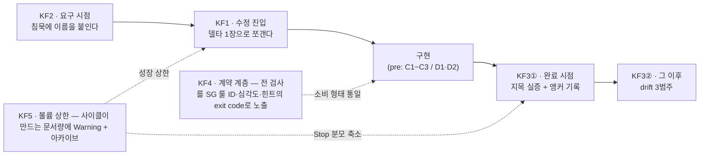
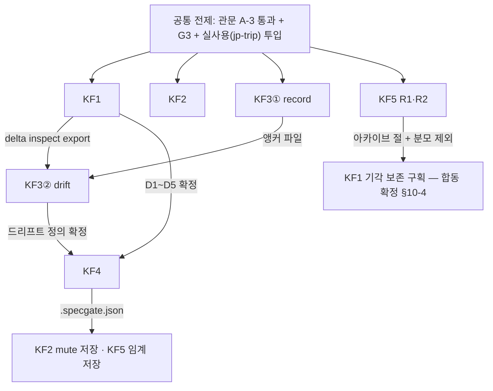

# specgate v-next 수정계획서 — 메인 (전체 조망)

## 0. 이 문서의 성격과 전제

이 문서는 세부 계획서 5장(plan-kf1~kf5)의 **조망 1장**이다. 코드 라운드는 이 문서가 아니라 세부
문서를 들고 시작한다 — 세부 각 장이 독립 작업 지시서다. 이 문서가 맡는 것은 사이의 정합(이름·번호·
공유 파일), 헌법(3예산), 시간축과 착수 순서, 진행 게이트, 그리고 세트 전체에 걸리는 선택 대기다.

**기반은 로드맵 항목이 아니다 — 아래는 전부 «이미 확보»이고, 어떤 세부 계획서의 «만들 것»에도
들어 있지 않다** (2026-08-19 리포 실물 확인 기준).

| 파일 | 줄 | 역할 |
|---|---|---|
| `framework/hooks/spec-gate.mjs` | 110 | 결정론 게이트 — `pre`(PreToolUse **Write만**, C1~C3) / `stop`(C1~C5). exit 2 차단, stderr가 에이전트에게 되돌아감. 차단 시 `.specgate-log.jsonl` 1줄. `--selftest` 10건(실프로세스) |
| `framework/hooks/hooks.json` · `.claude-plugin/plugin.json` | 25 · 9 | Write·Stop 배선 · 플러그인 `specgate` v0.1.0 |
| `framework/spec-verify.mjs` | 252 | C1~C5 정적 검사. exit 0/1/2. `inspect()` export(게이트가 import). `--json` · `--selftest` r32 픽스처 6장 |
| `framework/commands/spec.md` | 22 | `/spec` — SPEC 없으면 작성, 있으면 검사기 보고 |
| `framework/skills/sdd/SKILL.md` · `skills/tdd/SKILL.md` | 79 · 16 | §1 명시 · §2 침묵(10범주 점검표 · 질문 승격 최대 3개 · 확정 3방식 · 6열 미확정표) · §3 완료 전 대조 / 자체 테스트를 자산으로 남김 |
| `framework/spec-template.md` | 94 | SPEC 골격 — 문장 ID 규약 S/I/U, §2.3 오염 개입 주석 |
| `framework/specprobe.mjs` | 34 | 보조기 — 센다. 판정을 exit에 싣지 않는다 |
| `framework/verify-tdd.mjs` · `rubric-sdd.md` | 519 · 183 | tdd 산출물 계측(무거워서 훅에 안 붙임) · sdd 판정 정의 v2.1 |
| `framework/README.md` | 79 | 소개·설치·한계·선택 대기 #1~#4 |
| `framework/FIELD-GUIDE.md` | 119 | 실사용 가이드 — 사건 4분류 · 예언 P1~P5 · 멈춤 조건 3 |
| `framework/smoke/` · `framework/verify-eval/` | — | 실측 원문 + 회귀 픽스처. 읽기만(절대 규칙 6) |

**전제 관문 2개 — 모든 KF의 착수 조건이다.**

- **A-3** (r38 관문 · FIELD-GUIDE §0): 플러그인 **설치 형태**에서 차단되는지 미확인. 실패하면
  원인 가름이 그 라운드의 전부이고, 통과 전에는 어떤 KF도 착수하지 않는다.
- **G3** (사용자 게이트): 실사용 실수요 확인. 억지 과제 금지(r38 작업 B). P1 안의 착수 순서를
  정하는 것이 바로 이 실사용 관측이다(§4).

## 1. 헌법 — 3예산

조사 F1의 교훈(SDD의 지배 비용 = 생성 문서의 인간 리뷰 — 2,577줄·리뷰 3.5시간, 그중 코드 리뷰는
30분)을 반증 가능한 설계 제약으로 만든다. 자체 실측의 반면교사도 같다 — SDD 처치 비용 4.3×,
프로브 $0.5~1.5/런.

**모든 기능은 세 축에 미치는 영향을 명시해야 채택된다.**

| 축 | 정의 | 판정 기준 |
|---|---|---|
| ① 읽기 | 개발자가 읽어야 할 텍스트 총량 증감 | 늘리는 기능은 반대급부를 증명해야 한다 |
| ② 중단 | 플로우가 끊기는 횟수 | 위와 같다. 상한 장치를 함께 명시한다 |
| ③ 화폐 | LLM 패스 수·토큰 | 결정론 게이트는 토큰 0. LLM은 Advisory 층뿐, **기능당 1패스 상한** |

**심사 형식**: 각 세부 계획서의 **§7(3예산 명세)이 그 기능의 채택 심사서다.** §7이 없거나,
늘어나는 축의 반대급부가 없는 기능은 채택 불가다 — 이것이 헌법이다.

심사 결과 한 줄 요약: 세트 전체에서 **중단을 늘리는 것은 KF2(+1회, 상한 고정)가 유일**하고 반대급부(조사 F4 발산 차단)와
완화 3종이 KF2 §7에 있다. KF1의 «커맨드 1회»는 사용자 개시 진입이고, LLM은 세트 전체에서 KF2의 1패스뿐이다(나머지 4개 전부 0패스·토큰 0).

## 2. Top 5 개요

| KF | 실패 시점 | Pain Point 근거 | 신규 산출물 | 3예산 영향 | 우선순위 |
|---|---|---|---|---|---|
| KF1 델타 스펙 수정 루프 | 수정 진입 | 조사 F8(medium·계쟁 — 델타 검증기는 OpenSpec에도 없음) + specgate 자신의 공백(SPEC은 새 기능만·Edit 비차단) | `spec-delta.mjs`(verify·merge) · `delta-template.md` · 런타임 `SPEC.delta.md` | 읽기 델타 1장 본문 ~10줄 · 중단 커맨드 1회(Stop 병합 자동) · LLM 0 | P1 |
| KF2 예산제 침묵 인터뷰 | 요구 | 리포 관측 갭(`specHit` 1/4 — 갭은 §2) + 조사 F4·F5 | `spec-interview.mjs`(log·stats) · 런타임 `.specgate-interview.jsonl` | 읽기 SPEC +3~6줄/세션 · **중단 +1회(유일 증가·상한 고정)** · LLM 1패스 | P1 |
| KF3 지목 실증기 + 드리프트 감시 | 완료 + 이후 | 조사 F3(빈손 완료)·F8a(스펙 사망) + C4·C5의 «ID 재기입만 잰다» 한계 | `spec-anchor.mjs`(record·drift) · 런타임 `SPEC.anchors.json`(커밋 대상) | 읽기 ±0(건당 1줄) · 중단 0(훅 미배선) · LLM 0 | ① P1 · ② P2 |
| KF4 SG 룰셋 + CLI 계약 | 계약 계층 | 조사 F2(LLM 체크리스트 비결정론)·F7(medium) + openapi-diff 선례(F6) | `specgate.mjs`(단일 CLI·RULES) · `.specgate.json` · finding `--json` 스키마 | 읽기 위반 대면 시 감소(README 룰 표 ~30행은 1회성) · 신규 중단 0 · LLM 0 | P2 |
| KF5 볼륨 예산 + 수명 관리 | 볼륨 상한 | 조사 F1(지배 비용 = 스펙 리뷰) + Q4(최적 분량 미정량 → Warning 전용) | **신규 파일 0** — specprobe v2·`## 4. 아카이브` 절·spec-verify 확장 | 읽기 1회성 ~10줄(활성 본문·Stop 분모는 감소) · 중단 0 · LLM 0 | P1 |

세트 합계: 리포 신규 파일 5개(`spec-delta.mjs`·`delta-template.md`·`spec-interview.mjs`·`spec-anchor.mjs`·`specgate.mjs`),
대상 프로젝트 루트의 런타임·설정 파일 4종(`SPEC.delta.md`·`.specgate-interview.jsonl`·`SPEC.anchors.json`·`.specgate.json`). 새 의존성 0 — 전부 Node 내장만.

## 3. 시간축 배치와 상호 연결

조사가 보인 세 실패는 각각 다른 시점에 일어난다 — 요구를 받는 순간(모호성이 침묵으로 들어감),
구현이 끝났다고 말하는 순간(자기 신고를 믿을 수밖에 없음), 그 이후(스펙이 코드와 갈라지며 죽음).
기존 SDD 툴은 이 셋을 «더 많은 문서»로 덮으려다 리뷰 부담(F1)에서 죽었다. 그래서 다섯 기능은
시간축 위에 배치되고, 마지막 둘은 축이 아니라 층이다.

산문으로: **KF2가 침묵에 이름을 붙이고 → KF1이 그걸 수정 단위로 쪼개고 → KF3이 «적은 것을 실제로 짚었는지»(record)와
«그 후에 갈라졌는지»(drift)를 기계로 확인하고 → KF4가 이 전부를 에이전트가 스스로 고칠 수 있는 exit code로 노출하고 →
KF5가 이 사이클이 만들어내는 문서량에 상한을 건다**(원 요청의 «서로 어떻게 물리는가» 그대로).

세부 5장을 가로지르는 연결선은 다음 일곱이다.

1. **KF1 → KF3②**: drift의 `modified` 범주(«MODIFIED 선언, 앵커 미갱신»)는 KF1의
   `spec-delta.mjs` `inspect()` 계열 export를 import해야 성립한다. KF1 전의 drift는 missing/stale
   2범주 퇴화 모드로 돌고, 이는 고장이 아니라 명시된 출력이다(KF3 §4-6).
2. **KF3① → KF3②**: 앵커 파일(`SPEC.anchors.json`)이 있어야 drift가 성립한다.
3. **KF1 ↔ KF5**: 델타 REMOVED는 KF5 이후에도 기본 **삭제 유지**다(이력은 git) — KF5 아카이브의
   진입 조건(구현·검증 완료·파일:줄 지목)을 기각 문장은 못 채우므로 «아카이브 이동» 자동 전환은
   하지 않는다(KF1 §4-5·KF5 §4-2). «기각 보존» 구획 신설·아카이브 되살리기는 KF1 병합 규칙과
   **합동 확정**한다(§10-4). 완료 문장 쪽 질서는 그대로다 — 아카이브 절 + 검사 분모 제외(KF5) 전에
   문장을 본문 밖으로 옮기면 그 문장이 C4 위반으로 되살아난다.
4. **KF3② → KF5**: 아카이브 진입 조건의 완전형(«드리프트 0» 기계 판정)은 KF3② 후. 그 전에는
   KF5 §4-2의 시기별 사다리(사람 확인 대체)로 간다.
5. **KF4 ← 전부**: SG 번호·단일 CLI는 룰 목록이 안정된 뒤가 적기(재번호 비용). KF4 →
   KF2·KF5: `.specgate.json`(KF4 도입)이 KF2 카테고리 mute와 KF5 임계값의 저장처다 — **그 전에는
   설정 파일이 없고**, KF2는 기록·제안만, KF5는 문서 상수만 갖는다. 저장·소비 배선(SG1031~1034
   발행 포함)의 소유 라운드는 **KF4 R4**다(KF4 §5) — KF2·KF5는 값 계약만 정의하고, 서로에게
   미뤄 소유가 비는 일을 이 확정이 막는다.
6. **KF1 → KF2(약한 방향)**: 예시 은행 가설(조사 F5a)의 재료가 «과거 델타·해소된 선택 대기»라
   KF1 산출이 쌓인 뒤에만 검증 가능하다. v-next 범위에서 미구현(KF2 §9-5) — 선후 강제는 아니다.
7. **공유 파일**: `spec-verify.mjs`를 4개 KF가 각자 additive로 확장한다 — KF1(파서 유틸 export),
   KF3(`c4.positions`·`POS_FILE`), KF4(finding `kind`·`line` 필드), KF5(아카이브 마스킹·반환 필드).
   전부 «기존 selftest 6장 기대값 무변경»이 회귀 조건이다(§7). `hooks/spec-gate.mjs`는
   KF1(델타 분기·재진입 가드의 차단 전용 재배치)과 KF4(stderr 포맷만)가, `commands/spec.md`는
   KF1(delta 분기)·KF2(인터뷰 절차)·KF5(볼륨 보고)가 나눠 고친다.

## 4. 의존 그래프와 착수 순서

**부분 순서만 계획이 박는다.** P1 = KF1·KF3①·KF2·KF5, P2 = KF3②·KF4이고,
**P1 안의 착수 순서는 계획이 정하지 않는다 — 실사용에서 무엇이 아쉬웠는지가 정한다**(조사 §221).

| KF | 착수 조건 | 비고 |
|---|---|---|
| KF1 | 공통 전제만 | 3라운드. 단독 완결 |
| KF2 | 공통 전제만 | 2라운드. KF4 없이 완결(mute **저장**만 KF4 이후) |
| KF3① | 공통 전제만 | R-A1 단독으로 도구로서 완결 — 유령 지목은 record 실행 시에만 드러난다(미배선 fail-open, KF3 §9-5) |
| KF3② | KF3① 완료. `modified`는 KF1 이후(그 전 2범주 퇴화 모드) | P2 |
| KF4 | 룰 목록 안정(KF1 D1~D5 · KF3 A1~A3·드리프트 확정) — 적기 자체가 선택 대기(KF4 §10-1) | R1·R2는 현행 spec-verify만으로도 돌 수 있다. R4(volume·interview 배선)는 KF5 R1·R2 + KF2 R1 이후 |
| KF5 | R1·R2는 공통 전제만. R3(첫 접기 실측)는 실사용 볼륨이 시작점에 접근할 때만 | 임계 밟으려는 억지 과제 금지(G3 정신) |

**공유 파일 직렬화(작업 규칙)**: `spec-verify.mjs`·`hooks/spec-gate.mjs`·`commands/spec.md`를
고치는 라운드는 KF 간 병행하지 않는다 — 한 라운드가 끝나고 §7의 공유 불변식이 확인된 뒤에 다음
KF의 수정 라운드를 연다. 설계 결정이 아니라 충돌 방지의 일정 규칙이고, 어느 KF가 먼저인지는
위 착수 순서 원칙(실사용 관측)을 따른다.

## 5. 공통 설계 결정

세부 5장이 공유하는 이름·번호·경계다(이 절이 SSOT — 세부가 이 절과 어긋나면 이 절이 이긴다).
세부 문서는 자기 몫의 상세를 채우되, 바꾸고 싶은 값은 바꾸지 않고 각자 §10에 대안으로 적었다 —
그 규약이 지켜졌음을 확인했고, 예외는 1건이다: KF5가 아카이브 마스킹 범위를 최초 규약안(C4 한정)
보다 넓게(C2~C5 + C1 예외) 논증과 함께 잡았고, 여기 §5-3에 그 확장안을 채택하되 범위 자체는
KF5 §10-10 선택 대기로 남긴다.

**5-1. 파일·이름** (요약)

| 것 | 이름 |
|---|---|
| 활성 델타 문서 | 프로젝트 루트 `SPEC.delta.md` — 한 번에 1장, 병합 후 삭제(이력은 git) |
| 델타 템플릿 / 검사기 | `framework/delta-template.md` / `framework/spec-delta.mjs`(D1~D5 · verify·merge) |
| 델타 진입 | 기존 `/spec` 확장 — `/spec delta "<한 줄 요구>"` (커맨드 수 불변) |
| 앵커 저장 / 도구 | 프로젝트 루트 `SPEC.anchors.json`(**커밋 대상**) / `framework/spec-anchor.mjs`(record·drift) |
| 인터뷰 기록 | 프로젝트 루트 `.specgate-interview.jsonl`(gitignore 권장) |
| 프로젝트 설정 | 프로젝트 루트 `.specgate.json` — **KF4에서 도입, 그 전에는 설정 파일 없음** |
| 단일 CLI | `framework/specgate.mjs` — 기존 도구를 얇게 감싼다(기존 도구 독립 실행 유지) |

**5-2. SG 룰 번호** (예약 블록 — 도입 적기는 KF4 §10-1 선택 대기)

| 블록 | 룰 | 심각도 |
|---|---|---|
| SG1001~1005 | C1~C5 위반 | Error(차단) |
| SG1006~1009 | 기존 경고 kind 5종 → 4번호(C5의 «전건 번호 판정 불가»·«부분 번호 제외» 두 kind는 SG1009 동번호 — KF4 §4-2) | Warning |
| SG1011~1015 | D1~D5(델타) | D3만 Warning, 나머지 Error |
| SG1021~1023 | A1~A3(record) | A3만 Warning, 나머지 Error |
| SG1024~1026 | drift 3범주 | Error — 단 훅 비배선(보고 + exit 1) |
| SG1031~1034 | 볼륨 4종 | **Warning 전용**(차단 승격 금지 — 조사 Q4) |

예약 블록 **밖**의 추가 번호 제안이 2건 있다 — KF4의 SG1000(게이트의 SPEC 부재 차단)과 KF5의
SG1010 후보(아카이브 내 `선택 대기` 경고). 세트 번호 공간의 결정이므로 **§10-2**에서 다룬다.

**5-3. 경계 원칙**

- **Advisory와 차단의 경계**: LLM이 개입하는 것은 세트 전체에서 KF2뿐이고, 어떤 경우에도 exit로
  차단하지 않으며 기능당 1패스 상한이다. KF1·KF3·KF4·KF5는 전부 정적·결정론(LLM 0·토큰 0).
- **specprobe의 성격 유지**: KF5가 확장해도 판정을 exit에 싣지 않는다. Warning화는 KF4 R4에서
  `verify`가 `probe()` 값을 읽어 SG103x로 내는 시점이고(`probe` 서브커맨드는 끝까지 패스스루),
  그 전에는 출력만 있다.
- **드리프트는 게이트에 걸지 않는다**: 명시 실행(나중에 CI) 전용 — Stop에 걸면 FIELD-GUIDE 예언
  P2(«제일 먼저 끄고 싶어질 것»)를 재생산한다. record도 훅 미배선(KF3 §4-7, 번복 조건부).
- **아카이브 절**: `## 4. 아카이브`의 문장을 spec-verify가 검사 분모에서 제외한다(KF5의
  spec-verify 확장 — C2~C5 마스킹, 단 C1 `[추론]` 계수만 마스킹 전 원문. 상세는 KF5 §4-3).
  게이트는 `inspect()` 경유라 **무수정으로** Stop 분모 축소를 얻는다 — P2 마찰의 구조적 완화다.
- **시점 분리 유지**: pre는 구현 시작 시점에 참일 수 있는 검사만(C1~C3 / 델타 활성 시 D1·D2),
  완료라야 쓸 수 있는 검사(C4·C5·D4·D5)는 stop — 이 분리가 게이트의 전부다(r37).

## 6. 공통 개발 규칙 적용

CLAUDE.md 프레임워크 개발 규칙 6개가 세트에 어떻게 걸리는지 한 줄씩.

| 규칙 | 세트 적용 |
|---|---|
| 1 돌아가는 코드 | 전 WBS 15라운드(KF1 3·KF2 2·KF3 3·KF4 4·KF5 3, 그중 조건부 4)의 산출물이 «코드 + selftest»로 정의됐다. 판정 문서 라운드 0. 문서는 README 몇 줄·rN 몇 줄로 코드가 돈 뒤에만 |
| 2 먼저 있는 걸 쓴다 | 신규 5파일 전부가 기존 파서(`inspect()`·`cellsOf`·`stripFences`)·selftest 패턴(mkdtemp·실프로세스) 재사용 위에 서고, 각 세부 §3이 «왜 새 파일인가»를 정당화한다. 새 의존성 0 |
| 3 재구현 금지 | 쓰는 자리 = 아무도 안 한 자리: 델타 포맷의 **검증기**(F8 — OpenSpec에도 없음), 앵커 해시 드리프트, 택소노미에 exit code(SG 룰) |
| 4 자기검사 | 코드마다 `--selftest`. 새 픽스처 디렉터리 0 — 인라인 문자열·mkdtemp 임시 프로젝트·기존 픽스처는 읽기만(절대 규칙 6) |
| 5 결정론/판단 분리 | 차단 경로·병합·집계·힌트 전부 정적(«같은 입력 → 같은 답»). 판단(질문 선별·접기 제안·stale 재검토)은 에이전트·사람 몫으로 명시 분리 |
| 6 선택 대기 | 조용한 확정 0 — 세부 5장 §10에 합계 36건, 메인 §10에 5건. 각 행에 기본값·대안·번복 조건이 있다 |

## 7. 검증 전략 총괄

**층 1 — 기능별 selftest** (각 세부 §6이 케이스 전문):

| KF | selftest | 방식 |
|---|---|---|
| KF1 | verify V1~V9 · merge M1~M8 · 게이트 추가 G11~G23 | 인라인 픽스처 + mkdtemp + 실프로세스(파일 상태까지) |
| KF2 | T1~T12 | 실프로세스 + mkdtemp |
| KF3 | record r1~r7 · drift d1~d7 | 실프로세스 + 합성 SPEC·소스 |
| KF4 | T1~T14 (+ R4 확장분) | r32 픽스처 6장 읽기 + mkdtemp |
| KF5 | V-A1~V-A3 · P-1~P-4 + 회귀 2행 | 인라인 픽스처 |

**층 2 — 공유 회귀 불변식.** `spec-verify.mjs`를 4개 KF가, `spec-gate.mjs`를 2개 KF가 고치므로
이것이 유일한 공유 회귀 스펙이다. 모든 라운드의 종결 조건에 들어간다:

1. `spec-verify.mjs --selftest` — r32 픽스처 6장의 `EXPECTED`(위반 수·경고 수·C5 미제시 목록)
   **무변경**. 기대값을 고쳐야 통과한다면 판정이 바뀐 것이니 멈추고 원인을 가른다(KF4 §6 문장을
   세트 공통 규칙으로 승격).
2. `hooks/spec-gate.mjs --selftest` — 기존 10건의 기대 exit **무변경**(KF1은 뒤에 G11~G23을
   추가만 한다. KF4의 stderr 개정은 exit를 안 건드린다).
3. `verify-tdd.mjs`·`framework/smoke/`·`framework/verify-eval/` **무접촉**(읽기만).

**층 3 — 실사용 관측** (FIELD-GUIDE 사건 4분류 = 정당/오차단/미차단/마찰과의 연결):

| KF | 관측 항목 | 분류·조치 연결 |
|---|---|---|
| KF1 | 새 기능의 «델타 위장»(델타 1장으로 pre 통과) | 미차단 — KF1 §9-6 |
| KF1 | 콜드스타트 누적 SPEC(점검표 없음)의 C2 승급 요구 · 자동 병합의 SPEC 훼손 | 마찰(의도된 동작 — 3회 반복 시 §10-4 번복) · 훼손 1건이면 §10-2 번복(병합 주체 변경) |
| KF2 | 인터뷰를 건너뛰고 싶어진 순간·mute 권장의 장기 0건/과다 발동 | 마찰 — KF2 §10-1. 효과 보고 시 «모델 기본 행동일 수 있다»(r31 §1-4) **병기 의무** |
| KF3 | 유령 지목(A1·A2류) 실측 | record 훅 배선 재고 — KF3 §10-1 |
| KF3 | 줄 이동성 stale 위양성이 같은 마찰 3회 | 심볼 앵커 재검토 — KF3 §10-4 |
| KF4 | `.specgate-log.jsonl`의 같은 룰 반복 차단(KF4 §4-6의 `rules` 필드가 판독 전제) | 자기수정 루프가 실제로 도는지의 판독 자료 — KF4 §9-3 |
| KF4 | «왜 막혔는지 모르겠다» 유형 마찰 | C 블록 조기 도입 전환 — KF4 §10-1 |
| KF5 | «리뷰가 버겁다» 첫 관측 시점의 실측 볼륨 | 임계 시작점(40·0.5·80)을 실측값으로 교체 — KF5 §10-1~3 |

관측은 사람이 받아적지 않는다(FIELD-GUIDE §1) — 로그·jsonl이 1차이고, 로그에 안 잡히는 미차단·
우회 유혹만 손으로 한 줄 남긴다.

## 8. 리스크와 정직한 한계

**Q1이 이 세트 전체의 머리말이다.** 원 요청 말미 원문 — «이 다섯 개 중 효과가 실측된 건 아직
없습니다. 차단 게이트가 작동한다는 것($0.36 프로브)까지만 확인됐고, 차단이 품질을 올린다는 통제
비교는 조사 전체에 존재하지 않습니다(Q1). 이 다섯은 "양쪽 실패 증거로부터 추론한 설계"이지
"검증된 처방"이 아닙니다.» 게다가 관측 트랙이 닫혔으므로(CLAUDE.md 전환) «값을 하는가»는 이제
통제 실험으로 못 재고, 반증 경로는 실사용의 아쉬운 지점뿐이다 — §7 층 3이 그 전부다.

각 KF의 최상위 한계(전문은 각 세부 §9):

| KF | 최상위 한계 |
|---|---|
| KF1 | 필수 필드가 강제하는 것은 «구현 전 열거»라는 **행위**지 열거의 완전성이 아니다(F8c — `listTags`를 놓치면 게이트도 모른다). 병합 규칙은 외부 선례 없는 «설계 판단»이고, Edit은 여전히 게이트 밖이다 |
| KF2 | 자기 실측이 반증 방향이다(r31 대조군 — 문안 없이도 판정 ③ 충족). 감지 능력을 만드는 게 아니라 트리거만 보장하고, 질문 3·창 10·임계 9는 근거 없는 기본값이다(Q3 미해결) |
| KF3 | **실재 확인 ≠ 의미 일치** — Q2를 푸는 게 아니라 결정론이 성립하는 범위로 문제를 깎았다. 앵커가 안 바뀐 의미 변화를 놓치고, 무위치 정당 지목(«실행 확인»류)은 드리프트 감시 밖이며, record 미배선이라 안 돌리면 fail-open이다 |
| KF4 | **검출력은 1도 늘지 않는다** — C4·C5의 «ID 재기입만 잰다» 한계는 SG1004·1005로 이름이 바뀌어도 그대로다. 자기수정 루프가 도는지는 미실측이고, 조기 번호 도입의 재번호 비용은 문서·로그·mute 설정 전부가 치른다 |
| KF5 | 임계(40·0.5·80)는 임의 시작점(Q4 — 0줄도 2,577줄도 반증, 사이 최적점 미정량). 문장 수·표 행수는 읽기 부담의 대리 지표고, Warning은 무시할 수 있다 |

공통 리스크 두 가지를 더한다. **공유 파일 회귀** — 4개 KF가 `spec-verify.mjs`를 잇달아 고친다.
§7 층 2의 불변식과 §4의 직렬화 규칙이 방어선의 전부고, additive라는 약속이 깨지는 순간이 곧 멈춤
신호다. **계획 자체의 읽기 비용** — 이 세트는 계획서 6장 약 1,860줄인데 헌법(3예산)은 기능에만
걸린다. 완화는 세부 각 장을 «착수하는 라운드에서만 읽는 독립 지시서»로 쪼갠 구조다(라운드당 1장).

개발 비용의 실측 밴드는 라운드당 $2~11(r16~r35)이고, 세트에서 LLM이 드는 검증은 KF2의 설치형
스모크 1런($0.5~1.5)뿐이다. 운영 시 LLM 비용은 KF2 1패스가 전부다.

## 9. 문서 맵과 진행 게이트

| 문서 | 내용 한 줄 |
|---|---|
| `plan-main.md` (이 문서) | 전체 조망 — 헌법·개요·연결·순서·공통 결정·게이트 |
| `plan-kf1-delta.md` | 델타 스펙 수정 루프 — D1~D5·기계 병합·콜드스타트 |
| `plan-kf2-interview.md` | 예산제 침묵 인터뷰 — 3택 프로토콜·결정론 기록·mute 제안 |
| `plan-kf3-anchor.md` | 지목 실증기 + 앵커 드리프트 감시 — A1~A3·3범주 |
| `plan-kf4-ruleset.md` | SG 번호 룰셋 + 단일 CLI — RULES·`--json`·`.specgate.json` |
| `plan-kf5-volume.md` | 스펙 볼륨 예산 + 아카이브 — specprobe v2·마스킹 |

공유 규약(이름·번호·경계)의 SSOT는 이 문서 §5고, 원 요청 전문(1차 소스)은 대화 원문이다.
사실·이름·번호의 우선순위: 리포 실물 > 메인 §5 > 세부. 단 각 KF의 설계 상세는 해당 세부 문서가
SSOT다 — 메인은 조망이지 상세의 사본이 아니다.

**진행 게이트** (순서대로, 하나라도 안 열리면 다음이 없다):

1. **A-3** — 설치 형태 차단 확인. 실패 시 원인 가름(`${CLAUDE_PLUGIN_ROOT}` 치환 의심 → 절대경로
   교체)이 그 라운드의 전부다. 통과 전 착수 0.
2. **G3** — 실사용 실수요. 억지 과제 금지. P1 첫 착수 KF는 실사용 사건이 가리킨다(§10-3).
3. **멈춤 조건** (FIELD-GUIDE §6 — 진행 중 상시): ① 분류된 사건 5~6건 축적 ② 같은 마찰 3회
   ③ 끄고 싶어진 순간(즉시). 세부 §10의 번복 조건들도 이 리듬(1건/3회/즉시)을 준용해 적혀 있다.

## 10. 선택 대기 (메인 수준)

세부 문서로 위임한 36건은 제외하고, 세트 전체에 걸리는 결정만 싣는다.

| # | 침묵 지점 | 적용한 기본값 | 대안 | 상태 | 번복 조건 |
|---|---|---|---|---|---|
| 1 | SG 번호 도입 시점(세트 공통) | 룰 목록 안정 뒤 — KF1 D1~D5·KF3 A1~A3·드리프트 정의 확정 후 KF4가 일괄 부여 | C 블록(SG1000~1009)만 조기 도입, D·A·V는 예약 유지 | 선택 대기 | 실사용에서 «왜 막혔는지 모르겠다» 마찰 발생 시 조기안으로 |
| 2 | 예약 블록 밖 추가 번호 2건 — SG1000(SPEC 부재)·SG1010(아카이브 내 선택 대기) | 둘 다 예약 블록에 **편입 인정**(도입 시점은 #1과 동일) — SG1000은 게이트 전용, SG1010은 경고 블록 말미 | SG1000은 현행 산문 유지 / SG1010 대신 SG1035(볼륨 블록 뒤) | 선택 대기 | KF4 번호 배정 라운드에서 사용자 확정 — 기각되면 KF4 §10-4·KF5 §10-7이 각자 대안으로 간다 |
| 3 | P1 첫 착수 KF의 결정 주체·계기 | 실사용 사건 축적(FIELD-GUIDE §6 리듬)이 가리키는 KF를 사용자가 고른다 — 계획은 후보 4개(KF1·KF2·KF3①·KF5)만 준다 | 계획이 지금 순서를 고정 | 선택 대기 | 실사용 개시 전에 특정 갭이 이미 재현·확정되면 그 KF 선착수 |
| 4 | 델타 병합 규칙(KF1 §10-1·2)과 아카이브 되살리기(KF5 §10-5)의 확정 방식 | **합동 확정** — KF1 병합 규칙 확정 라운드에서 되살리기 규칙을 함께 다룬다(따로 정하면 REMOVED·아카이브·복귀의 3자 규칙이 어긋난다) | 각 문서가 각자 확정 | 선택 대기 | KF1 라운드 2(merge) 착수 시 |
| 5 | 계획서 세트의 리포 반입 여부·형태 | 반입하지 않음 — 채팅 전달용으로 두고, 착수하는 라운드가 해당 세부 문서만 참조한다 | `docs/next/YYYY-MM-DD/rN.md`로 압축 반입 / `framework/` 밖 별도 디렉터리 반입 | 선택 대기 | 사용자가 정한다 — 반입 시 rN 문서 규약(결정 과정 기록)에 맞춰 재편 |
