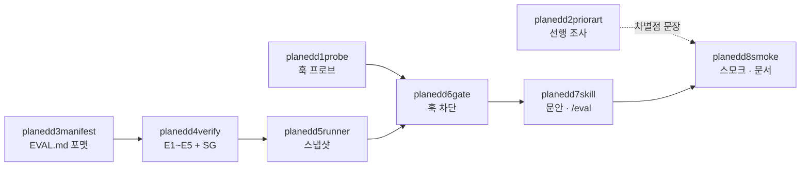

# EDD 트랙 작업지시서 팩 — 메인 (전체 조망) — planeddmain

## §0. 목적과 산출물

**목적 한 줄**: r34 §0-1이 보류시킨 3단계 edd를 2026-08-24 사용자 결정으로 해제하고, 도구 트랙
방식(관측이 아니라 제작)으로 specgate에 **edd 축**(평가 도출→Red-Check→완료 재실행→동결, 훅 차단 포함)을 신설한다.

**이 지시서의 산출물 한 줄**: 팩 8장(planedd1probe.md ~ planedd8smoke.md)의 정합 기준 — 배경·경계·
확정 설계 10항·파일 지도·목차·의존·라운드 배분·충돌 관리·한계·선택 대기 총괄. 세부 지시서가 이
문서와 어긋나면 이 문서가 이긴다(설계 상세는 각 세부가 SSOT — planmain §9 규약과 같다).

## §1. 배경과 근거

### 1-1. 왜 지금 여는가

r34 §0-1은 v0.1을 2축(sdd+tdd)으로 닫으면서 edd를 «v0.2 또는 실사용 관측 중 병행»으로 보류했다
(사용자가 r27 방향 B 선택). **이 팩은 그 보류를 2026-08-24 세션 대화의 사용자 결정으로 해제한다.**
단 재개 방식이 다르다 — 보류 당시의 edd는 관측 트랙의 «3단계 스킬 문안»이었고(r16 §3), 지금 여는
것은 도구 트랙의 **게이트 축**이다(r27 방향 D의 실행형). v0.1=2축 확정은 유지된다 — 2축 실사용
관측과 edd 제작은 병행이고, 이 팩은 실사용 2회차를 «3축판»으로 바꾸지 않는다. 보류로 내려갔던
사용자 결정 2건(r16 §7-2 edd 정의 승인·§7-3 동결 강도)은 형태를 바꿔 되살아난다 — §7-2는 /eval의
승인 절차(planedd7)로, §7-3은 `evalFreeze` 3단계 설정으로 **관측하며 답하는 장치**가 된다(§3-3·§7 #2).

### 1-2. sdd / tdd / edd 경계 — 판정 주체가 다르다

| 축 | 무엇을 잡나 | 판정 주체 | 산출물 |
|---|---|---|---|
| sdd | 침묵 → 문장 (S/I/U) | **지목**(자기신고 — C4는 ID 재기입만 잰다, README) | SPEC.md |
| edd | 문장 → 실행 판정 | **러너의 빨간/초록불** | EVAL.md · tests/eval/ · 스냅샷 |
| tdd | 구현 중 발견 → 자산 | 잔존·실행(verify-tdd 검사 A) | 자체 테스트 파일 |

사슬은 침묵→문장→실행 판정→자산이다. edd는 sdd 문장을 재료로 쓴다(r16 §5-2 — §2의 산출이 곧 평가
항목의 재료). «조회 버튼» 한 요구의 3축 분해: sdd가 «결과 0건이면 무엇을 보여주나»라는 침묵을
S/I/U 문장으로 만들고 → edd가 그중 판정 가능한 문장을 EV 항목(«클릭 시 결과 목록이 렌더된다» —
red 확인 후 구현)으로 승격하고 → tdd가 구현 중 생긴 세부 테스트(디바운스·키 입력)를 자산으로
남긴다. **tdd는 이번 트랙 범위 밖이다** — 수정 금지(§6).

### 1-3. 딥리서치 요약 (2026-08-24, 20소스 · 25건 3표 적대 검증)

**확정(3-0) 6건**: ① tdd-guard(2.3k★)가 동일 PreToolUse(Write|Edit|MultiEdit) 지점에서 실제
차단 — «훅 차단의 존재»는 차별점이 아니다. ② 단 tdd-guard는 차단 판정을 LLM에 맡기고 자체 문서가
간헐적 오차단을 인정한다 — **«결정론-전용 차단»은 미점유**. ③ spec-kit 헌법 Article III는 테스트
선실패 확인을 명령하지만 강제 기계 0(LLM 지시문뿐). ④ 문장 ID↔테스트 기계 링크는 제3자 확장
spec-kit-v-model(37★)이 부분 점유. ⑤ PreToolUse deny 결정론 차단은 공식 문서 + 이 리포 2026-08-16
실측 이중 확인. ⑥ **Stop/SubagentStop 훅은 타임아웃 시 fail-open**(공식 문서 명시 — 단 감리 2차 조사에서는 이 문서
클레임이 3표 검증을 통과하지 못했다: «확정»이 아니라 planedd1 P-3 실측 필수로 읽는다) — 완료 게이트
안에서 러너를 돌리면 차단력이 조용히 사라진다 = 스냅샷 구조가 필수인 근거. 부가로 ⑦
OpenFastTrace/Ankaios/Sphinx-Needs의 spec↔테스트 대사는 성숙 실무지만 전부 사후 CI·기본 fail-open,
⑧ OFT revision-in-ID(문장 개정 시 그 링크만 기계 무효화)가 이식 1순위다.

**기각(0-3) 2건 — 지시서에서 사실로 쓰지 마라**: ✗ «PreToolUse 타임아웃은 fail-closed다» ✗
«다중 훅에서 deny 최우선은 하드 보장이다». 이 둘은 **planedd1probe.md의 프로브 대상**이다
(2026-08-16 프로브는 정상 경로만 확인했다).

**미결 3건 — planedd2priorart.md 조사 대상**: ⓐ arXiv 2606.02755(평가 동결 축 점유 여부 미확인,
유일한 근접 후보) ⓑ Probity(tdd-guard 후속 — 결정론으로 이동했으면 차별점 절반이 닫힘) ⓒ spec-kit-v-model 상세.
**감리 반영**: ⓑ·ⓒ는 2차 조사가 원문 인용을 선확보했다(ⓑ 실존·하이브리드 — 핵심 판정 LLM 유지 →
예상 분기 ② / ⓒ opt-in 사후 스크립트 게이트 → 예상 분기 ① — planedd2 §1) · ⓐ는 2차 조사에서도
실존 미확인. 집행 라운드는 §3-0 규약대로 재확인만 남는다.

**차별점 문장 — 확정(2026-08-24 조사, 판정표 r53 §2 — planedd2 종결로 «잠정» 꼬리표 해소)**:
«**훅 수준 실시간** 결정론-전용 차단 + 구현 전 평가 동결·Red-Check + 출처별 게이트 강도의 결합은
확인된 선례 없음 — 부분 선례 병기: spec-kit-v-model의 opt-in 결정론 **커맨드** 게이트(훅 아님·
hybrid mode 우회 자인), 후속 Probity의 하이브리드(핵심 판정 LLM — enforceTdd «Uses an AI
validator») · 개념 선례: arXiv 2606.02755(release gates·red-train-green — 강제 기계는 산출물로
미확인, 본문 정독 불가 한계는 r53 §2-a)».

**감리 반영(2026-08-24, 팩 작성 직후)**: 실물 대조 30항목 중 어긋남 4건 — specgate selftest는 22가
아니라 **26건**(r51이 T20~T23을 선점, T 최대 T23·T11 결번) · T3b는 :375 · T16은 :479 · line1은 :83 ·
commands/spec.md는 65줄 — 과 2차 딥리서치(104 에이전트 · 3표 적대 검증) 확정 10건을 팩 전체에 반영했다.
반영 지점: 이 문서 §1-3·§3-2·§3-7·§7·§8, planedd1 §1·§3-1·§3-4·§3-6, planedd2 §1·§3-1·§3-3,
planedd4 §2·§3-6·§4·§5·§8, planedd6 §2·§3-5·§5-2·§7·§8, planedd7 §1, planedd8 §3-7.

## §2. 선행 조건 (팩 전체)

- [ ] specgate 2축 + 훅 차단 구현 완료 상태(README 실물)에서 출발한다 — sdd 자산 무접촉이 전제다.
- [ ] planedd1(훅 프로브)·planedd2(선행 조사)는 병행 가능. **planedd6(훅) 착수 전 planedd1 완료
      필수** — 기각 2건(타임아웃 fail-closed·deny 최우선)이 미실측인 채로 게이트를 배선하면 안 된다.
- [ ] 각 세부 지시서는 자기 §2에 이 순서를 반영한다: planedd3→planedd4(한 라운드 병합 가능) →
      planedd5 → planedd6 → planedd7 → planedd8.
- [ ] 병행 sdd 작업과의 충돌 확인(§3-6) — hooks.json·specgate.mjs RULES·README를 고치는 라운드는
      sdd 쪽 수정 라운드와 병행하지 않는다(planmain §4 공유 파일 직렬화 규칙 준용).

## §3. 작업 — 팩의 구조

### 3-1. 확정 설계 10항 (모든 세부 지시서의 상위 계약)

1. **EDD 4요소**: ① SPEC 문장(S/I)에서 평가 항목 도출·확정(구현 전) ② Red-Check — 구현 전 실행해
   실패 확인(«평가가 구현을 재고 있다»의 증거, FROZEN2 §2) ③ 완료 전 재실행 — 전건 통과 또는
   항목별 기각 사유 ④ 동결 — 승인 후 평가를 구현과 함께 고치지 못하게 차단(REPORT4 §6-1 번복
   5건의 재발 방지).
2. **판정 주체 구분**: §1-2 표 그대로 — sdd는 지목, edd는 러너의 빨간/초록불.
3. **출처별 게이트 강도**(미점유 차별점 — 리서치 3-0): S 지목 = 차단 게이트 자격 / I 지목 =
   게이트 + 위임 표시 / **U(§2.3 선택 대기 행) 지목 = 단언 금지** — 구현 전 검사 위반(E4). 근거:
   i1-cart-r1 판정 IV에서 선택 대기 10행 중 4행의 기본값이 테스트 단언으로 굳었다(r35 §2-4) —
   이 규칙이 그 «별도 라운드였던 예비 개입»이다.
4. **결정론-전용 차단**(개발 규칙 5): 차단 게이트에 LLM 금지. 판단(«이 평가가 정말 그 문장을
   재는가»)은 Advisory/루브릭 몫. tdd-guard와 정반대이고 이 대비가 README «다른 점» 문안의 근거다.
5. **스냅샷 구조 필수**(리서치 확정 ⑥): 러너를 훅 안에서 돌리지 않는다. 에이전트가
   eval-run.mjs로 스냅샷(`.specgate-eval.json`)을 남기고 훅은 스냅샷만 읽는다(밀리초 판정).
6. **runOk 분리**(exp judge의 acRunOk 규율): 계측 실패(러너 미실행·크래시·파싱 실패)와 평가
   실패(빨간불)를 스냅샷 필드로 구분. 계측 실패는 통과도 실패도 아니다 — 게이트는 «유효한 스냅샷
   없음»으로 차단(SG1048).
7. **문장 단위 무효화**(OFT revision-in-ID의 무접촉 변형): EV 항목이 문장 ID + 승인 시점 문장
   내용 해시(정규화 후 sha256 앞 8hex)를 기록. 문장이 바뀌면 그 항목만 기계적으로 Outdated(E5).
   SPEC ID 포맷은 바꾸지 않는다 — ~N 표기 도입은 선택 대기(⑩ #5).
8. **Red-Check 판정**: 실행 기록 부재 = 차단 / 항목 red = 정상 / 항목 green(구현 전인데 통과) =
   Advisory 경고. **전건 red를 강제하지 않는다** — 스캐폴드가 이미 만족하는 문장이 실존한다.
9. **평가 자격**: 사전 명세 가능 + 러너가 참/거짓을 낼 수 있는 것만. jsdom 제약 — «보이는가»
   불가, «렌더/언렌더»만. 선례: axe 전체 스캔 탈락·개별 규칙만 AC-08 승격(exp/FROZEN.md §4).
10. **tdd 무접촉**: skills/tdd/SKILL.md·verify-tdd.mjs 수정 금지(import도 금지 — r20 §7-5).
    평가 테스트 위치는 tests/eval/ 고정. verify-tdd 계수 상호작용은 **알려진 한계로 기록만**(§3-7).

### 3-2. 고정 인터페이스 (요약 — 전문은 각 담당 지시서, 이름·값은 9장 공통)

- EVAL.md: ID EV1, EV2…, 필수 열 6(`ID`·`근거`·`근거 해시`·`무엇을 어떻게 재나`·`테스트`·`승인`
  — 열 이름 리터럴은 planedd3manifest.md 템플릿이 SSOT), 필수 절 `## 기각`·`## 개정`.
- 스냅샷 `.specgate-eval.json`: `{phase:"red"|"final", at, runOk, runner:"vitest",
  items:[{id,status:"red"|"green"|"missing"}], evalLockHash, implHash}` · 락 `.specgate-eval.lock`:
  `{approvedAt, evalMd, tests, sentences}` · 테스트↔EV 매핑: it/describe 이름의 `EV3:` 접두 —
  리포터 테스트 이름에서 `/\bEV\d+\b/` 전부.
- E검사 E1~E7(전부 정적, planedd4verify.md): E1 파싱·ID 유일 / E2 테스트 경로·판정 한 줄 / E3
  근거 문장 실존(SPEC 없으면 경고 강등) / E4 U 지목 위반 / E5 해시 불일치 Outdated(`## 개정`
  행 있으면 통과) / E6(stop) 전건 green 또는 기각 사유 / E7(stop) 동결 — 락 대조(`evalFreeze`
  단계 적용). **C4 복제 금지** — «전 문장이 평가로 덮였는가»는 차단하지 않는다(SG1050 경고 집계만).
- SG 번호: SG1041~1047 = E1~E7 · SG1048 스냅샷 부재/무효 · SG1049 신선도 · SG1050 미커버 집계(Warning).
- exit 규약: eval-verify 0/1/2(spec-verify 선례) · eval-run 0 스냅샷 산출(빨간불이어도 0)/1 계측
  실패/2 사용법(verify-tdd 선례 — 판정을 exit에 싣지 않는다) · eval-gate 0 통과/2 차단(spec-gate 선례).
- 게이트 시점: pre(구현 SRC 쓰기 직전 — matcher `Write|Edit|MultiEdit`, planedd6 §3-5) — EVAL.md 없으면 통과(축 꺼짐, 산출물 존재로만 연결 — r16
  §1 조합 원칙), 있으면 락 + phase=red 스냅샷·runOk + E1~E5 / stop — phase=final 스냅샷·runOk + 신선도(implHash) + E6·E7.
- /eval 흐름(planedd7skill.md): 도출 → 표 제시 → **승인 1회**(일괄 기본·항목별 제외 가능 —
  확정은 사용자 몫, sdd 확정 3형과 같은 결) → 락 생성 → red-check → 구현 → final → stop 게이트.
- 각 신설 mjs는 `--selftest` 필수(인라인 픽스처 — 새 픽스처 디렉터리 금지, 개발 규칙 4). Node
  내장만(규칙 2). 차단성 검사에 LLM 금지(규칙 5).

### 3-3. 파일 지도

**신설**(담당 지시서 병기): `framework/eval-template.md` + EVAL.md 포맷 정의(planedd3manifest.md) ·
`framework/eval-verify.mjs`(planedd4verify.md) · `framework/eval-run.mjs`(planedd5runner.md) ·
`framework/hooks/eval-gate.mjs`(planedd6gate.md) · `framework/skills/edd/SKILL.md` +
`framework/commands/eval.md`(planedd7skill.md).

**대상 프로젝트 산출물**: `EVAL.md`(루트, SPEC.md 옆) · `tests/eval/*.test.*` ·
`.specgate-eval.json` · `.specgate-eval.lock`. `.specgate.json` 신규 키
`"evalFreeze": "warn"|"reason"|"block"`(기본 `"reason"`) — r16 §7-3 «동결 강도» 미결을 관측으로 답하는 장치.

**수정(전부 additive)**: `framework/hooks/hooks.json`(eval-gate 배선 — planedd6) ·
`framework/specgate.mjs`(RULES E룰 등재 + eval 서브커맨드 — planedd4) ·
`framework/README.md`·`CLAUDE.md`(트랙 종결 시 일괄 — planedd8smoke.md).

**수정 금지**: spec-verify.mjs · spec-gate.mjs · spec-delta.mjs · spec-anchor.mjs · specprobe.mjs ·
spec-interview.mjs · skills/sdd/ · skills/tdd/ · verify-tdd.mjs · commands/spec.md. 기존 selftest
EXPECTED 기대값 변경 0이 정합 증거다(r50 선례). 단 **import 재사용은 허용**(spec-verify의
`inspect()` import는 spec-gate가 이미 하는 선례) — **verify-tdd.mjs만은 import도 금지**(r20 §7-5,
계측기와 처치의 축 분리 — «통합한다면 그때도 복사로만»).

### 3-4. 지시서 8장 목차와 의존

| 파일 | 산출물 | 의존 |
|---|---|---|
| planedd1probe.md | 훅 프로브 실측(타임아웃 fail-open/closed·deny 우선순위) — 리서치 기각 2건의 직접 확인 | 없음(병행 가능) |
| planedd2priorart.md | 미결 3건(arXiv 2606.02755·Probity·spec-kit-v-model) 조사 → 차별점 문장 확정/개정 | 없음(병행 가능) |
| planedd3manifest.md | eval-template.md + EVAL.md 포맷 정의 | 없음 |
| planedd4verify.md | eval-verify.mjs(E1~E5 정적) + specgate.mjs E룰·eval 서브커맨드 | planedd3 |
| planedd5runner.md | eval-run.mjs(러너 어댑터 → 스냅샷) | planedd4 |
| planedd6gate.md | hooks/eval-gate.mjs + hooks.json 배선 | planedd5 + **planedd1 완료 필수** |
| planedd7skill.md | skills/edd/SKILL.md + commands/eval.md(/eval 흐름·승인) | planedd6 |
| planedd8smoke.md | 설치형 스모크(리포 밖 스크래치) + README·CLAUDE.md 일괄 갱신 | planedd7 |

### 3-5. 라운드 배분

| 라운드 | 지시서 | 산출물 정의(개발 규칙 1) |
|---|---|---|
| R1 | planedd1 + planedd2 병행 | 프로브 실측 JSON + 조사 판정(코드 없는 유이한 라운드 — 프로브 자체가 실행물) |
| R2 | planedd3 + planedd4 병합 가능 | eval-verify.mjs 돌아감 + `--selftest` 통과 |
| R3 | planedd5 | eval-run.mjs 돌아감 + `--selftest` 통과 |
| R4 | planedd6 | eval-gate.mjs `--selftest` + 실프로세스 차단 확인 |
| R5 | planedd7 | SKILL.md·/eval — 문안은 코드가 돈 뒤에 |
| R6 | planedd8 | 설치형 스모크 유효 런 + 문서 일괄 |

총 6라운드(R2를 쪼개면 7), 라운드당 $2~3대(실측 기준). 코드 라운드의 산출물은 «돌아가는 코드 + selftest 통과»다 — 판정 문서만 남는 라운드는 실패다(개발 규칙 1).

### 3-6. 충돌 관리 (병행 sdd 작업과)

edd 트랙이 고치는 기존 파일은 **hooks.json · specgate.mjs RULES · README 셋뿐이고 전부 additive**다.
sdd 쪽 라운드와 이 세 파일을 같은 라운드에서 고치지 않는다(planmain §4 직렬화 규칙 준용 — 설계
결정이 아니라 일정 규칙). 나머지 신설 파일(eval-*)은 이름 공간이 겹치지 않는다.

### 3-7. 알려진 상호작용·한계 (해소 대상 아님 — 기록)

- **edd가 tdd를 흡수한다는 가설**(r16 §5-1, 1차 출처 exp/FROZEN.md §8) — v0.1과 마찬가지로 이
  트랙도 판정하지 않는다. 끄고 켤 수 있게만 둔다.
- **verify-tdd 계수에 tests/eval/이 섞인다** — 자체 테스트 열거가 tests/ac/만 제외하므로 eval
  파일이 tdd 산출물로 계수될 수 있다. 계측기 수정은 기존 세션 전수 재측정 조건이므로(절대 규칙 3)
  **기록만 한다**.
- **sdd 없이 edd는 상한이 낮다**(r16 §5-2) — 침묵이 먼저 문장이 돼야 평가 재료가 생긴다. EVAL.md
  없으면 축 꺼짐·SPEC 없으면 E3 경고 강등이 이 비대칭의 구현이다.
- **게이트는 파일을 신뢰한다**(감리 반영) — 스냅샷·락은 에이전트가 Bash로 직접 쓸 수 있고,
  `echo > src/x.ts` 류 셸 쓰기는 PreToolUse matcher 밖이다(tdd-guard 실사용 기록에도 에이전트의
  터미널 우회 시도가 있다 — 감리 2차 조사). 이 축의 위협 모델은 «드리프트 방지 절차 강제»지
  보안 경계가 아니다 — README 한계 절에 명시한다(planedd8 §3-7 ④).
- **효과 근거는 여전히 0이다** — 이 팩이 만드는 것은 도구이지 효과 증명이 아니다. 반증 경로는
  실사용의 아쉬운 지점뿐이다(CLAUDE.md 전환의 대가 명시 그대로).

## §4. 산출물 (이 지시서 포함 팩 전체)

- `docs/next/2026-08-24/planeddmain.md`(이 문서) + planedd1probe.md ~ planedd8smoke.md(§3-4 표의
  8장) — 총 9장. 팩이 집행되면 §3-3의 신설 6파일 + 수정 3파일이 나온다. 이 문서 자체는 코드를 만들지 않는다.

## §5. 검증 (팩 수준 완료 조건)

| # | 조건 | 기대값 |
|---|---|---|
| 1 | 세부 8장 전부가 §3-2 인터페이스의 이름·값을 그대로 쓴다 | 어긋남 0건 — EV/SG 번호·스냅샷 필드·exit 규약 대조 |
| 2 | 기존 selftest 회귀 | spec-verify·spec-gate·spec-delta·spec-anchor·specgate `--selftest` EXPECTED **무변경**(r50 선례) |
| 3 | 신설 mjs 3종(verify·run·gate) | 각 `--selftest` exit 0 · 인라인 픽스처만 사용 |
| 4 | planedd6 착수 시점 | planedd1의 프로브 결과 JSON이 존재하고 기각 2건에 대한 실측 답이 적혀 있다 |
| 5 | 차별점 문장 | planedd2 종결 시 «잠정» 꼬리표가 확정 또는 개정으로 바뀌어 있다 |
| 6 | 최종 스모크(planedd8) | 리포 밖 스크래치·설치 형태에서 pre 차단 1건 + stop 차단 1건 + 정상 통과 1건이 실측된다 |

## §6. 하지 말 것·경계

- §3-3 수정 금지 목록의 파일을 고치지 않는다. verify-tdd.mjs는 **import도** 하지 않는다.
- exp*/ 4트랙은 한 글자도 수정 금지. `framework/smoke/` 기존 디렉터리는 실측 원문 — 덮어쓰기
  금지, 시드는 복사만(절대 규칙 6).
- 차단 게이트에 LLM 판단을 넣지 않는다. 훅 안에서 러너를 돌리지 않는다(Stop fail-open — §1-3 ⑥).
- «전 문장 커버리지»를 차단으로 승격하지 않는다(C4 복제 금지 — SG1050 Warning까지만).
- 리서치 기각 2건을 사실로 인용하지 않는다 — planedd1 실측 전까지는 미확인이다.
- Windows 하드 제약 재검토 금지: 네이티브 바이너리 실행 불가·jsdom 레이아웃 없음 — 검증은 jsdom + `tsc -b` + `vite build`만.
- 시험 설치는 리포 밖 스크래치에서만(FIELD-GUIDE F1~F3 — 설치 세션엔 훅 안 붙음·재설치 필요·캐시는 작업 트리 복사).
- 사용자 몫을 조용히 정하지 않는다 — 기본값 진행은 되지만 §7 표에 남긴다(개발 규칙 6).

## §7. 선택 대기 (팩 전체 총괄 — 각 세부 §7의 상위 합본, 소유 지시서 병기)

| # | 항목 | 기본값 | 대안 | 상태 | 번복 조건 | 소유 |
|---|---|---|---|---|---|---|
| 1 | 승인 UX | 일괄 승인 1회 + 항목별 제외 | 항목별 개별 승인 | 선택 대기 | 일괄 승인이 «안 읽고 넘김»으로 관측 1건 | planedd7 |
| 2 | evalFreeze 기본값 | `"reason"`(수정 허용 + `## 개정` 행 필수) | `"warn"` / `"block"` | 선택 대기 | 실사용에서 개정 행이 형식적 통과로 전락 3회 → block / 마찰 3회 → warn | planedd6 |
| 3 | 델타(`SPEC.delta.md`) 활성 중 E3·E5의 base | 본 SPEC.md 고정(델타 미인식) | 델타 병합 후 문장까지 base로 | 선택 대기 | 델타 활성 중 E5 위양성 관측 1건 | planedd4 |
| 4 | 스모크 과제 | cart 계열 재사용 여부 미정 | 신규 과제 | 선택 대기 | planedd8 착수 라운드에서 사용자 확정 | planedd8 |
| 5 | 문장 ID ~N 개정번호(OFT식) 도입 | 도입 안 함 — 내용 해시로 대체(sdd 무접촉) | `S3~2` 표기 도입 | 선택 대기 | ⓐ 표현만 고친 개정으로 Outdated 마찰 실사용 3건(planedd2priorart.md §3-2) 또는 ⓑ 해시 방식이 «어느 개정인지» 추적 요구를 실사용에서 못 채운 사건 1건 | planedd3 |
| 6 | SG1050 미커버 집계의 분모 | S 문장만 | S+I | 선택 대기 | I 문장 미커버가 실사용 사건의 발원 1건 | planedd4 |
| 7 | eval-gate pre의 SRC 판정 | spec-gate.mjs의 SRC 목록과 동일 기준(복사) | 별도 목록 | 선택 대기 | 두 게이트의 대상 불일치로 오차단 1건 | planedd6 |
| 8 | spec-gate matcher의 동일 확장(`Write|Edit|MultiEdit`) | 이번 트랙에서 안 한다 — 기존 항목 무접촉(eval-gate 신설 항목만 확장 matcher, 감리 반영) | 동일 확장(별도 라운드) | 선택 대기 | Edit/MultiEdit 경유 SPEC 게이트 우회 실사용 관측 1건 | planedd6 |

각 세부 지시서 §7이 확정되면 이 표와 어긋나는지 대조한다 — 어긋나면 이 표가 이긴다.

## §8. 참조

- 리포: CLAUDE.md(방식 전환 절·개발 규칙 6개) · docs/STATUS.md · framework/README.md ·
  docs/next/2026-08-13/r16.md(§1 조합 원칙·§5 상호작용·§7-2/3) · docs/next/2026-08-19/planmain.md
  (형식 선례·공유 파일 직렬화) · docs/next/2026-08-16/r35.md(§2-4 판정 IV 오염) ·
  exp/FROZEN.md §4(평가 자격 선례) · exp2/FROZEN2.md §2(Red-Check 원형) · docs/REPORT4.md §6-1(번복 5건).
- 외부: github.com/nizos/tdd-guard(+docs/validation-model.md) · github.com/nizos/probity(공식 후속 —
  감리 2차 조사) · github.com/github/spec-kit/blob/main/spec-driven.md ·
  github.com/leocamello/spec-kit-v-model · github.com/itsallcode/openfasttrace(doc/user_guide/user_guide.md) ·
  eclipse-ankaios.github.io/ankaios/0.2/development/requirement-tracing/ · sphinx-needs.com ·
  code.claude.com/docs/en/agent-sdk/hooks · code.claude.com/docs/en/hooks · arxiv.org/abs/2606.02755.

집행 중 이 지시서와 실물이 어긋나면 실물이 이긴다 — 어긋난 항목을 rN에 기록하라(r50 §2 선례).
